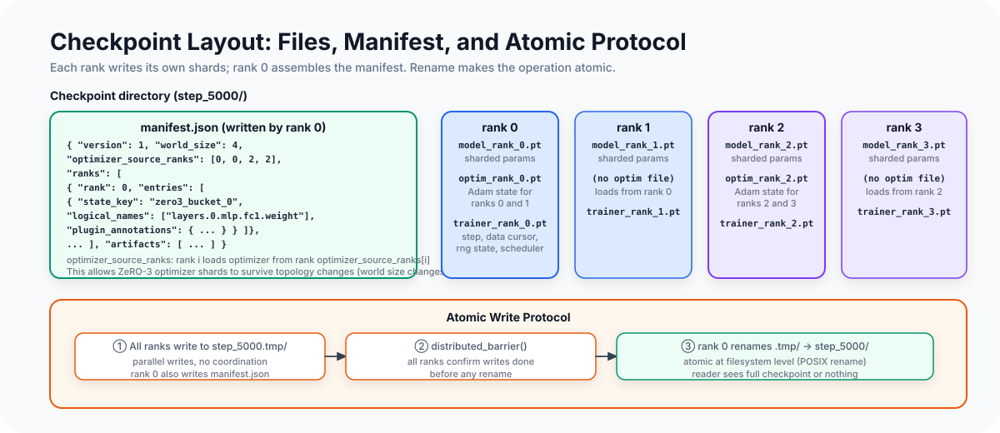

# Checkpoint Semantics Under Sharding

A checkpoint for a distributed pretraining run is not a file. It is a directory
containing dozens of files, written in parallel by all ranks, governed by a manifest
that describes how those files relate to the full model and optimizer state.

Getting this right has several independent requirements:

- **Completeness**: the checkpoint captures all state needed for an exact resume
- **Consistency**: the checkpoint represents a single step boundary, not a mix of
  different steps across ranks
- **Atomicity**: a partial write (due to a hardware failure mid-checkpoint) must not
  leave a corrupt checkpoint that looks valid
- **Correctness under sharding**: loading must account for which rank saved what,
  and under what topology

This article covers how MALTOS's checkpoint system handles each of these, and where
the interesting design decisions live.

---

<div class="article-figure">
  
</div>

---

## What State Is Actually Required

The minimum state for a correct exact resume is:

**Model parameters**: not just the parameter values at the time of the checkpoint,
but the sharded view that the current distributed configuration expects. A TP-sharded
checkpoint must be loaded into a TP-sharded runtime. A ZeRO-3 checkpoint must be
loaded into a ZeRO-3 runtime with matching world size.

**Optimizer state**: Adam's first moment (m), second moment (v), and step count per
parameter. Loading without optimizer state produces a "warm start" that is not
equivalent to an uninterrupted run. The Adam moments encode the history of gradient
updates; without them, the optimizer behaves as if it just started, which can cause
a temporary spike in effective learning rate and slows convergence.

**Scheduler state**: the current position in the learning rate schedule. Most LR
schedules (cosine annealing, warmup-decay) are a function of the step number. If the
step count is correctly restored but the scheduler is reinitialized to step 0, the
learning rate will jump back to its initial value.

**Data loader state**: the current shard index and token offset. Without this, the
resumed run reads from the beginning of the dataset, re-training on tokens already
seen. This is the most common checkpoint bug in practice — it's invisible in the loss
curve (the loss decreases, just on data that was already trained on).

**RNG state**: CPU and CUDA random number generator state. Dropout masks, any weight
initialization noise from steps after resume, and other stochastic operations should
be reproducible from the checkpoint. Omitting RNG state doesn't cause incorrect
training; it just means the resumed run diverges from what an uninterrupted run would
have produced.

**Plugin state**: some plugins maintain their own state across steps. ZeRO-3 saves
partial gradient state when checkpointing mid-accumulation (between micro-steps).
PP saves the pipeline stage assignments.

---

## The Manifest

The manifest is a single JSON file written by rank 0 after all other ranks have
written their files. It provides the map from logical parameter names to physical
storage locations:

```json
{
  "version": 1,
  "world_size": 4,
  "optimizer_source_ranks": [0, 0, 2, 2],
  "ranks": [
    {
      "rank": 0,
      "entries": [
        {
          "state_key": "zero3_bucket_0",
          "logical_names": ["model.layers.0.mlp.fc1.weight"],
          "logical_shapes": [[4096, 2048]],
          "physical_shape": [512],
          "dtype": "torch.bfloat16",
          "plugin_annotations": {
            "zero3": {
              "bucket_index": 0,
              "rank": 0,
              "world_size": 4,
              "shard_offset": 0,
              "shard_numel": 512,
              "numel": 2048
            }
          }
        }
      ]
    }
  ],
  "artifacts": [
    {"kind": "model", "rank": 0, "path": "model_rank_0.pt"},
    {"kind": "optimizer", "rank": 0, "path": "optim_rank_0.pt", "source_rank": 0},
    {"kind": "trainer", "rank": 0, "path": "trainer_rank_0.pt"},
    ...
  ]
}
```

The `plugin_annotations` field is the key piece: it records how the saved tensor
relates to the logical parameter it came from. For a ZeRO-3 checkpoint:

- `logical_shapes`: the shape of the full, non-sharded weight matrix
- `physical_shape`: the shape of the shard actually saved
- `shard_offset` / `shard_numel` / `numel`: how to reconstruct the full tensor from shards

For a TP checkpoint, the annotation records the shard dimension, rank, world size,
and extent:

```json
"tensor_parallel": {
  "shards": [{
    "logical_name": "model.layers.0.mlp.fc1.weight",
    "axis": "param_out",       // column-parallel: sharded along output
    "rank": 0,
    "world_size": 2,
    "shard_dim": 0,
    "shard_offset": 0,
    "shard_extent": 2048,
    "logical_shape": [4096, 2048]
  }]
}
```

These annotations are populated by each plugin's `annotate_checkpoint_state()`
method during the save. On load, the same plugin reads the annotations and knows
how to correctly restore its state.

---

## Atomic Write Protocol

A checkpoint that is partially written is worse than no checkpoint: a training
pipeline that attempts to resume from a corrupt checkpoint will crash in a hard-to-
diagnose way, rather than cleanly restarting from a valid earlier checkpoint.

The standard approach for atomic checkpoint writes: write to a temporary directory,
then rename:

```python
def save_sharded_checkpoint(state_manager, path):
    checkpoint_dir = Path(path)
    tmp_dir = checkpoint_dir.with_name(f"{checkpoint_dir.name}.tmp")

    # Step 1: Rank 0 removes any stale tmp dir
    if rank == 0:
        if tmp_dir.exists():
            shutil.rmtree(tmp_dir)

    distributed_barrier()  # All ranks wait for rank 0 to clean up

    # Step 2: All ranks write their files to tmp_dir in parallel
    _save_sharded_checkpoint_contents(state_manager, tmp_dir)

    distributed_barrier()  # All ranks confirm their writes are done

    # Step 3: Rank 0 renames tmp_dir → checkpoint_dir
    if rank == 0:
        tmp_dir.rename(checkpoint_dir)

    distributed_barrier()  # All ranks confirm rename complete
```

The key property: if the process crashes after step 1 but before step 3, the
checkpoint directory at `checkpoint_dir` still does not exist (or still contains
the previous checkpoint). The partially-written files are in `tmp_dir`, which is
identifiable as incomplete by its `.tmp` suffix.

The rename at step 3 is atomic on POSIX filesystems for directories within the same
filesystem — the directory appears completely or not at all from any other process's
perspective. This is the property that makes the checkpoint atomic.

**Why does step 2 not need coordination between ranks?** Each rank writes to its own
files (`model_rank_N.pt`, `optim_rank_N.pt`, `trainer_rank_N.pt`), so there are no
write conflicts. The barrier at the end of step 2 ensures that no rank renames the
directory before all files are fully written.

**What about NFS?** On network filesystems, rename semantics can differ from POSIX.
Lustre and GPFS provide `rename(2)` atomicity for files but not always for directories.
For distributed training at scale, this is why storage systems like NVME-of-F or
parallel file systems with proper atomic rename support are important.

---

## Rank-0-Writes-Manifest Pattern

The manifest is written by rank 0 in step 2, after gathering metadata from all ranks:

```python
def _save_sharded_checkpoint_contents(state_manager, checkpoint_dir):
    # Each rank saves its own files and collects metadata
    model_state, rank_entries = state_manager.export_model_state()
    # ... write model, optimizer, trainer files ...

    # All ranks share their metadata with rank 0
    gathered_metadata = [None] * world_size
    gathered_artifacts = [None] * world_size
    dist.all_gather_object(gathered_metadata, [asdict(e) for e in rank_entries])
    dist.all_gather_object(gathered_artifacts, local_artifacts)

    # Rank 0 assembles and writes manifest.json
    if rank == 0:
        manifest = CheckpointManifest(
            version=1,
            world_size=world_size,
            ranks=[RankCheckpointMetadata(rank=i, entries=...)
                   for i, entries in enumerate(gathered_metadata)],
            optimizer_source_ranks=[runtime.optimizer_state_source_rank(i)
                                    for i in range(world_size)],
            artifacts=[...],
        )
        with open(checkpoint_dir / "manifest.json", "w") as f:
            json.dump(asdict(manifest), f, indent=2)
    distributed_barrier()
```

The `all_gather_object` calls are distributed operations that require all ranks to
participate. This is why rank 0 can't write the manifest until all ranks have
provided their per-rank metadata.

The `optimizer_source_ranks` list is computed at save time by the runtime:
`runtime.optimizer_state_source_rank(rank_id)` returns the rank whose optimizer
file rank `rank_id` should load from. This is where the topology-specific logic
lives — each ZeRO plugin overrides `optimizer_state_source_rank()` to encode its
specific sharding pattern.

---

## Loading: Strict Topology Matching

The loader validates that the saved topology matches the current runtime before
loading any tensors:

```python
def _validate_manifest_for_runtime(manifest, runtime):
    runtime_world_size = dist.get_world_size() if dist.is_initialized() else 1
    if manifest.world_size != runtime_world_size:
        raise ValueError(
            f"checkpoint world_size mismatch: "
            f"checkpoint={manifest.world_size}, runtime={runtime_world_size}"
        )
    # Also validates per-rank optimizer source mapping matches current runtime's mapping
    for rank_id in range(manifest.world_size):
        runtime_source = runtime.optimizer_state_source_rank(rank_id)
        manifest_source = manifest.optimizer_source_ranks[rank_id]
        if runtime_source != manifest_source:
            raise ValueError(
                "optimizer source mapping mismatch: "
                f"rank={rank_id}, runtime={runtime_source}, "
                f"checkpoint={manifest_source}"
            )
```

The optimizer source mapping validation is subtle. Suppose you save a checkpoint
with ZeRO-3 where each rank owns its own optimizer state (source rank = self). Then
you attempt to load it into a runtime configured with ZeRO-1 where rank 0 owns the
optimizer for all ranks (source rank = 0 for everyone). The mapping would mismatch
and the load would fail — correctly, because rank 1 doesn't have the ZeRO-1 optimizer
state it would need.

---

## Per-Rank Trainer State

Each rank saves its own trainer state:

```python
# Saved as trainer_rank_N.pt
{
    "step_context": {
        "step": 5000,
        "microbatch_idx": 0,
        "grad_accum_steps": 8,
    },
    "consumed_tokens": 12288000,
    "dataloader": {
        "shard_idx": 3,
        "token_offset": 47382,
        "consumed_tokens": 12288000,
        "seed": 1234,
    },
    "plugin_states": {
        "zero3": { ... },   # partial gradient state if mid-accumulation
        "pp": { ... },      # pipeline schedule state
    },
    "rng": {
        "cpu": <cpu_rng_state>,
        "cuda": <cuda_rng_state>,
    },
}
```

Each rank saves its own dataloader state because DP ranks have different data
cursors. Rank 0 at step 5,000 is at a different position in the token stream than
rank 1 at step 5,000 — they have been reading interleaved non-overlapping windows.
On resume, rank 0 restores rank 0's cursor and rank 1 restores rank 1's cursor.

The RNG state is also per-rank: GPU random number generators are independent per
device, and dropout masks computed on GPU 0 differ from those on GPU 1 (they should
differ — DP ranks need independent randomness).

---

## The POST_LOAD Phase

After loading all state, the runtime runs `RuntimePhase.POST_LOAD`:

```python
def load_sharded_checkpoint(state_manager, path):
    # ... load model, optimizer, trainer state ...
    state_manager.import_model_state(model_state)
    if optim_state is not None:
        state_manager.import_optimizer_state(...)
    state_manager.import_trainer_state(...)

    runtime._run_phase(RuntimePhase.POST_LOAD)  # ← plugins can react
    distributed_barrier()
```

This gives plugins the opportunity to post-process the loaded state. ZeRO-3 uses
`POST_LOAD` to re-shard parameters: after loading sharded parameter data into
`bucket.local_param`, it calls `_free_full_params()` to set each module's `param.data`
to point at the appropriate shard. Without this, the module's `param.data` would be
stale from before the load.

The `distributed_barrier()` after `POST_LOAD` ensures all ranks complete their
post-processing before training resumes. A rank that fails during `POST_LOAD` would
block here, preventing a situation where some ranks resume training while others are
still setting up.

---

## Checkpoint Retention Policy

The trainer's `max_checkpoints` field controls how many checkpoints to retain:

```python
class Trainer:
    max_checkpoints: int = 3

    def _maybe_cleanup_checkpoints(self, step: int) -> None:
        checkpoints = sorted(self._find_checkpoints())
        while len(checkpoints) > self.max_checkpoints:
            oldest = checkpoints.pop(0)
            if rank == 0:
                shutil.rmtree(oldest)
            distributed_barrier()
```

The deletion is always performed by rank 0 (to avoid races) followed by a barrier.
Deleting a checkpoint from multiple ranks simultaneously would produce intermittent
partial-deletion bugs.

With `max_checkpoints=3`, the run retains the last three checkpoints. If the most
recent checkpoint is corrupt, you can fall back to the previous one. For long
pretraining runs, 3 checkpoints is usually sufficient; for runs where you might want
to compare intermediate models, a larger value (or an explicit set of "pinned"
checkpoints not subject to cleanup) is more appropriate.

---

## What Doesn't Work Yet

**Topology change on resume**: loading a checkpoint saved with world_size=8 into a
world_size=4 run is not supported. The manifest validation will catch this and raise.
Supporting topology change requires resharding: for ZeRO-3, redistributing the
parameter shards from 8 equal parts to 4 equal parts. For TP, reassembling from
2-way TP and re-sharding into 4-way TP. This is implementable but adds significant
complexity to the load path.

**Optimizer state for different hyperparameters**: changing the optimizer type or
learning rate on resume is not checked. You can load a checkpoint and change the
optimizer hyperparameters in the optimizer factory — the Adam moments will be loaded
but the learning rate will be whatever you specify. This is sometimes intentional
(learning rate warmup restart) but can also be a misconfiguration.

**Cross-framework checkpoints**: the saved format is PyTorch-specific. Converting
to/from Hugging Face `safetensors` format requires assembling the full weight tensors
from shards and saving in the expected format. This is typically done as a separate
post-processing step, not inline with training.

---

## Designing for Checkpoint Correctness

A few principles from implementing this:

**Always validate at load time.** A mismatch between checkpoint and runtime that
is caught at load time produces a clear error. The same mismatch uncaught would
produce subtle wrong-answer bugs (wrong optimizer state, wrong parameters for wrong
ranks) that surface as instability hours into a resumed run.

**Separate "what needs to be saved" from "how it's stored".** The `StateManager`
knows that params + optimizer + trainer state need to be saved. Each plugin knows
how to format its piece. Neither needs to know about the physical layout of files —
that's the checkpoint writer's job.

**Make the incomplete-write state distinguishable.** The `.tmp` directory suffix is
purely a convention, but it makes it trivially easy to identify abandoned partial
checkpoints in the checkpoint directory. Without it, you'd need to inspect the
manifest (which might not exist) to determine if a checkpoint is complete.

**The manifest is the source of truth, not the files.** If a file is listed in the
manifest and is missing, that's an error. If a file exists in the checkpoint directory
but isn't in the manifest, it can be ignored. This asymmetry means you can add
auxiliary files (profiling traces, loss curves, configs) to the checkpoint directory
without breaking the loader.

---

## Experiment Placeholder

> **[Placeholder: Checkpoint save/load throughput vs. storage speed]**
> At scale, checkpoint writes can take minutes. Measure checkpoint save time vs.
> model size at different storage bandwidth tiers (local NVMe vs. shared NFS vs.
> object store). Key metric: checkpoint overhead as fraction of training time.
> At typical pretraining checkpoint frequencies (every 1,000 steps), the checkpoint
> should take under 1% of total training time to not meaningfully affect throughput.
