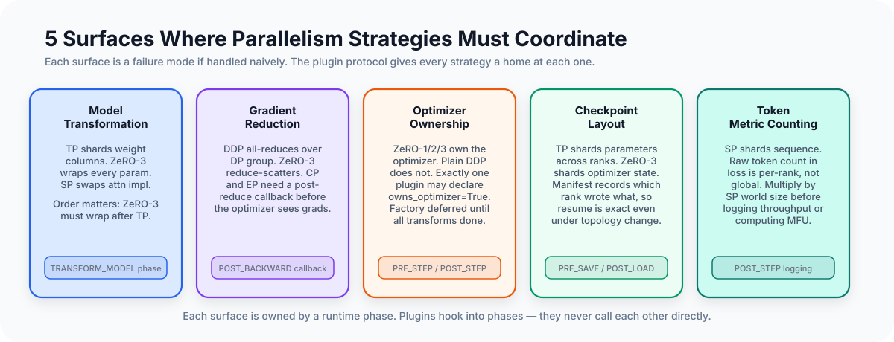

# Why Composable Parallelism Is Hard

The hardest part of building a distributed training system is not implementing
any individual strategy. Data parallelism, tensor parallelism, pipeline
parallelism, ZeRO, context parallelism, expert parallelism: each one has a
paper, a diagram, and a fairly crisp local story. The hard part is making them
coexist inside one runtime without turning the trainer into a pile of strategy
branches.

When you add a second parallelism strategy to a working training loop, you do
not usually get two independent features. You get two claims on the same
surface. Adding ZeRO to DDP changes who owns gradients. Adding tensor
parallelism changes which parameters even exist. Adding context parallelism
changes what "gradient reduction complete" means. Adding pipeline parallelism
changes what a step is.

Each new strategy is a cross-cutting concern. Without explicit interaction
boundaries, every new feature drags edits into every other one.

The conclusion I ended up with in MALTOS is simple: parallelism strategies do
not compose by default. What composes is a protocol. This post is about that
protocol: the five surfaces where strategies interact, the failure modes on each
surface, and the runtime rules that keep the system from collapsing into
feature-specific trainer code.

---

<div class="article-figure">
  
</div>

---

## The Five Interaction Surfaces

Every parallelism strategy needs to interact with the training loop at one or
more of these surfaces:

- **Model transformation**: some strategies modify the model before training
  begins — replacing modules, installing hooks, partitioning layers
- **Gradient synchronization**: strategies differ in how, when, and where they
  reduce gradients
- **Optimizer ownership**: only one entity should create, step, and checkpoint
  the optimizer
- **Checkpoint layout**: sharded training produces sharded checkpoints; the
  layout depends on which strategies are active and at which ranks
- **Metrics**: token counts, loss values, and throughput numbers all have
  distributed semantics that depend on the active topology

These are not just implementation categories. They are the places where
distributed semantics leak. If a strategy embeds its own logic directly into the
trainer at one of these surfaces, the next strategy usually has to patch around
it.

## The Naive Approach and Where It Breaks

The obvious way to handle multiple strategies is conditionals in the trainer:

```python
# naive approach — breaks with three strategies
if using_zero3:
    with fsdp_context:
        loss = model(batch) / accum_steps
elif using_ddp:
    loss = model(batch) / accum_steps
else:
    loss = model(batch) / accum_steps

if using_tp:
    token_count = input_ids.numel() / tp_world_size
else:
    token_count = input_ids.numel()

if using_pp:
    # different backward path entirely
    ...
```

This works for the first strategy. With two strategies it produces an O(N²)
branch structure. With three it becomes the real architecture. At that point the
trainer is no longer a trainer. It is a hidden compatibility layer for every
strategy combination you have ever added.

The problem is that each strategy affects multiple phases of training, and the
same phase is affected by multiple strategies. A conditional-per-strategy
approach puts strategy logic next to the code it affects, but creates invisible
dependencies between strategies: changing how ZeRO reduces gradients can break
CP's assumption about when its post-reduction sync runs.

Another problem is that local feature tests give false confidence here. TP may
work by itself. ZeRO may work by itself. CP may work by itself. But the
cross-feature bug lives in the interaction surface, not in either feature's
standalone implementation. That is one reason composition bugs survive so long:
the individual parts each look correct under isolated testing.

## The Phase Model

The alternative is to define explicit coordination points that plugins hook into,
rather than letting strategies inject logic at arbitrary positions in the trainer.

MALTOS has eleven phases:

```
SETUP
TRANSFORM_MODEL
PRE_MICROBATCH
PRE_FORWARD  →  [forward]  →  POST_FORWARD
PRE_BACKWARD →  [backward] →  POST_BACKWARD
PRE_STEP     →  [optimizer step]  →  POST_STEP
PRE_SAVE
POST_LOAD
```

Every plugin is notified at each phase and decides what to do. The trainer does
not know what each plugin does. It only knows that these are the only legal
coordination points.

The phases are not arbitrary. Each one corresponds to a concrete coordination
need that distributed training requires:

| Phase | Why it exists |
|---|---|
| `SETUP` | plugin-local setup such as grad scaler init and runtime scratch state |
| `TRANSFORM_MODEL` | model must be in final form before optimizer is built |
| `PRE_BACKWARD` | ZeRO3 resets grad buffers; PP resets microbatch state |
| `POST_BACKWARD` | DDP/ZeRO synchronize gradients |
| `PRE_STEP` | gradient clipping, after gradients are in their final reduced form |
| `POST_STEP` | ZeRO3 reshards parameters; metrics/profiling can observe the completed step |
| `POST_LOAD` | ZeRO3 reshards after loading a checkpoint |

The trainer loop is agnostic to which plugins are registered:

```python
def fit(self) -> None:
    while step < max_steps:
        batch = self.dataloader.next_batch()
        loss, should_step = self.runtime.run_step(batch)
        if should_step:
            self.runtime.step_optimizer()
            self._maybe_log()
            self._maybe_checkpoint()
```

`run_step` fires phases around the forward and backward passes. `step_optimizer`
fires phases around the optimizer step. The trainer does not know whether
gradients are being synchronized by DDP, bucketed DDP, ZeRO, or any future
strategy.

## Surface 1: Model Transformation Ordering

Model transformation is where ordering constraints are most visible.

Tensor parallelism replaces `nn.Linear` modules with sharded variants:

```python
# TensorParallelPlugin.transform_model()
model.set_submodule(
    rule.module_path,
    ColumnParallelLinear.from_linear(module, self.tp_group, ...),
)
# register the replacement so other plugins can discover it
self.runtime.register_module_replacement(nn.Linear, ColumnParallelLinear)
self.runtime.register_module_replacement(nn.Linear, RowParallelLinear)
```

ZeRO3 wraps modules by type — by default `nn.Linear`. If ZeRO3 runs before TP,
it wraps the original `nn.Linear` instances. TP then replaces those instances
with `ColumnParallelLinear`. ZeRO3's wrapped modules are now unreachable: the
module references it holds point to objects that are no longer in the model.
Training will crash or silently produce wrong parameter updates.

The correct order is TP first, ZeRO3 second. ZeRO3 discovers TP's replacements
through the runtime registration:

```python
# Zero3Plugin.transform_model()
for cls in list(self.wrap_cls):
    # expand wrap_cls to include ColumnParallelLinear, RowParallelLinear
    self.wrap_cls.update(self.runtime.get_module_replacements(cls))
```

ZeRO3 doesn't import `ColumnParallelLinear` directly. It queries which types TP
introduced through the neutral runtime interface. This is the key: plugins
communicate through the runtime, not through direct imports of each other's
implementation classes.

## Plugin Dependency Ordering

Expressing ordering constraints verbally is not enough. The runtime needs to
enforce them regardless of which plugins are enabled and what order they are
registered.

MALTOS uses Python's `graphlib.TopologicalSorter`. Each plugin declares its
ordering requirements:

```python
@dataclass
class RuntimePlugin:
    id: PluginId
    requires: set[PluginId] = ...     # these plugins must be present
    runs_after: set[PluginId] = ...   # run after these, if present
    runs_before: set[PluginId] = ...  # run before these, if present
```

ZeRO3 declares:

```python
class Zero3Plugin(RuntimePlugin):
    def __init__(self):
        super().__init__(
            id=PluginId.ZERO3,
            owns_optimizer=True,
            runs_after={PluginId.PP, PluginId.CP, PluginId.TP, PluginId.SP},
        )
```

The runtime resolves execution order once at setup:

```python
# RuntimeCore._resolve_plugin_order()
sorter = TopologicalSorter()
for plugin in plugins:
    deps = set(plugin.requires) | (set(plugin.runs_after) & set(plugin_by_id))
    sorter.add(plugin.id, *deps)
for plugin in plugins:
    for before_id in plugin.runs_before:
        if before_id in plugin_by_id:
            sorter.add(before_id, plugin.id)
order = [plugin_by_id[id] for id in sorter.static_order() if id in plugin_by_id]
```

This ordering applies to all phases. A plugin that runs after TP during
`TRANSFORM_MODEL` also runs after TP during `POST_BACKWARD`. The topological
invariant that governs model transformation also governs gradient flow and
checkpoint annotation.

Using `TopologicalSorter` rather than relying on construction order catches two
classes of bugs:

- A plugin is registered in the wrong order because of a refactor elsewhere in
  the config code
- A plugin is conditionally enabled or disabled, and the remaining plugins need
  a different order than they would get if all plugins were present

Neither of these bugs is detectable without explicit ordering enforcement.

## Surface 2: Optimizer Ownership

Optimizer ownership is the interaction surface most likely to fail silently.

If both the runtime and ZeRO3 create an optimizer, training proceeds without
crashing. The runtime's optimizer holds references to the original parameters.
ZeRO3's optimizer holds references to its shard parameters. Both call `step()`
every iteration. The result is neither the intended optimizer update nor the
intended ZeRO3 sharded update — it is two separate optimizers applying
conflicting updates to overlapping parameter subsets.

MALTOS enforces exactly one optimizer owner. The runtime checks this at setup:

```python
def _validate_optimizer_owner(self) -> None:
    runtime_owners = ["runtime"] if self.optimizer is not None else []
    plugin_owners = [p.id.value for p in self.plugins if p.owns_optimizer]
    if len(plugin_owners) > 1:
        raise ValueError(f"only one optimizer-owning plugin allowed, got {plugin_owners}")
    if runtime_owners and plugin_owners:
        raise ValueError(
            "runtime optimizer ownership is mutually exclusive with plugin ownership"
        )
```

If no plugin declares `owns_optimizer=True`, the runtime creates the optimizer
after all `transform_model` calls complete. If a plugin declares ownership
(ZeRO1, ZeRO2, ZeRO3 all do), that plugin creates the optimizer over its shard
parameters and the runtime skips optimizer creation entirely.

**The deferred optimizer factory**. The optimizer must be built after model
transformation, not at construction time. The setup sequence is:

```
construct model
→ runtime.setup()
  → plugin.transform_model() for each plugin (in topological order)
  → register_module(model)              # parameters are now in final form
  → _maybe_build_runtime_optimizer()   # called here, not at construction
```

If the optimizer were built at construction time, TP's parameter replacements
would not yet exist. The optimizer would hold references to the full-size
pre-transform parameters. After TP runs, those parameters are replaced by shard
variants with different shapes. The optimizer and the model would be tracking
different objects.

## Surface 3: Gradient Synchronization and the Callback Interface

DDP and ZeRO are the primary gradient reducers. They own the synchronization
mechanism: when a gradient is ready, they reduce it across the appropriate
process group.

Context parallelism needs an extra gradient synchronization step after the
DP-equivalent reduction. So does expert parallelism, for per-expert parameter
routing. But CP and EP shouldn't have to modify DDP or ZeRO to add this.

The solution is a callback interface registered on the runtime:

```python
# RuntimeCore
def register_post_grad_reduction_callback(
    self,
    cb: Callable[[torch.Tensor], dist.Work | None],
    *,
    role_filter: ParamRole | None = None,
) -> None:
    """
    Register a callback invoked after each DP-equivalent gradient reduction
    completes. Plugins (CP, EP) register here instead of embedding sync logic
    inside the reducer.

    The callback receives the local gradient shard and may return an async
    Work handle; the reducer will wait on it before PRE_STEP.
    """
    self._post_grad_reduction_callbacks.append((cb, role_filter))
```

After DDP or ZeRO reduces each gradient bucket, it fires these callbacks with
the local gradient shard. CP registers a callback that performs the cross-CP-rank
gradient synchronization. EP registers callbacks for expert-specific gradient
routing with a `role_filter` so only expert parameters trigger the EP callback.

The reducer doesn't need to know that CP or EP exist. CP and EP don't need to
modify the reducer. Both sides depend only on the callback interface, not on each
other's implementation.

## Surface 4: Checkpoint Layout

A checkpoint saved under TP+ZeRO3 on four GPUs is not directly loadable as a
single-GPU checkpoint. The on-disk representation must include enough metadata to
reconstruct the logical model from the distributed shards.

MALTOS checkpoints each rank independently, with a global manifest written by
rank 0 after all ranks have finished:

```
step_00001000/
  manifest.json          # written by rank 0 after all ranks complete
  model_rank_0.pt
  optim_rank_0.pt        # only on ranks that own optimizer state
  trainer_rank_0.pt      # step context, RNG, dataloader cursor
  model_rank_1.pt
  trainer_rank_1.pt
  ...
```

The manifest records:

- `world_size`: required to validate that the checkpoint is loadable with the
  current topology
- `optimizer_source_ranks`: for each rank, which rank holds its optimizer shard
- per-rank parameter metadata: logical shape, physical shape, plugin annotations

The `optimizer_source_ranks` field is what makes optimizer resumption correct.
Under ZeRO, optimizer state is sharded. Rank 2 may hold the optimizer shard for
its own parameters, but under a different DP configuration those shards might
belong to different ranks. The manifest records the source rank for each rank's
optimizer state, and load validates that the current runtime topology maps to the
same ownership pattern as the checkpoint.

Plugins annotate their checkpoint entries with strategy-specific metadata. TP
records shard axis, offset, and extent for each sharded parameter. ZeRO3 records
which DP rank holds each bucket shard and at what offset within the full
parameter:

```python
# Zero3Plugin.annotate_checkpoint_state()
entry.set_plugin_annotation(
    self.id.value,
    {
        "bucket_index": bucket.index,
        "rank": bucket.group_context.rank,
        "world_size": bucket.group_context.world_size,
        "shard_offset": bucket.group_context.rank * shard_len,
        "shard_numel": shard_len,
        "numel": bucket.buffer_size,
    },
)
```

A tooling layer that reads the manifest and these annotations can reconstruct the
full logical parameter from its distributed shards without needing to understand
the runtime internals.

**Atomic writes**. Checkpointing at scale fails silently if a partial write is
left on disk. MALTOS writes to a `.tmp` directory, then renames to the final path
after all ranks complete:

```python
def save_sharded_checkpoint(state_manager, path):
    tmp_dir = checkpoint_dir.with_name(f"{checkpoint_dir.name}.tmp")
    if rank == 0:
        # clean up any stale tmp
        if tmp_dir.exists(): shutil.rmtree(tmp_dir)
    distributed_barrier()
    _save_sharded_checkpoint_contents(state_manager, tmp_dir)  # all ranks write
    distributed_barrier()
    if rank == 0:
        tmp_dir.rename(checkpoint_dir)   # atomic rename only after all content exists
    distributed_barrier()
```

A process that dies after some ranks have written but before rank 0 renames
leaves a `.tmp` directory, not a partially-valid checkpoint. The resume path
looks for complete checkpoints, ignoring `.tmp` directories.

## Surface 5: Metrics Under Parallelism

Token counts and loss values have distributed semantics that are easy to get
wrong.

Under tensor parallelism, all TP ranks process the same batch. If each rank
reports `input_ids.numel()` as its token count, global token count is inflated
by the TP world size. The correct global contribution from a local token count is:

```python
def _global_token_contribution(local_tokens: int, mesh: MeshConfig) -> float:
    replicated_ranks = mesh.tp * mesh.pp * mesh.cp
    return float(local_tokens) / float(replicated_ranks)
```

DP ranks each hold a distinct data shard, so their token counts add up. TP, PP,
and CP ranks replicate the same data at the model level, so their contributions
must be divided out.

The same applies to loss. Under DDP or ZeRO, each DP rank sees a distinct data
shard, so the reported loss already has the expected data-parallel semantics.
Under PP, the tail stage computes the scalar loss and the PP plugin broadcasts
the microbatch-averaged value across the PP group before metrics are collected.

The runtime collects metrics via plugin callbacks and applies topology-aware
correction before logging. Plugins that emit metrics declare them without
needing to know the full topology:

```python
# ZeRO3's collect_metrics() just reports local loss scale and overflow state.
# RuntimeCore.collect_metrics() applies the global token correction.
```

## What Doesn't Compose Cleanly

The phase and plugin model handles most interactions without coupling. Some cases
are still awkward, and those awkward cases are revealing because they show where
the abstraction is still too weak.

**ZeRO3 and pipeline parallelism share step state**. PP has multiple microbatches
in flight simultaneously. ZeRO3 materializes parameters per-module and frees them
immediately after use. With PP schedules, the same module may be
needed by multiple concurrent microbatches. ZeRO3 handles this by maintaining a
separate `_BucketExecState` per PP microbatch:

```python
# Zero3Plugin._make_bucket()
exec_state_count = self.runtime.plan.pp_schedule.microbatches
exec_states = [_BucketExecState(...) for _ in range(exec_state_count)]
```

This is a case where PP's scheduling semantics leak into ZeRO3. The interaction
is contained — ZeRO3 reads `plan.pp_schedule.microbatches` from the runtime and
manages state accordingly — but it is visible cross-plugin state. A more complete
abstraction would hide microbatch count behind a runtime-owned scheduling
primitive rather than exposing it as a config field.

**Async overlap across plugin boundaries is still conservative.** Bucketed DDP
and ZeRO-3 each overlap communication with computation *within* their own
gradient reduction. Composing overlap *across* strategies is harder: a real
communication scheduler would need to know which transfers are in flight from
which plugins and whether they can safely interleave on the available streams.
The current callback mechanism is deliberately simpler — reducers hand
post-reduction work to CP/EP as async handles, but the runtime waits on all of
them before `PRE_STEP`. That is correct and composable; it is not yet a
communication scheduler.

## A Concrete Walk-Through: TP + ZeRO-3 on 4 GPUs

To make the surfaces concrete, trace through what happens when you compose
TP (tensor parallelism, tp=2) with ZeRO-3 (dp=2) on 4 GPUs.

**Setup**: 4 GPUs form a 2×2 mesh. TP axis connects GPUs [0,1] and [2,3].
DP axis connects GPUs [0,2] and [1,3].

**Surface 1 — Model transformation** (setup time):

`TensorParallelPlugin.transform_model()` runs first (TP has no ordering
dependencies). It replaces each `nn.Linear(4096, 4096)` with a `ColumnParallelLinear`
that holds a `[2048, 4096]` weight (half the columns). The replacement is registered:
`runtime.register_module_replacement(nn.Linear, ColumnParallelLinear)`.

Then `Zero3Plugin.transform_model()` runs. It expands its `wrap_cls` to include
`ColumnParallelLinear` (via the registration), so it wraps the already-sharded
`ColumnParallelLinear` modules. The further sharding is *not* a 2D slice: ZeRO-3
flattens each module's parameters into a 1D bucket buffer (here
2048 × 4096 ≈ 8.4M elements) and each DP rank keeps a contiguous 1D shard of
~4.2M elements. The checkpoint manifest reflects this — `physical_shape` for a
ZeRO-3 entry is one-dimensional, with `shard_offset`/`shard_numel` locating it
inside the flat buffer.

The optimizer is built inside `Zero3Plugin.transform_model()` with these 1D
local param shards as inputs.

After setup, GPU 0 holds:
- Weight params: a TP column slice, flattened and further sliced 1D by ZeRO-3
- Adam m/v: matching the 1D ZeRO-3 shard shape

**Surface 2 — Gradient synchronization** (backward pass):

The `ColumnParallelLinear` backward fires an all-reduce over the TP group (`[0,1]`)
to combine the gradient contributions from both TP ranks. This is built into the
module's `backward()`.

Then ZeRO-3's `_make_reduce_grad_hook()` fires when the last parameter in each
bucket completes. It launches a `reduce_scatter_tensor()` over the DP group (`[0,2]`)
to average the gradients and distribute shards.

CP or EP callbacks (if active) would fire after the DP reduce-scatter, via the
post-grad-reduction callback interface.

**Surface 3 — Optimizer ownership** (PRE_STEP):

The ZeRO-3 plugin owns the optimizer. At `PRE_STEP`, `Zero3Plugin.on_phase()`
waits for all reduce-scatter handles; the `GradClipPlugin` (if configured)
clips gradients at the same phase. The runtime then steps the plugin-built
optimizer through its single shared step path — `get_optimizer_and_scheduler()`
resolves to ZeRO-3's optimizer over the 1D shard parameters. Ownership decides
*which* optimizer steps, not *who* calls `.step()`.

**Surface 4 — Checkpoint layout** (PRE_SAVE):

Each rank writes its 1D param shard to `model_rank_N.pt`. The
`TensorParallelPlugin.annotate_checkpoint_state()` records that this shard came
from a TP split at axis 0 (column parallel). The `Zero3Plugin.annotate_checkpoint_state()`
records the DP shard offset and extent.

Rank 0 writes the manifest: `world_size=4`, `optimizer_source_ranks=[0, 1, 2, 3]`
— under ZeRO-3 every rank's optimizer state covers exactly its own shards, so
every rank is its own source. (A replicated-optimizer configuration like plain
DDP+TP would instead map DP peers to a shared source.) A future tool could use
the manifest's double-layered annotations to reconstruct the full
`[4096, 4096]` weight matrix.

**Surface 5 — Metrics** (POST_STEP):

Each rank reports `batch_tokens = input_ids.numel()`. But TP, PP, and CP ranks
may be observing replicated views of the same logical tokens. The runtime fixes
this by dividing out the replicated mesh axes before logging the token
contribution, rather than treating every rank-local count as globally distinct.

The loss scalar is collected separately from the gradient path. For TP, the
runtime divides out replicated axes in token accounting; for PP, the PP plugin
broadcasts the final loss scalar to the full PP group before metrics are
collected.

---

## Why the Ordering Constraint Must Be Statically Enforced

The TP → ZeRO-3 ordering requirement is not a suggestion — it is a correctness
invariant. Yet it is easy to violate by accident.

A plugin system that relies on registration order gives no protection. You write:

```python
runtime = RuntimeCore(plugins=[Zero3Plugin(), TensorParallelPlugin()])
```

and the wrong order is silently accepted. The failure mode is not a crash. ZeRO-3
wraps the un-sharded `nn.Linear` modules, then TP replaces those modules with
`ColumnParallelLinear`. The ZeRO-3 bucket's hooks are registered on the old modules,
which now live outside the model graph. On the forward pass, ZeRO-3's
`register_forward_pre_hook` fires... on a module that is no longer in the model.
The parameters the hooks try to materialize are not the ones the forward pass uses.
You get either a crash on the first step (if the shapes don't accidentally match) or,
worse, a silent wrong update (if they do).

The topological sort fixes this regardless of registration order:

```python
plugins = [Zero3Plugin(), TensorParallelPlugin()]  # wrong order
runtime = RuntimeCore(plugins=plugins)
runtime.setup()
# → TP is executed before ZeRO-3 because of the declared dependency
```

The `Zero3Plugin` declares `runs_after={PluginId.TP}`. If TP is in the config,
the sorter places TP before ZeRO-3, regardless of how the list was constructed.
The failure mode that raises is different: if two plugins declare an
unsatisfiable cycle, `static_order()` fails during setup instead of letting the
runtime execute in an ambiguous order.

---

## The Cost of the Abstraction

The plugin+phase model provides clean separation at the cost of some capabilities.

**You can't do things between phases.** A plugin that wants to modify gradients at
an arbitrary point in the backward pass has to pick the nearest defined phase. If
the right moment is between `POST_BACKWARD` and `PRE_STEP`, there is no hook for
that. This is a real limitation for advanced gradient-conditioning techniques that
want to operate after gradient synchronization but before clipping.

**You can't see other plugins.** Plugins communicate through the runtime's neutral
interface. This means a plugin can't inspect another plugin's internal state. In
some cases this is overly restrictive: a plugin that needs to know "is ZeRO-3
currently materializing parameters?" cannot ask ZeRO-3 directly. It must coordinate
through the runtime (for example, via the `_exec_state` per-microbatch index).

**Debugging cross-plugin interactions is harder.** When something goes wrong in a
TP + ZeRO-3 + PP configuration, the error may manifest in any of three plugins'
code, with no obvious connection to the root cause. The phase system makes each
plugin's behavior isolated and testable, but the integration of three isolated-but-
composing plugins creates a combinatorial testing surface.

**The abstraction doesn't cover protocol-level communication patterns.** Plugins
declare ordering dependencies but not communication patterns. Two plugins that both
want to launch async communications on the same NCCL stream will silently interfere
— NCCL's implicit stream ordering serializes them, potentially defeating the overlap
intent. Expressing "my communication must be on a different stream than yours" requires
lower-level coordination than the current plugin interface supports.

These are not fatal limitations. They are the cost of a composable abstraction
relative to a hard-coded multi-strategy implementation. The composable version
handles the common cases cleanly; the unusual cases require reaching behind the
abstraction.

---

## What This Abstraction Buys Me

For MALTOS, this abstraction has already paid for itself in two ways.

First, I was able to add CP, PP, and EP without rewriting the trainer loop.
Those features still required real interaction work — especially around
checkpoint semantics and gradient synchronization — but the integration surface
was runtime-owned rather than trainer-owned.

Second, it made the test strategy legible. The matrix tests are organized around
composed runtime behaviors rather than around trainer variants. That is exactly
what I want from the abstraction: if a new strategy requires a brand-new trainer
test harness, the composition boundary is probably in the wrong place.

---

## Where This Sits Relative to DTensor

A fair question from anyone watching the PyTorch ecosystem: isn't tensor-level
composition — DTensor placements propagating through operations, DeviceMesh as
the topology object, FSDP2 and TorchTitan building on both — the more principled
substrate than a phase-and-plugin protocol?

For the *sharding propagation* problem, probably yes. DTensor answers "what
happens when a `Shard(0)` tensor meets a `Replicate()` tensor in a matmul" once,
at the tensor library level, instead of every strategy answering it separately.
That subsumes a real part of what TP/SP plugins do by hand here.

But notice which of the five surfaces that covers: mostly surface 1 (model
transformation) and part of surface 3 (where reductions are implied by
placements). Optimizer ownership, checkpoint manifests and source-rank mapping,
metric semantics, schedule-level execution (PP's step runner), and the
*ordering* of cross-cutting setup are not tensor-level problems — systems built
on DTensor still need an orchestration layer that answers them, and that layer
ends up looking like phases and ownership rules whatever you call it. The
honest comparison is: DTensor would shrink MALTOS's plugin implementations, not
eliminate the protocol between them. I chose explicit plugins partly for
pedagogy — the communication is visible rather than implied by placement
algebra — and partly because the protocol surfaces are the part I wanted to
study.

## The Design Commitment

The plugin+phase model works because it makes the interaction protocol explicit.
Each of the five surfaces has a defined place in that protocol:

- Model transformation goes through `transform_model()` with explicit ordering
  constraints
- Gradient synchronization goes through `POST_BACKWARD` hooks or the
  post-reduction callback interface
- Optimizer ownership is declared at construction time and enforced at setup
- Checkpoint layout is annotated by plugins in a structured manifest
- Metrics are emitted through `collect_metrics()` and corrected by topology

New strategies declare their interactions through these interfaces rather than by
modifying the training loop. The constraint is that plugins cannot do arbitrary
things at arbitrary times. A plugin that wants to modify gradients outside
`POST_BACKWARD` will find the protocol has no hook for it. That constraint is
intentional: it keeps strategies from coupling to each other in unpredictable
ways.

Whether this abstraction holds at very large scale is still an open question.
What I am confident about now is the smaller but more important claim: once the
interaction surfaces are explicit, composition bugs stop looking like "random
distributed instability" and start looking like concrete protocol violations.
That is the difference between a runtime you can extend and a runtime you are
afraid to touch.
