# MALTOS: A Modular Runtime for LLM Training

The hardest part of building a pretraining runtime is not implementing one
parallel strategy at a time. It is making them compose. TP+SP+ZeRO3 should not
require a different trainer than bucketed DDP or a single-GPU baseline. Those
are runtime behaviors. The trainer should not need to know the difference.

That constraint is harder to satisfy than it sounds. Gradient synchronization,
parameter sharding, optimizer ownership, checkpoint layout, and metric
aggregation all have distributed semantics that change by strategy. If those
semantics leak into the trainer, every new parallel feature becomes a
cross-cutting edit. If they stay behind a runtime/plugin boundary, the trainer
can remain stable while the strategies compose.

I built MALTOS to work through that problem from first principles. The goal was
not to produce a bigger framework brochure. It was to build something small
enough to understand end to end, but realistic enough to force the same hard
decisions that production pretraining systems face: process groups, model
transforms, mixed precision, sharded optimizer state, resumable data loading,
distributed checkpoints, and runtime metrics.

This post is the runtime overview for the deeper series. It covers the system
design, the invariants that keep the trainer small, and the validation evidence
that convinced me the runtime is doing real work rather than just producing
plausible-looking loss curves. The experiments are intentionally small. They
exist to validate runtime correctness, not to win a throughput benchmark.

Repository: [xing7code/maltos](https://github.com/xing7code/maltos)

Experiment tracking: [W&B report](https://api.wandb.ai/links/xing7-org/f2s88x30)

## Design Goals

The project is organized around a few constraints that kept reappearing during
implementation:

- **Composable parallelism.** A training loop should not need a separate branch
  for "TP plus SP plus ZeRO3" versus "bucketed DDP" versus "single GPU". Those
  are runtime behaviors, not trainer behaviors.

- **Explicit runtime phases.** Forward, backward, gradient reduction, optimizer
  stepping, checkpointing, and metric collection all need coordination points.
  If those coordination points are hidden inside a monolithic trainer, every new
  parallel strategy becomes invasive.

- **Checkpointing as a distributed protocol.** In a sharded training system, a
  parameter on rank 0 may only be a slice of a logical tensor. Saving
  `model.state_dict()` is not enough. The checkpoint needs to describe both the
  local shard and the global object it belongs to.

- **Training state beyond model state.** A real resume path needs the optimizer,
  scheduler, RNG, trainer step, and data cursor. Otherwise a run may restart
  without crashing but silently train on the wrong data or with the wrong
  optimizer state.

## System Overview

The runtime is built around a small set of components. The trainer owns policy;
the runtime owns execution; plugins own distributed behavior; and the state
manager owns checkpoint boundaries plus trainer/dataloader resume state.

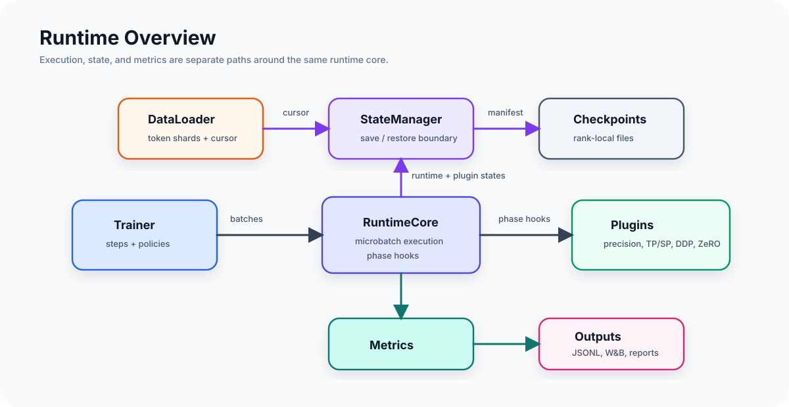

The trainer is deliberately boring. It decides how many steps to run, when to
log, and when to checkpoint. It does not know whether gradients are synchronized
by DDP, bucketed DDP, ZeRO2, or some future communication-overlap plugin.

`RuntimeCore` owns execution semantics. It knows how to run a microbatch, when
to step the optimizer, how to collect metrics, and how to drive plugin phases.
Plugins supply the distributed behavior.

`StateManager` binds together runtime state, trainer state, and dataloader
state. This split matters: the dataloader should not be owned by the runtime,
but checkpoint/resume needs both.

## Runtime Phases

The core abstraction is a sequence of runtime phases:

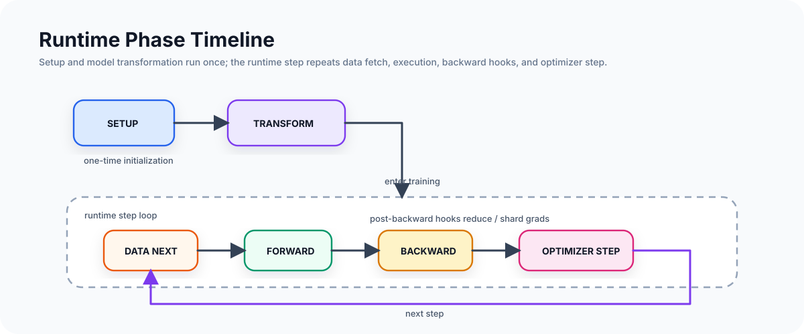

Each plugin hooks only the phases it cares about. For example:

- precision config wraps forward/backward with the desired compute dtype,
- gradient clipping runs before optimizer step,
- DDP and ZeRO plugins synchronize or shard gradients after backward,
- ZeRO3 materializes and releases parameter shards around module execution,
- performance metrics collect low-overhead step timing and memory counters.

This keeps the trainer stable as the runtime grows. Adding a new parallelism
strategy should usually mean adding a plugin, not rewriting the training loop.

The phase system is intentionally not a general-purpose event framework. It is
small and pretraining-specific by design. The goal is to expose the coordination
points distributed training actually needs, not to create another application
framework.

## Plugin Dependencies

Plugins are not just a flat list of callbacks. Some need to run before or after
others.

For example:

- tensor-parallel model transformation should happen before optimizer
  construction,
- sequence parallelism depends on the tensor-parallel layout,
- pipeline parallelism must partition the model before TP/SP/EP/ZeRO inspect
  local module structure,
- precision must wrap execution after structural transforms, otherwise plugins
  such as EP see an autocast wrapper instead of the real model interface,
- gradient clipping should run after gradients are reduced/sharded into their
  final local form,
- checkpoint annotations from TP or ZeRO need to run after local checkpoint
  entries exist.

Each plugin declares a stable plugin id and optional dependency constraints. The
runtime resolves execution order with a small topological sort before running
phase hooks.

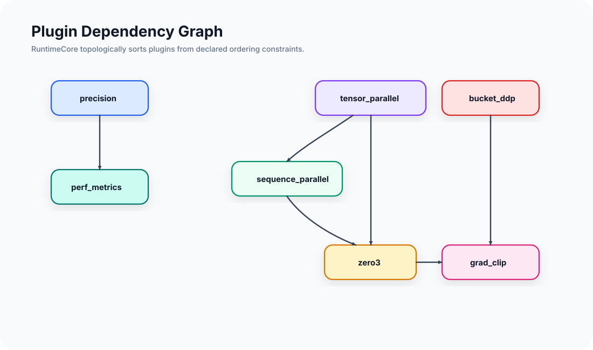

This is intentionally stricter than relying on construction order. It makes
composition explicit and catches invalid runtime configurations early.

## Model and Optimizer Lifecycle

One subtle source of bugs in distributed training systems is creating the
optimizer too early. Model transformation plugins may replace modules, shard
parameters, or wrap tensors. If the optimizer is constructed before those
transformations finish, it may hold references to the wrong parameters.

The runtime therefore supports an optimizer factory rather than a prebuilt
optimizer:

```text
construct model
  -> runtime setup
  -> plugin transform_model
  -> register final parameters
  -> build optimizer from factory
  -> validate optimizer ownership
  -> train
```

This also makes ownership explicit. In normal training, the runtime owns the
optimizer. In ZeRO-style training, a plugin may own optimizer state because it
needs to shard, save, or step it differently. The runtime validates that there
is at most one optimizer owner, and it does not accept externally constructed
optimizers or schedulers. That constraint is deliberate: if the runtime does not
control optimizer construction time, it cannot guarantee optimizer correctness
after model transformation.

## Composable Parallelism

The runtime currently covers the main pretraining axes and the interactions that
matter for correctness:

| Strategy | Implementation role |
|---|---|
| Tensor Parallelism | Shards linear layers across a TP group; introduces `ColumnParallelLinear` and `RowParallelLinear` |
| Sequence Parallelism | Partitions sequence-dimension activations around TP regions |
| DDP | Synchronous and asynchronous gradient all-reduce |
| Bucketed DDP | Gradient reduction by bucket to enable communication-compute overlap |
| Pipeline Parallelism | Stages layers across PP ranks; supports AFAB and 1F1B schedules |
| Context Parallelism | Shards sequence length across CP ranks; all-gather-KV and ring-attention variants |
| Expert Parallelism | Routes tokens to expert subsets across EP ranks; supports TP/CP dimension reuse |
| ZeRO1 | Shards optimizer state across DP ranks |
| ZeRO2 | Shards optimizer state and gradients |
| ZeRO3 | Shards optimizer state, gradients, and parameters; materializes parameters on demand |

The important point is not that every plugin is production complete. It is that
they compose through the same runtime interface. The same trainer can run
single-GPU training, TP+SP, CP, PP, EP, bucketed DDP, or DP+TP+SP+ZeRO3
without branching on strategy-specific code.

Future work follows the same plugin pattern:

- fused optimizer paths,
- communication scheduling and overlap,
- FlashAttention and custom attention kernels.

## Distributed Checkpointing

Checkpointing is where the runtime stops being just a clean training loop and
starts becoming a real distributed system.

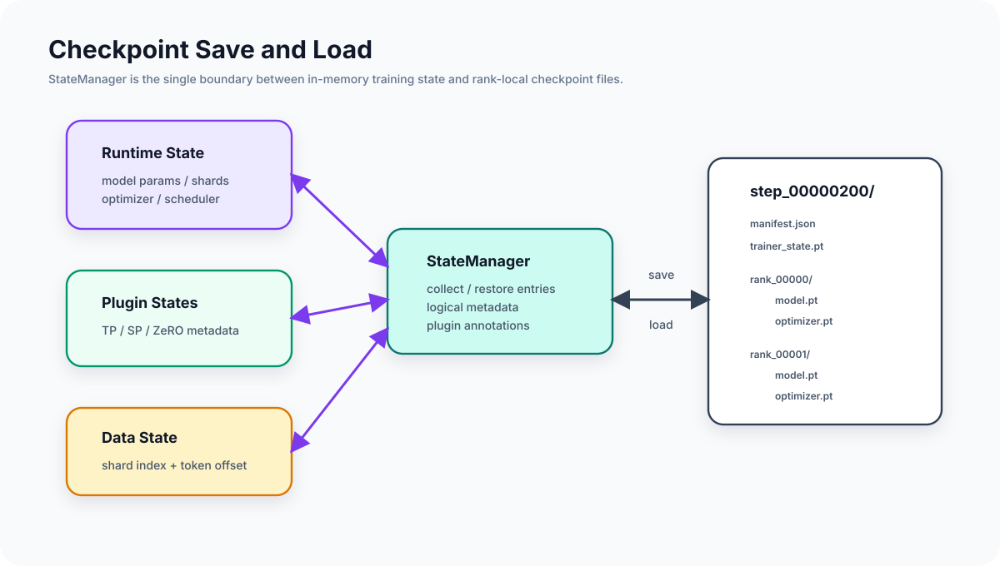

In a single-process PyTorch script, checkpointing is often just:

```python
torch.save(model.state_dict(), path)
```

That breaks down once the model is sharded. A rank-local tensor may be only one
slice of a global parameter. Optimizer state may be partitioned by data-parallel
rank. Some plugins also need to annotate checkpoint entries with extra metadata
so a restore can reconstruct the logical object.

This runtime represents checkpointed tensors as entries with fixed fields and
plugin annotations:

```text
CheckpointEntry
  name
  tensor
  logical_shape
  local_shape
  dtype
  owner
  annotations
```

The checkpoint layout is rank-local, with flat per-rank files:

```text
step_00000200/
  manifest.json
  model_rank_0.pt
  optim_rank_0.pt      # present only on ranks that hold optimizer state
  trainer_rank_0.pt
  model_rank_1.pt
  trainer_rank_1.pt
  ...
```

The local layout keeps writes simple and scalable. The logical metadata keeps
the checkpoint understandable after the fact.

Optimizer checkpointing follows the same principle. If a plugin owns the
optimizer, the plugin decides which ranks need to save optimizer shards. If the
runtime owns the optimizer, the runtime computes optimizer source ranks from the
active mesh axes. This is one of the places where "runtime-owned optimizer
lifecycle" matters beyond stepping: it also determines checkpoint semantics.

## Data Loading and Resume Correctness

Pretraining data loading is unlike a standard supervised-learning dataloader.
The training stream is a long token sequence, usually stored as token shards.
Resume correctness depends on knowing exactly where the next token should come
from.

The project uses a `PretrainingDataLoader` that tracks:

- current shard,
- token offset inside the shard,
- sequence length,
- batch size.

The dataloader is intentionally decoupled from `RuntimeCore`. The runtime does
not need to know how data is stored. The `StateManager` binds them together for
checkpointing:

```text
save checkpoint:
  runtime state
  trainer state
  dataloader state

load checkpoint:
  restore runtime
  restore trainer counters
  restore dataloader cursor
```

This makes resume a first-class part of the system rather than an afterthought.

## Metrics

The runtime logs a small set of steady-state metrics:

- loss,
- learning rate,
- gradient norm,
- step time,
- tokens per second,
- TFLOPS per GPU,
- memory allocated/reserved,
- precision overflow state.

The metric path is runtime-aware. Token counts must not be double-counted across
tensor-parallel ranks, and PP loss needs to be broadcast from the tail stage
before logging. Runtime metrics are collected by plugins and aggregated before
they are written to JSONL or W&B.

I intentionally avoided fine-grained CUDA event timing in the steady-state
training loop. Forward/backward/optimizer timing breakdowns are useful during
profiling, but they introduce synchronization points if measured naively. For
regular training, low-overhead step-level metrics are the better default.

## What I Validated

The runtime is already beyond "unit-test clean but never exercised end to end."
Its validation story has three layers:

- smoke tests for runtime core, trainer loop, and pretrain CLI
- targeted equivalence tests for TP / PP / CP / EP / ZeRO combinations
- real pretraining runs on tokenized FineWeb-Edu data with checkpoint/resume and
  W&B logging

The maintained test split mirrors that:

- `tests/run_single_feature.sh` for single-feature regressions
- `tests/run_matrix.sh` for the full-stack distributed matrix

## Experiments

The experiments use real tokenized data from FineWeb-Edu and a LLaMA-style model
with a LLaMA tokenizer. The first goal is to validate the full training path:

- real token shards,
- CUDA BF16 training,
- gradient accumulation,
- gradient clipping,
- checkpoint save/load,
- dataloader resume,
- W&B logging,
- W&B checkpoint artifacts.

The absolute performance numbers should not be read as a Megatron or DeepSpeed
comparison. The model is intentionally small, and the implementation does not
yet use FlashAttention or fused kernels. The point of these runs is to validate
runtime semantics and show how the system scales under controlled conditions.

### Experimental Setup

The setup is deliberately small, but it uses the same categories of state and
runtime behavior as a larger pretraining job.

| Component | Setup |
|---|---|
| Model | LLaMA-style decoder-only transformer |
| Tokenizer | LLaMA tokenizer |
| Data | FineWeb-Edu token shards |
| Precision | BF16 compute |
| Optimizer | AdamW |
| Logging | JSONL + W&B |
| Checkpointing | rank-local sharded checkpoints |

The single-GPU runs used two LLaMA-style model sizes:

| Config | Parameters | Layers | Hidden | Heads | MLP Hidden | Seq Len |
|---|---:|---:|---:|---:|---:|---:|
| small | 38.7M | 6 | 384 | 6 | 1,536 | 512 |
| bigger | 66.3M | 8 | 512 | 8 | 2,048 | 1024 |

### Runs

| Run | Hardware | Topology | Data | Seq Len | Purpose |
|---|---:|---|---:|---:|---|
| single baseline | 1x4090 | no distributed parallelism | 10M | 512 | validate CUDA BF16 path |
| single bigger | 1x4090 | no distributed parallelism | 10M | 1024 | validate larger workload behavior |
| resume | 1x4090 | restore from step 200 | 10M | 512 | validate model/optimizer/data resume |
| TP/SP | 2xGPU | `tp=2, sp=true` | 10M | 1024 | validate model-parallel execution |
| bucketed DDP | 2xGPU | `dp=2, ddp=bucket` | 10M | 1024 | validate bucketed gradient reduction |
| ZeRO3 composed | 4x4090 | `dp=2, tp=2, sp=true, zero=3` | 50M | 1024 | validate composed sharding |

### Results Summary

The single-GPU experiments were run on one RTX 4090 with CUDA BF16. They
validated the core pretraining path before moving to distributed runs:

- real FineWeb-Edu token shards,
- LLaMA tokenizer and 32k vocabulary,
- BF16 forward/backward,
- gradient accumulation,
- gradient clipping,
- rank-local checkpoint save/load,
- dataloader cursor restore,
- W&B metric logging.

Single 4090 summary:

| Config | Seq Len | Tokens / Step | Tokens / Sec | Step Time | TFLOPS / GPU | Reserved Memory |
|---|---:|---:|---:|---:|---:|---:|
| small | 512 | 2,048 | ~4.6k-4.8k | ~4.2s-4.6s | ~0.8 | ~1GB |
| bigger | 1024 | 4,096 | ~4.7k-5.0k | ~8.0s-8.7s | ~4.5-4.8 | ~4GB |

Small single-GPU run:

<table>
<tr>
<td></td>
<td>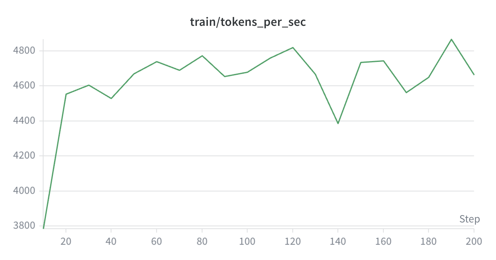</td>
</tr>
<tr>
<td>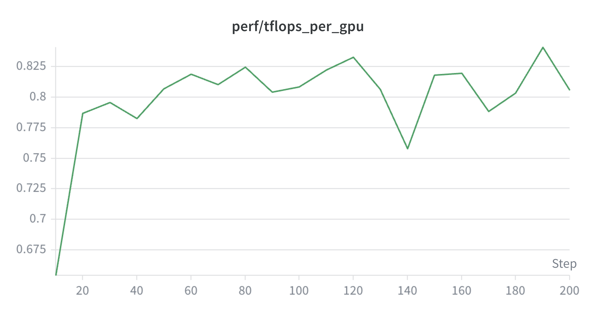</td>
<td>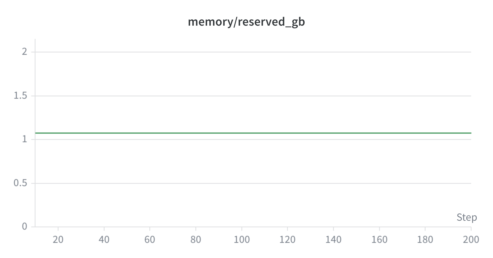</td>
</tr>
</table>

The small configuration reports low absolute TFLOPS because the workload is too
small to saturate a 4090.

For the small single-GPU run, loss decreased from roughly 2.45 to 1.65 over 200
optimizer steps. Throughput warmed up quickly and then stayed around
4.6k-4.8k tokens/sec. Reserved memory stayed flat at about 1.06GB, which is a
useful sanity check that the training loop is not accumulating GPU memory across
steps. Reported TFLOPS/GPU stabilized around 0.8, matching the expected
under-utilization of such a small workload on a 4090.

Bigger single-GPU run:

<table>
<tr>
<td>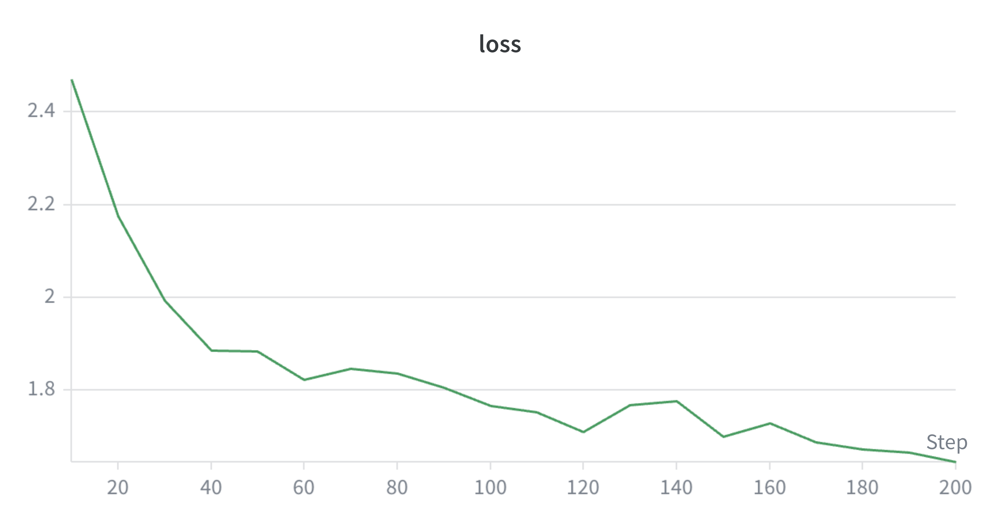</td>
<td></td>
</tr>
<tr>
<td></td>
<td></td>
</tr>
</table>

Increasing sequence length and model size raises reported TFLOPS from roughly
0.8 to 4.5-4.8 while keeping tokens/sec roughly stable. That is the expected
direction: the runtime stays stable while the workload becomes more GPU-bound.

The resume smoke restored from a rank-local checkpoint at step 200 and
continued training. With `log_every=10`, the first printed resumed step was
210, as expected. The first step after resume can be slightly slower due to
load and warmup effects, but steady-state throughput returned to the previous
range.

<table>
<tr>
<td>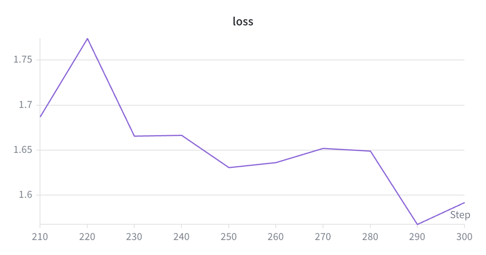</td>
<td>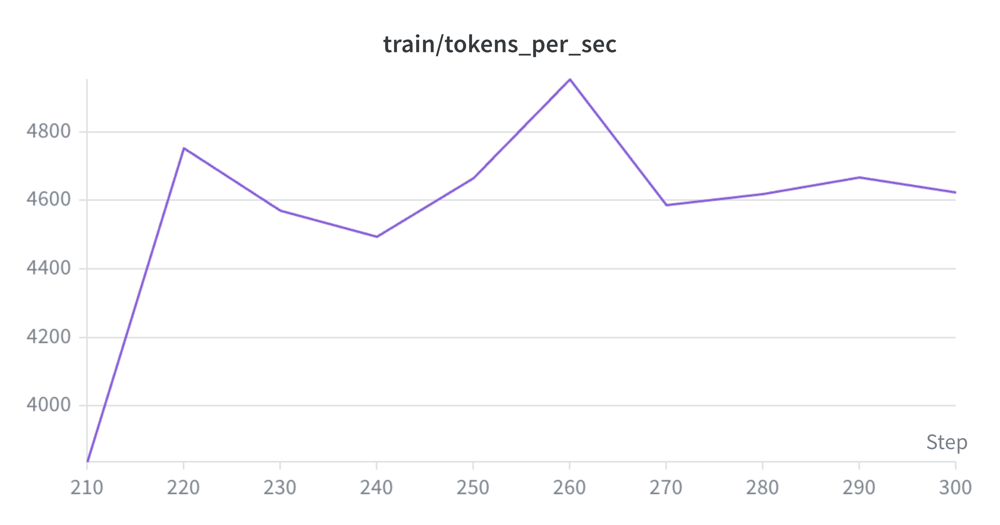</td>
</tr>
<tr>
<td>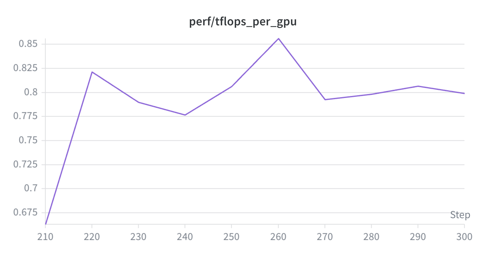</td>
<td>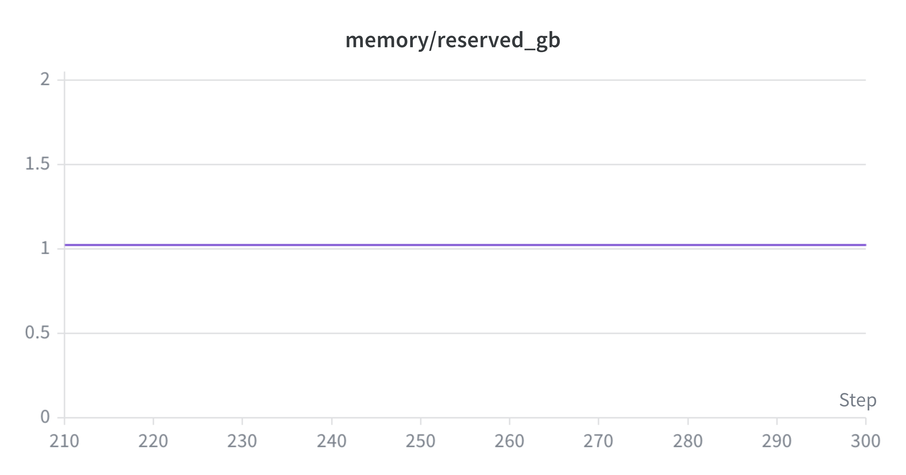</td>
</tr>
</table>

This validates that the checkpoint includes more than parameters: optimizer
state, trainer step, and dataloader cursor all need to resume together.

Loss decreased normally in both single-GPU configurations. The point of these
runs was not model quality, but end-to-end runtime correctness: data loading,
CUDA execution, optimizer state, checkpointing, resume, and logging all worked
on real tokenized data.

### Distributed Results

The 2-GPU runs validate two different distributed paths. TP+SP exercises
model-parallel transformation and sequence activation sharding. Bucketed DDP
exercises data-parallel gradient reduction. Broader PP, CP, EP, and ZeRO
coverage comes from the distributed regression suite rather than from these
specific Vast runs.

| Run | Topology | Loss Trend | Tokens / Sec | Step Time | Memory | Checkpoint / Resume |
|---|---|---|---:|---:|---:|---|
| TP/SP | `tp=2, sp=true` | 2.48 -> ~1.67 | ~2.3k-2.7k | ~7.6s-9.0s | ~1.0GB reserved | resumed 200 -> 250 |
| bucketed DDP | `dp=2, ddp=bucket` | 2.46 -> ~1.63 | ~5.6k-5.9k | ~6.9s-7.2s | ~1.07GB reserved | resumed 200 -> 250 |
| ZeRO3 composed | `dp=2, tp=2, sp=true, zero=3` | ~1.16 -> ~0.56 | ~4.2k-4.4k | ~3.8s | ~1.33GB reserved | resumed 2500 -> 3100 |

TP+SP run:

<table>
<tr>
<td>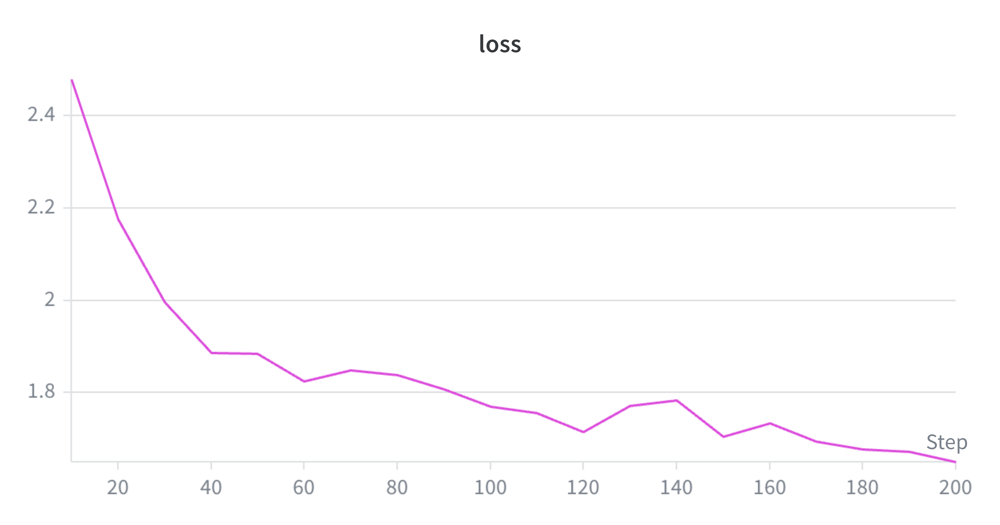</td>
<td>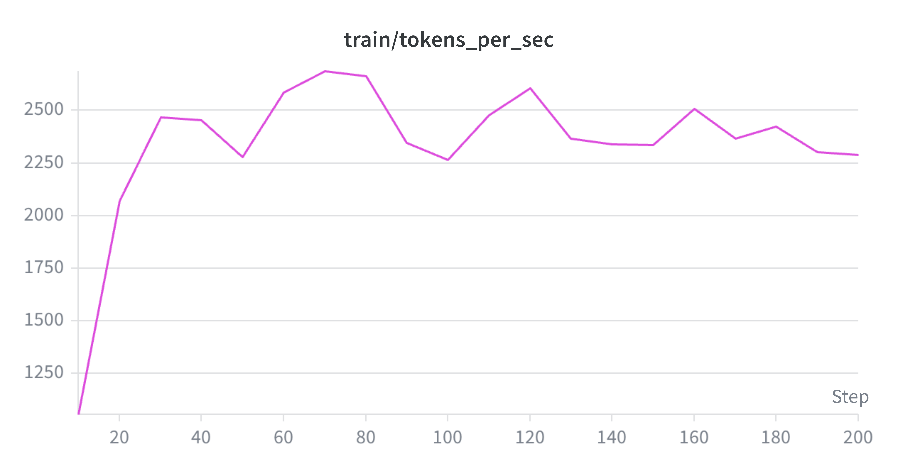</td>
</tr>
<tr>
<td>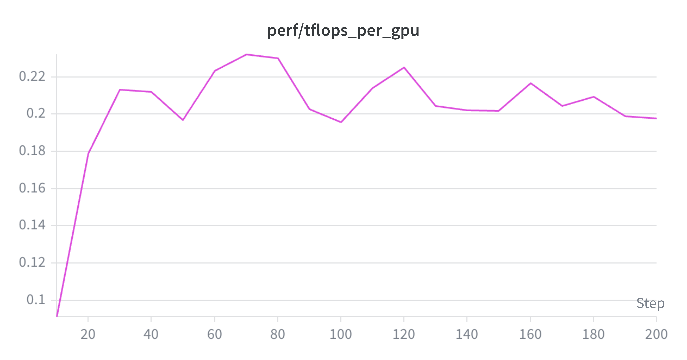</td>
<td>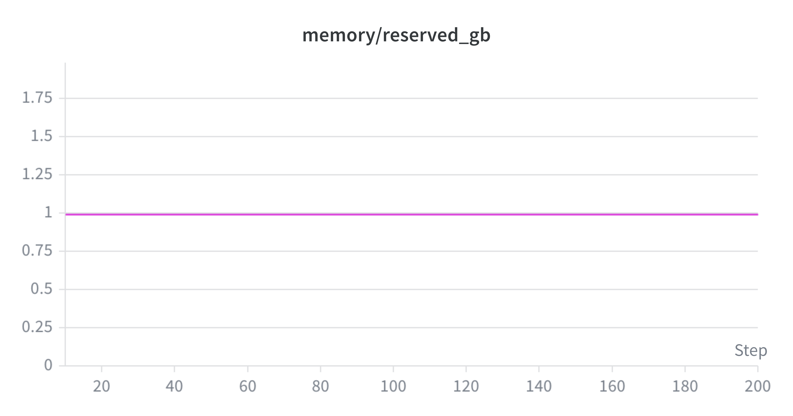</td>
</tr>
</table>

The TP+SP run is slower than the single-GPU baseline because this model is too
small for tensor-parallel communication to pay off. That is expected. The point
of the run is correctness: the model-parallel plugins transform the model, loss
decreases normally, token accounting is not double-counted across TP ranks, and
checkpoint/resume works.

Bucketed DDP run:

<table>
<tr>
<td>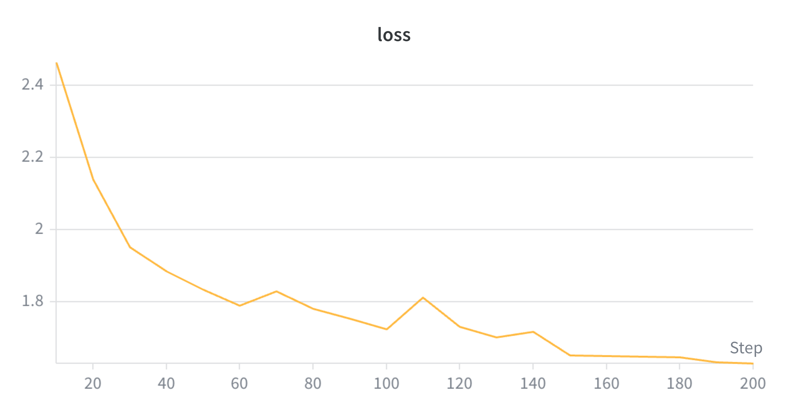</td>
<td>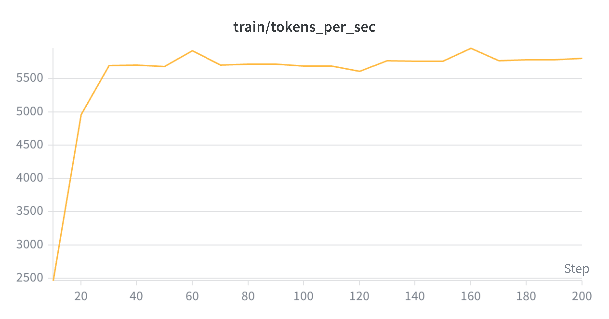</td>
</tr>
<tr>
<td>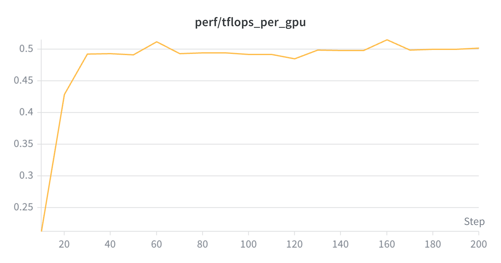</td>
<td>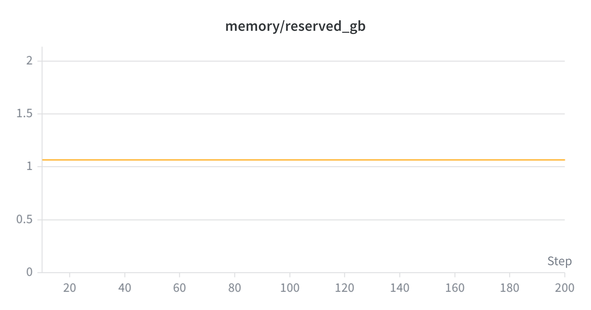</td>
</tr>
</table>

Bucketed DDP increases global tokens per optimizer step from 2,048 to 4,096 by
adding a second data-parallel replica. Throughput improves over the single-GPU
baseline, while memory stays close to the single-GPU run because DDP replicates
parameters rather than sharding them. This run validates the bucketed
gradient-reduction path.

The most important distributed run is the 4-GPU ZeRO3 composition. It exercises
the parts of the system that are hardest to fake: process-group topology,
parameter sharding, optimizer ownership, distributed checkpointing, and resume.

4-GPU ZeRO3 composed run:

<table>
<tr>
<td>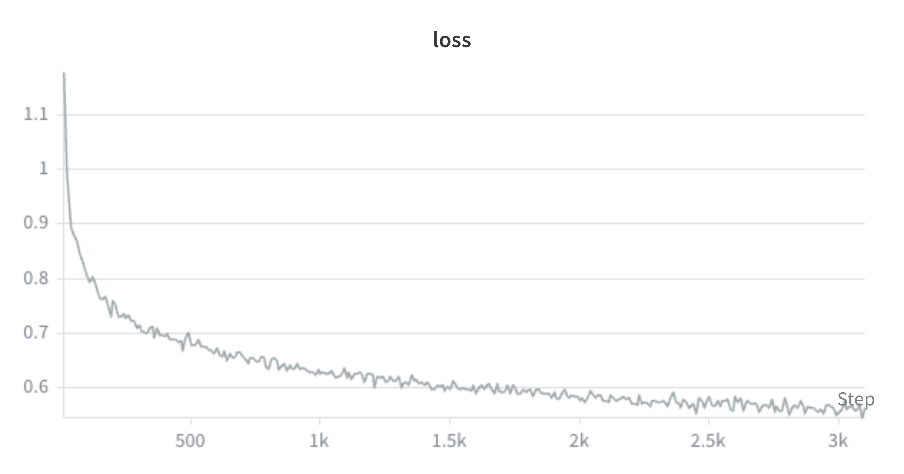</td>
<td>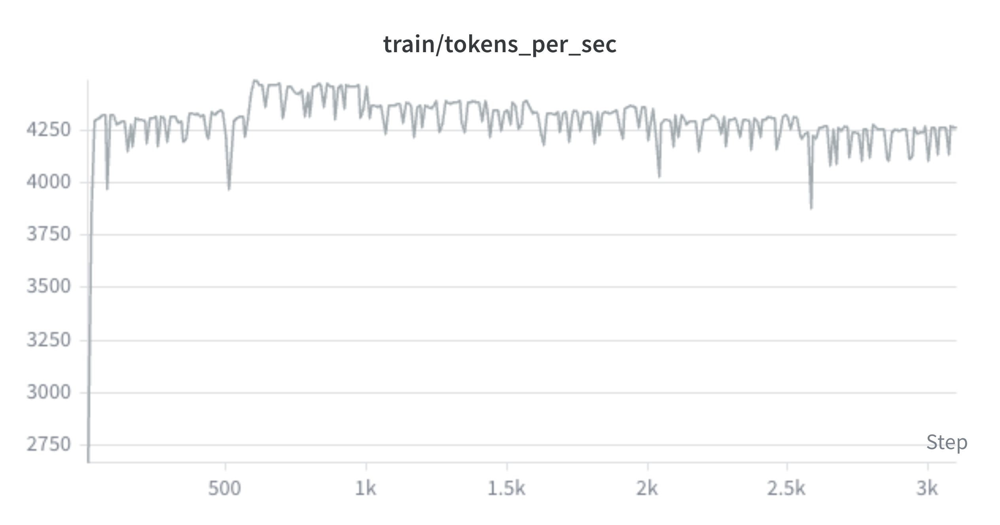</td>
</tr>
<tr>
<td>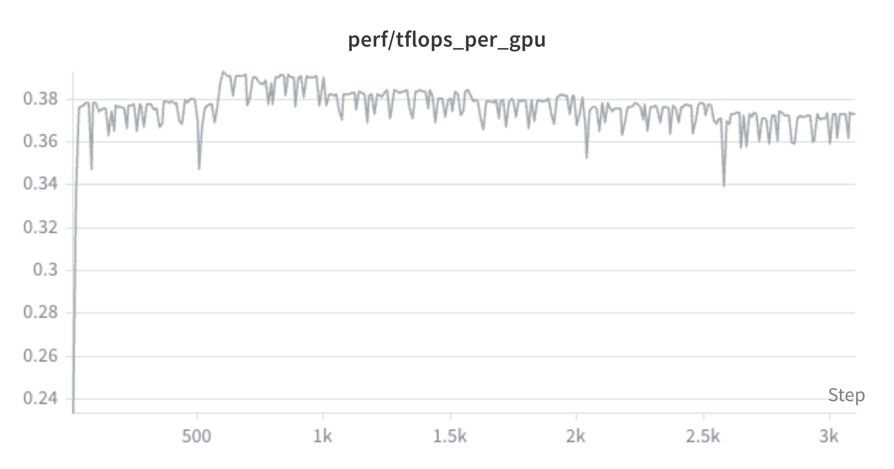</td>
<td>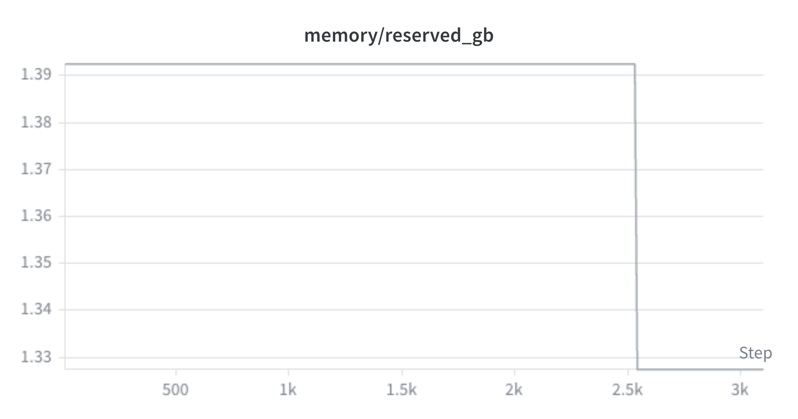</td>
</tr>
</table>

This run trained for 3,100 optimizer steps, or about 50.8M tokens. It used four
RTX 4090 GPUs with `dp=2`, `tp=2`, sequence parallelism enabled, ZeRO3, BF16
compute, gradient accumulation of 8, and gradient clipping. The final logged
loss was about 0.56. Throughput stayed around 4.2k-4.4k tokens/sec, with about
1.33GB reserved memory per GPU. That low memory footprint is expected for a
small model under TP plus ZeRO3 sharding. The throughput number is global, not
per GPU, and per-GPU throughput is lower than the single-GPU baseline because
this model is too small to amortize TP all-gather/reduce-scatter overhead. That
is expected. The point of the run is not to fill a 4090, but to prove that the
composed runtime path can train, checkpoint, resume, and export metrics on real
tokenized data.

## Lessons

**The trainer is the wrong place to encode distributed behavior.** Once a
training loop knows too much about DDP, TP, ZeRO, checkpointing, and metrics,
every new feature becomes a cross-cutting edit.

**Checkpointing defines the real boundaries of a training system.** It forces
the runtime to answer concrete questions: who owns this tensor, what is its
logical shape, which rank saves optimizer state, and what state must be restored
before the next batch is read?

**Small-scale experiments are still useful.** They do not prove large-scale
efficiency, but they catch real infrastructure bugs:

- optimizer creation before model transformation,
- double-counted token metrics under tensor parallelism,
- missing dataloader state on resume,
- incorrect optimizer checkpoint rank ownership,
- plugin interactions that only appear in composed configurations.

**Performance metrics need context.** A tiny model on a 4090 can report low
TFLOPS without indicating a broken runtime. The useful question is whether the
metric moves in the expected direction as the workload becomes larger and more
GPU-bound.

**A good training runtime is mostly about ownership boundaries.** Who owns the
optimizer? Who owns gradient synchronization? Who owns checkpoint layout? Who is
allowed to replace the step runner? Most "distributed training bugs" are really
ownership bugs that only show up once multiple strategies compose.

## What Comes Next

Two ongoing series go deeper into the runtime design. The first post in the
deep-dive series is already up:
[Why Composable Parallelism Is Hard](composable-parallelism.html).

The Pretraining Concepts series covers the full distributed training stack from
first principles, one component at a time: training loop, data loading, DDP,
TP/SP, ZeRO, PP, CP, and MoE. More pieces from both series are publishing
gradually.
