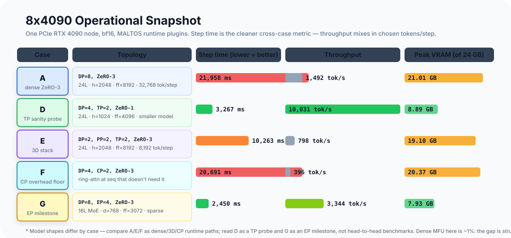
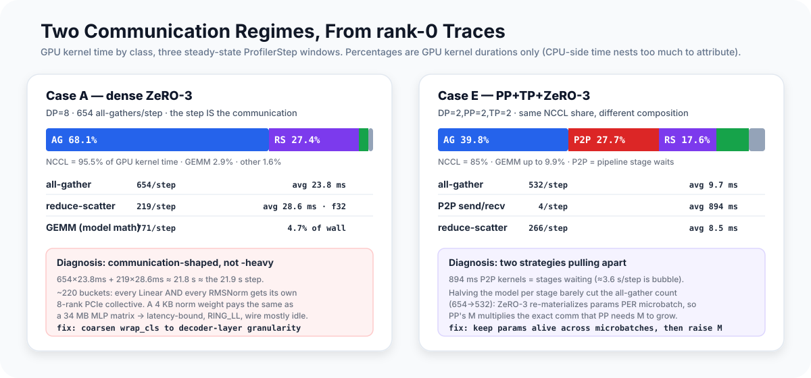

# What Actually Gets Slow on 8x4090 LLM Training

Getting a training runtime to "work" is one milestone. Getting the full stack
of ZeRO, tensor parallelism, pipeline parallelism, context parallelism, and
expert parallelism to run on a real 8x RTX 4090 node is a different one.

This post is not a benchmark shootout. It is an **operational profile** of
MALTOS on a single 8x4090 machine, aimed at a narrower question:

**Once the runtime is correct, which parallelism paths actually become slow,
and what kind of slow are they?**

That distinction matters. Consumer PCIe boxes are where a lot of independent
research and fast iteration happen. They are also where distributed design
mistakes become painfully visible. A runtime that looks clean on paper can turn
into a communication machine the moment the optimizer, topology, and trainer
start sharing a critical path.

The goal here is to show what MALTOS looks like under that pressure.

---

## Setup and Guardrails

All runs below were executed:

- on a single `8x RTX 4090` node
- in `bf16`
- with MALTOS runtime plugins, not hand-written per-case trainers

Reported metrics:

- **step time**: global max-rank average over steady-state steps
- **throughput**: global tokens per second from the same steady-state window
- **peak VRAM**: global max rank

Trace-derived observations later in the post use:

- rank-0 PyTorch profiler traces only
- Cases **A** and **E** only
- three steady-state profiled steps

So when I talk about trace evidence below, I am using it as a **signature of
pressure** inside a real run, not as a full-node, fully normalized time
attribution study.

One caveat needs to be explicit up front: not every case uses the same model
shape. Some runs are deliberately sized to stress a particular runtime path
rather than to create a fair model-for-model benchmark. So the right reading of
this dataset is:

- compare **A vs. E vs. F** as dense/3D/CP runtime paths on the same large
  model family
- read **D** as a **TP path sanity probe**, not a fair head-to-head against A
- read **G** as an **EP operational milestone**, not a dense-model throughput
  comparison

That framing is important. It keeps the claims honest.

One more practical note: **step time is the cleaner cross-case metric here**.
Throughput mixes runtime efficiency with the chosen `tokens/step`, and some
cases intentionally run different global token counts to keep the topology
operational on this hardware.

---

  

## Snapshot

<table>
  <thead>
    <tr>
      <th>Case</th>
      <th>Topology</th>
      <th>Model summary</th>
      <th>Tokens/step</th>
      <th>Step time</th>
      <th>Throughput</th>
      <th>Peak VRAM</th>
    </tr>
  </thead>
  <tbody>
    <tr>
      <td><strong>A</strong></td>
      <td>DP=8, ZeRO-3</td>
      <td>24L, h=2048, ff=8192</td>
      <td>32,768</td>
      <td>21,958 ms</td>
      <td>1,492 tok/s</td>
      <td>21.01 GB</td>
    </tr>
    <tr>
      <td><strong>D</strong></td>
      <td>DP=4, TP=2, ZeRO-1</td>
      <td>24L, h=1024, ff=4096</td>
      <td>32,768</td>
      <td>3,267 ms</td>
      <td>10,031 tok/s</td>
      <td>8.89 GB</td>
    </tr>
    <tr>
      <td><strong>E</strong></td>
      <td>DP=2, PP=2, TP=2, ZeRO-3</td>
      <td>24L, h=2048, ff=8192</td>
      <td>8,192</td>
      <td>10,263 ms</td>
      <td>798 tok/s</td>
      <td>19.10 GB</td>
    </tr>
    <tr>
      <td><strong>F</strong></td>
      <td>DP=4, CP=2, ZeRO-3</td>
      <td>24L, h=2048, ff=8192</td>
      <td>8,192</td>
      <td>20,691 ms</td>
      <td>396 tok/s</td>
      <td>20.37 GB</td>
    </tr>
    <tr>
      <td><strong>G</strong></td>
      <td>DP=8, EP=4, ZeRO-3</td>
      <td>16L MoE, d=768, ff=3072</td>
      <td>8,192</td>
      <td>2,450 ms</td>
      <td>3,344 tok/s</td>
      <td>7.93 GB</td>
    </tr>
  </tbody>
</table>

To calibrate how far these numbers are from the hardware's potential, a rough
MFU estimate (model FLOPs ÷ aggregate peak bf16 FLOPs, counting activation
recomputation; 4090 dense bf16 peak ≈ 165 TFLOPS): **Case A ≈ 1.2%, Case D ≈
2.4%, Case E ≈ 0.7%.** Production dense training on well-matched hardware
runs 35–50% MFU. The gap is not a tuning gap; it is a structural one, and the
trace sections below show exactly where it lives.

One hardware fact frames everything that follows: **RTX 4090s have no NVLink
and no peer-to-peer PCIe access** (GeForce disables P2P). Every NCCL collective
on this box bounces through host memory — each hop in a ring is
device→host→device — so per-collective latency is high and effective ring
bandwidth lands far below the PCIe 4.0 x16 line rate. This is the adversarial
interconnect for ZeRO-3-style designs that issue many small collectives, which
is precisely what makes it a good stress test: communication mistakes that
NVLink would absorb are fully visible here.

The numbers already suggest the shape of the story:

- **A** fits a reasonably large dense model, but step time is dominated by
  distributed overhead
- **E** lowers memory pressure enough to make a 3D stack operational, but does
  not magically become fast
- **F** proves the CP ring-attn path is alive — and, because this run used the
  same seq length as the dense baseline, it cleanly measures CP's *overhead
  floor* rather than its long-context benefit
- **G** shows that EP is not just conceptually implemented; it is stable enough
  to produce a usable operational profile

What matters next is *why* those paths behave differently.

---

## A: ZeRO-3 on PCIe Turns Communication Into the Main Character

Case A is the cleanest starting point because it removes TP, PP, CP, and EP
from the picture. What remains is:

- replicated forward/backward math
- ZeRO-3 parameter materialization
- ZeRO-3 gradient/state sharding

That is enough to expose the first real systems lesson.

On this machine, dense ZeRO-3 is not primarily limited by GEMM throughput. It
is limited by how often the runtime has to move sharded state through PCIe.

The rank-0 PyTorch profiler trace makes this quantitative. Aggregating GPU
kernel time by class over three steady-state steps:

| Kernel class | Share of GPU kernel time | Launches/step | Avg duration |
|---|---:|---:|---:|
| NCCL all-gather | 68.1% | 654 | 23.8 ms |
| NCCL reduce-scatter | 27.4% | 219 | 28.6 ms |
| GEMM | 2.9% | 771 | — |
| everything else (elementwise, norm, copy) | 1.6% | ~7,100 | — |

**95.5% of all GPU kernel time is NCCL.** Compute kernels — the actual model
math — occupy 4.7% of the wall-clock window. And the arithmetic closes: 654
all-gathers × 23.8 ms plus 219 reduce-scatters × 28.6 ms ≈ 21.8 s, against a
21.9 s step. The step doesn't *contain* communication. The step *is* the
communication, end to end, with compute squeezed into the cracks.

Three details in the trace sharpen the diagnosis from "communication-heavy" to
"specifically mis-shaped communication":

1. **654 all-gathers per step is a bucket-granularity problem.** The ZeRO-3
   wrap class set includes every `nn.Linear`, `nn.Embedding`, *and every
   RMSNorm* — so a 24-layer model shatters into ~220 buckets, and a 2048-element
   norm weight (4 KB!) gets the same 8-rank PCIe collective as a 34 MB MLP
   matrix. At ~24 ms average per collective, this is latency-bound, not
   bandwidth-bound: the wire is mostly idle while the launches serialize.
2. **The reduce-scatter runs in fp32** (`ReduceScatter_Sum_f32` in the kernel
   name) — gradients cross PCIe at 4 bytes/element when the params travel at 2.
   That doubles the gradient-sync bytes for free.
3. **NCCL chose the LL (low-latency) protocol** (`RING_LL`) for these message
   sizes, which trades away roughly half the effective bandwidth — reasonable
   for small messages, and another tell that the buckets are too small.

There is also a CPU-side echo: ~3,800 `aten::to`/`aten::copy_` calls per step
totaling tens of seconds of blocked CPU time — dtype and shard-buffer traffic
around the materialization path serializing kernel launches.

  

The figure above is built directly from the raw PyTorch profiler traces, not
from a hand-written conceptual diagram. Each horizontal strip shows where one
class of events appears inside a single steady-state `ProfilerStep#2` window on
rank 0. I grouped the original event stream by runtime role so the trace stays
readable in article form.

One accounting note for honesty: CPU-side event time in these traces overlaps
and nests too much to attribute trustworthily, which is why all percentages
above are computed from *GPU kernel durations only* — those don't lie about
what the device was doing. (A subtlety: an NCCL ring kernel on PCIe spends most
of its "GPU time" waiting on the wire while occupying SMs, so "GPU busy 99.9%"
and "GPU doing useful math 4.7%" are simultaneously true. That gap is the whole
story.)

The conclusion is unambiguous: **dense ZeRO-3 on a PCIe 8x4090 box is not
communication-heavy; it is communication-shaped.** The runtime's parameter
materialization policy — bucket granularity, gradient dtype on the wire,
prefetch and overlap — is not a tuning knob here. It is the first-order
performance decision.

That is a useful result for MALTOS. It means the runtime has moved beyond
"correctness demo" territory into the zone where those policies are worth
serious engineering effort — and the trace says exactly which one to start
with.

---

## E: 3D Parallelism Is a Capacity Path Before It Is a Throughput Path

Case E stacks:

- `PP=2`
- `TP=2`
- `ZeRO-3`

on the same large dense model family as Case A.

This run matters because it tests a real composition story, not an isolated
feature. If a runtime claims support for TP, PP, and ZeRO independently, that
is still much easier than making the combined stack coherent in one trainer and
one optimizer ownership model.

The good news is that the stack works. The less cheerful news is that consumer
PCIe hardware sends a clear bill for it.

Compared with Case A:

- peak VRAM drops from `21.01 GB` to `19.10 GB`
- tokens/step also drops by `4x`, from `32,768` to `8,192`
- even with that smaller step payload, step time is still `10.26s`

That is the right way to read 3D parallelism here:

- first as a **capacity path**
- only later, with better overlap and tuning, as a **throughput path**

The trace explains why. Aggregating GPU kernel time over three steady-state
steps on rank 0:

| Kernel class | Share of GPU kernel time | Launches/step | Avg duration |
|---|---:|---:|---:|
| NCCL all-gather | 39.8% | 532 | 9.7 ms |
| NCCL P2P send/recv | 27.7% | 4 | **894 ms** |
| NCCL reduce-scatter | 17.6% | 266 | 8.5 ms |
| GEMM | 9.9% | 648 | — |
| everything else | 5.0% | ~5,500 | — |

NCCL is still 85% of GPU kernel time, but the composition changed, and two
features of this table deserve a hard look.

**The P2P kernels are 894 ms each.** A pipeline activation tensor at this size
is ~17 MB — about 2 ms of PCIe transfer. The other ~890 ms is the *wait*: the
`SendRecv` kernel sits on the stream until the peer stage arrives at its
matching call, so pipeline stall time shows up inside the kernel duration
rather than as visible idle. Roughly 3.6 s of the 10.3 s step — a third — is
stages waiting for each other. That is the bubble plus stage imbalance, and on
a trace it masquerades as "communication."

**There are 532 all-gathers per step — but each stage holds only half the
layers.** Case A needed 654 for the full model. Halving the model should have
roughly halved the count; instead it barely moved. The reason is that ZeRO-3
re-materializes parameters *per microbatch*: with 4 PP microbatches, each
bucket is gathered and freed once per microbatch traversal rather than once per
step. PP multiplies ZeRO-3's communication volume by the microbatch count —
exactly the M that PP needs to raise to shrink its bubble. The two strategies'
tuning knobs point in opposite directions, and that interaction is invisible
until you count collectives in a trace.

This is the systems reality of 3D training on a PCIe box. You still pay the
ZeRO-3 bill — now multiplied by microbatches — and you add TP collectives and
PP stage-boundary waits on top.

That is not an argument against 3D parallelism. It is an argument against
pretending that "supports PP+TP+ZeRO-3" automatically means "efficient PP+TP+ZeRO-3".
It does not. The runtime has to earn that second claim through overlap,
microbatch tuning, and better communication scheduling.

In practice, I would describe Case E as a proof that MALTOS has crossed the
most important boundary first: the stack is operational. Optimization comes
next.

---

## F: Context Parallelism's Overhead, Measured Where It Has No Benefit

Case F exercises the `CP=2` ring-attention path under ZeRO-3 — and one
configuration detail matters enormously for reading it honestly: **this run
used `seq=2048`, the same sequence length as the dense baseline** — that is what
the recorded `8,192 tok/s` over `dp=4 × batch=1` resolves to. (The case was
originally specced for longer sequences, and the snapshot header still carries
the `seq=4096` label from that spec; the recorded tokens/step is the ground
truth, and it says 2048. I am reading the data, not the label.)

That makes F useless as a long-context story — and unexpectedly useful as
something else: a measurement of CP's *pure overhead*. At seq=2048, CP=2 has
no job to do. The sequence fits comfortably on one rank; splitting it in half
buys nothing and costs the full ring machinery: per-layer KV rotation through
ranks, online-softmax accumulation, CP gradient synchronization.

The price for running CP where it isn't needed:

- `20,691 ms` step time for 8,192 tokens — against Case A's effective
  ~5,500 ms for the same token count (A: 21,958 ms for 4× the tokens)
- `396 tok/s`
- `20.37 GB` peak VRAM — essentially the same as A's 21.01 GB, because at this
  sequence length there is no activation pressure for CP to relieve

So the honest readings are:

- the CP ring path executes inside the same orchestration model as everything
  else — no side trainer, no bespoke launch script — and survives a real
  multi-strategy run; and
- CP at a sequence length that doesn't need it costs roughly **4× over dense**
  on this interconnect. That number is the floor you must overcome before CP
  pays for itself; the crossover lives at the sequence lengths where dense
  attention stops fitting, which this dataset does not yet measure.

The missing experiment is obvious — the same case at seq=8K/16K/32K, where CP
either earns its keep or doesn't. That is the follow-up this section is
honest about not yet having.

---

## G: Expert Parallelism Is Operational, Not Just Implemented

Case G is the most important *breadth* datapoint in the set.

This run is not directly comparable to the dense cases because the model is
smaller and sparse. That is fine. Its value is different.

What it shows is that:

- `EP=4`
- `ZeRO-3`
- the same runtime phase model
- the same plugin ordering and optimizer ownership rules

all survive contact with a real MoE training path.

That matters because EP is where runtime architecture starts getting exposed.
Once expert and non-expert parameters need different reduction groups, different
bucket rules, and different post-reduction behavior, a fragile system usually
collapses into special cases. MALTOS does not. It keeps the EP path inside the
same runtime contract.

Operationally, the run is also healthy:

- `2,450 ms` step time
- `3,344 tok/s`
- `7.93 GB` peak VRAM

Again, do not over-read the number against dense baselines. The important
statement is narrower and stronger: **the EP stack is alive enough to profile,
measure, and reason about as part of the same system.**

That is a much higher bar than "the MoE forward pass compiles."

---

## D: The TP Path Is Not the Problem Here

Case D is the outlier in the table because it uses a smaller model and a
lighter sharding setup:

- `TP=2`
- `ZeRO-1`
- no PP
- no CP

The reason to keep it in the article is not to inflate the throughput chart. It
is to show what happens when the stack removes the heaviest ZeRO-3 and pipeline
costs and lets TP run in a relatively clean setting.

The result is straightforward:

- `3,267 ms` step time
- `10,031 tok/s`
- `8.89 GB` peak VRAM

So if someone looks at A or E and asks whether "tensor parallelism on PCIe is
the real problem," the answer from this dataset is: **not by itself**. The more
severe costs in these runs come from the combined communication structure around
ZeRO-3, PP, and CP, not from the mere existence of TP.

One calibration, though: D's 10k tok/s is still only ~2.4% MFU. "Fastest case
in the table" and "healthy" are different claims — even the cleanest path here
leaves ~97% of the silicon idle. D bounds how much of A's and E's pain is
attributable to their *extra* machinery; it does not certify the baseline.

That is why I treat D as a sanity probe. It helps separate "TP exists" from
"the whole distributed stack is communication-dense."

---

## What This Dataset Does Not Claim

There are a few claims I am deliberately **not** making.

- This is **not** a fair benchmark across identical model shapes, identical
  tokens/step, and identical optimization targets.
- The A/E trace comparison is **not** a full-node load-balance study. It is a
  rank-0 signature comparison used to show which communication regimes become
  visible once the runs are already operational.
- This is **not** evidence for how the same runtime would behave on NVLink or
  frontier-class interconnects. The point of this post is the opposite: to show
  what becomes expensive on a single PCIe 8x4090 box.

That may sound limiting, but it is actually what makes the post useful. It
keeps the conclusions tied to the data we actually have, rather than the data I
wish I had.

---

## What I Would Optimize Next

The traces don't just say "slow" — they rank the fixes. In order of measured
leverage:

### 1. Bucket granularity: stop all-gathering norm layers individually

654 collectives per step at ~24 ms each *is* Case A's step time. Wrapping at
decoder-layer granularity instead of per-`Linear`/per-`RMSNorm` collapses ~220
buckets to ~26, turning latency-bound dribble into bandwidth-bound transfers.
Back-of-envelope: the same bytes in 26 collectives instead of 654 should cut
the all-gather wall time by 5–10× on this interconnect. This is a config-level
change (`wrap_cls`) plus whatever bucket-size plumbing it exposes — by far the
highest leverage-to-effort ratio in the entire dataset.

### 2. Gradient dtype on the wire

`ReduceScatter_Sum_f32` means gradient sync moves 4 bytes/element where
parameters move 2. Reducing in bf16 (with fp32 accumulation at the optimizer)
halves reduce-scatter bytes — a straight ~2× on the 27% of GPU time Case A
spends there. Needs a numerics check (bf16 ring reductions reorder sums), which
is exactly what the equivalence suite exists to answer.

### 3. Don't re-gather per microbatch under PP

Case E shows ZeRO-3's gather count barely drops when the per-stage model
halves, because every microbatch re-materializes every bucket. Keeping
materialized parameters alive across a step's microbatches (freeing only at
step end) trades memory headroom — which Case E has, at 19 GB of 24 — for a
~4× cut in all-gather traffic at M=4. Longer term, this is the argument for a
parameter-lifetime policy that is schedule-aware rather than module-hook-naive.

### 4. Right-size the strategy to the model

An honest item: a 1.3B model on 24 GB cards does not need ZeRO-3. Parameters,
bf16 gradients, and fp32 Adam moments fit replicated (~16 GB). ZeRO-1 with one
flat all-reduce per step would move ~5 GB per rank instead of Case A's
per-bucket storm — likely a 5–15× end-to-end speedup *with no new code*. Case A
earns its place as a stress test of the ZeRO-3 path, but the fastest
optimization is sometimes configuration honesty: shard because you must, not
because you can.

### 5. PP stall time and microbatch tuning

E's P2P kernels hide ~3.6 s/step of stage waiting. More microbatches shrink the
bubble but multiply item 3's re-gather cost until it is fixed — so the order of
operations matters: fix parameter lifetime first, then raise M, then revisit
the schedule.

### 6. CP needs its real experiment before its optimization

F measured CP's overhead floor (4× over dense at a seq length that doesn't need
CP). Before optimizing ring overlap or attention kernels, run the seq-length
sweep (8K/16K/32K vs. dense-with-recomputation) to find where CP's crossover
actually sits on this hardware. Optimizing a path before knowing its break-even
point is how effort gets misallocated.

### 7. Keep perf profiling as part of the runtime contract

One practical lesson from this whole exercise is that correctness tests and
performance diagnostics need to live close together. MALTOS now has:

- correctness matrices that catch topology regressions
- profiler traces that show where the runtime spends time once correctness is in
  place

That is the right combination. A distributed runtime should not only answer
"does this topology work?" It should also answer "what kind of pain did it
introduce?"

---

## Why This Snapshot Matters

The most important result here is not a single headline throughput number.

It is that the same runtime can execute:

- dense ZeRO-3
- TP-integrated training
- PP + TP + ZeRO-3
- CP ring attention
- EP + ZeRO-3

on a real 8x4090 node, while exposing the actual systems tradeoffs instead of
hiding them behind simplified benchmarks.

That is the point of MALTOS.

Not just to claim support for more parallelism modes on paper, but to make
their interactions inspectable, testable, and debuggable under realistic
training pressure.
