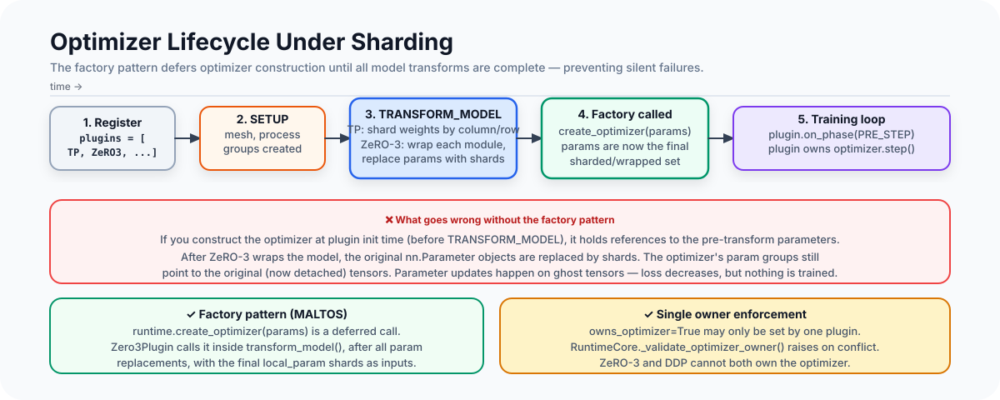

# The Optimizer Lifecycle Under Sharding

In single-GPU training, the optimizer is trivial to set up: `optimizer =
AdamW(model.parameters(), lr=3e-4)`. The parameters are known at model creation
time, and the optimizer holds references to them permanently.

In distributed training under sharding, this breaks in ways that are easy to
introduce and hard to debug.

The problem starts with `model.parameters()`: after ZeRO-3 replaces each `nn.Linear`'s
weight with a shard, the original parameter tensors are detached from the model. An
optimizer created before sharding holds references to those detached tensors, runs
`AdamW.step()` faithfully on every iteration, and produces a loss curve that
decreases plausibly — because the loss is computed against the reshaped model, not
the tensors the optimizer is updating. You get the illusion of training.

This article covers the factory pattern that prevents this, the single-ownership
enforcement that prevents optimizer state conflicts, and the deferred construction
timeline that makes it possible to compose TP, ZeRO, and PP without writing
special-cased optimizer initialization code.

---

<div class="article-figure">
  
</div>

---

## The Setup Sequence

`RuntimeCore.setup()` runs in a specific order:

```python
def setup(self) -> None:
    # 1. Bind plugins (each plugin gets a reference to the runtime)
    for plugin in self.plugins:
        plugin.bind(self)

    # 2. SETUP phase: create process groups, initialize NCCL
    self._run_phase(RuntimePhase.SETUP)

    # 3. Plugin transform_model: each plugin modifies the model in turn
    for plugin in self.plugins:
        self.model = plugin.transform_model(self.model)

    # 4. StateManager registers the (now transformed) model
    self.state_manager.register_module(self.model)

    # 5. TRANSFORM_MODEL phase notification
    self._run_phase(RuntimePhase.TRANSFORM_MODEL)

    # 6. Build runtime-owned optimizer, if no plugin owns it
    self._maybe_build_runtime_optimizer()

    # 7. Validate ownership
    self._validate_optimizer_owner()
```

The key question is: when is `create_optimizer()` called? For a ZeRO-3 run, the
answer is inside `Zero3Plugin.transform_model()` — step 3. For a plain DDP run,
it's `_maybe_build_runtime_optimizer()` — step 6. In both cases, it happens after
all parameter transformations are complete.

---

## Why Parameters Change During transform_model

`transform_model` is where the model's parameter set gets reshuffled. Three kinds
of transformation happen:

**Tensor parallelism shards weight tensors in-place**:

```python
# In TensorParallelPlugin.transform_model:
model.set_submodule(
    rule.module_path,
    ColumnParallelLinear.from_linear(module, self.tp_group, ...)
)
```

`ColumnParallelLinear.from_linear()` slices the original weight along the column
axis and stores the slice as its `self.weight` parameter. The original `nn.Linear`
is replaced in the model's module hierarchy. After this call, `model.parameters()`
now returns the TP-sharded slices, not the original full weights.

**ZeRO-3 wraps modules and replaces parameters with shards**:

```python
# In Zero3Plugin._make_bucket:
full_param = torch.zeros(buffer_size, dtype=dtype, device=device)
# copy original params into full_param...
shard_len = buffer_size // world_size
shard_start = rank * shard_len
local_param = nn.Parameter(full_param[shard_start:shard_end].clone())
```

Each original parameter is replaced by a shard. After ZeRO-3's `transform_model`,
`model.parameters()` does not return the sharded `local_param`s — those are stored
in `bucket.local_param`, not in the module hierarchy. The module's parameters now
point to temporary `param.data` buffers that get swapped out during forward/backward.

**Precision plugin (if used) may cast parameters**:

Mixed-precision training might keep master parameters in fp32 while the forward pass
uses bf16. A precision plugin that manages master parameters needs the optimizer to
work on fp32 copies, not the bf16 parameters visible in the model.

All three transformations must complete before the optimizer is created. The factory
pattern is what enforces this ordering.

---

## The Deferred Factory

`RuntimeCore` stores an optimizer factory function rather than an optimizer:

```python
@dataclass
class RuntimeCore:
    optimizer_factory: OptimizerFactory | None = None
    scheduler_factory: SchedulerFactory | None = None
    optimizer: torch.optim.Optimizer | None = None
    scheduler: torch.optim.lr_scheduler.LRScheduler | None = None
```

The `create_optimizer` method invokes the factory on demand:

```python
def create_optimizer(self, params: Iterable[nn.Parameter]) -> torch.optim.Optimizer:
    if self.optimizer_factory is None:
        raise ValueError("optimizer_factory is required to create an optimizer")
    return self.optimizer_factory(params)
```

Plugins call this inside their `transform_model` method, after they have established
the final parameter set. For ZeRO-3:

```python
# Zero3Plugin.transform_model:
self._prepare_buckets(model)  # establishes final local_param shards
optimizer_params = [bucket.local_param for bucket in self.buckets]
self.optimizer = self.runtime.create_optimizer(optimizer_params)
self.scheduler = self.runtime.create_scheduler(self.optimizer)
```

For plain DDP (no plugin owns the optimizer):

```python
# RuntimeCore._maybe_build_runtime_optimizer (called AFTER all transform_model):
def _maybe_build_runtime_optimizer(self) -> None:
    if self._plugin_owns_optimizer():
        return  # a plugin built it already
    self.optimizer = self.create_optimizer(self.model.parameters())
    self.scheduler = self.create_scheduler(self.optimizer)
```

In the DDP case, `self.model.parameters()` at this point returns the TP-sharded
parameters (if TP is active) or the full parameters (if no TP). Either way, it
reflects the final state after all `transform_model` calls.

---

## The Single-Owner Rule

An optimizer step is not a read-only operation. It modifies parameters and updates
internal state (the Adam moment buffers). If two entities both call `optimizer.step()`
on overlapping parameters, they will conflict: both will try to update the same
parameters, the moment buffers will be double-updated, and the effective learning rate
will be wrong.

In practice, the conflict looks like this:
- ZeRO-3 plugin owns the optimizer (it was created with the ZeRO shard params)
- Some other plugin also calls `optimizer.step()` at `PRE_STEP`
- Both steps fire → double update → training instability

MALTOS prevents this with an explicit ownership check:

```python
def _validate_optimizer_owner(self) -> None:
    runtime_owners = ["runtime"] if self.optimizer is not None else []
    plugin_owners = [plugin.id.value for plugin in self.plugins if plugin.owns_optimizer]
    if len(plugin_owners) > 1:
        raise ValueError(
            f"RuntimeCore allows only one optimizer-owning plugin, got {plugin_owners}"
        )
    if runtime_owners and plugin_owners:
        raise ValueError(
            "Runtime optimizer ownership is mutually exclusive with optimizer-owning plugins, "
            f"got {runtime_owners + plugin_owners}"
        )
```

This runs at `setup()` time — before training begins — so the error surfaces
immediately rather than producing incorrect results silently during a training run.

The ownership flag is set on the `RuntimePlugin` base class:

```python
@dataclass
class RuntimePlugin:
    id: PluginId
    name: str
    owns_optimizer: bool = False  # ZeRO-1/2/3 set this to True
    # ...
```

`DataParallelPlugin` (plain DDP) does not set `owns_optimizer`. It performs the
all-reduce in `POST_BACKWARD` but leaves the actual optimizer step to the runtime.
`Zero1Plugin`, `Zero2Plugin`, and `Zero3Plugin` all set `owns_optimizer=True` because
they need to control exactly which parameters are updated and in what order.

---

## Step Execution: Plugin vs. Runtime Optimizer

At the `PRE_STEP` phase, whoever owns the optimizer runs it:

```python
# RuntimeCore.step_optimizer:
def step_optimizer(self) -> None:
    self._run_phase(RuntimePhase.PRE_STEP)
    if not self._plugin_owns_optimizer():
        # Runtime owns it: run the optimizer directly
        grad_norm = torch.nn.utils.clip_grad_norm_(
            self.model.parameters(), self.max_norm
        )
        self.optimizer.step()
        if self.scheduler is not None:
            self.scheduler.step()
    self._run_phase(RuntimePhase.POST_STEP)
```

When a plugin owns the optimizer, `_plugin_owns_optimizer()` returns True and the
runtime skips its own step. The plugin is expected to have run its optimizer inside
`PRE_STEP`:

```python
# Hypothetical ZeRO plugin on_phase:
def on_phase(self, phase: RuntimePhase) -> None:
    if phase == RuntimePhase.PRE_STEP:
        self._wait_grad_sync()  # wait for reduce-scatter to complete
        clip_grad_norm_(self.sharded_params, self.max_norm)
        self.optimizer.step()   # update local shards
        self.scheduler.step()
```

The separation ensures no double-stepping, regardless of which plugins are loaded.

---

## Gradient Clipping Under Sharding

Gradient norm computation is subtle under parameter sharding. `clip_grad_norm_`
computes `||g||₂ = sqrt(sum(gᵢ²))` over all parameters. If each rank only has
sharded parameters and sharded gradients, each rank computes a partial norm — the
square root of the sum of its own shard's squared gradients.

To get the correct global norm, ranks need to all-reduce their partial norms before
clipping:

```python
# Conceptually (how ZeRO-1/2/3 should clip):
local_norm_sq = sum(g.norm()**2 for g in local_params if g.grad is not None)
global_norm_sq = dist.all_reduce(tensor([local_norm_sq]), op=SUM, group=dp_group)
global_norm = global_norm_sq.sqrt()
scale = min(1.0, max_norm / global_norm)
for g in local_params:
    if g.grad is not None:
        g.grad.mul_(scale)
```

A naive `clip_grad_norm_` on sharded parameters computes the wrong norm (the partial
norm, not the global norm), then clips based on that wrong value. The effective
clipping is inconsistent across ranks.

In MALTOS, the `GradClipPlugin` is a separate plugin that explicitly gathers partial
norms across the sharded axes and applies the correct global norm clip. This is one
of the non-obvious interactions in the optimizer lifecycle: clipping, which looks like
a local operation, actually requires distributed communication when gradients are sharded.

---

## Optimizer State in Checkpoints

When the runtime saves a checkpoint, optimizer state must be correctly associated
with the parameters it updates.

For a plain DDP run, each rank holds identical parameters and an identical optimizer
state. Only one rank per DP group needs to save the optimizer state — the manifest
records which rank by setting `optimizer_source_ranks[i] = 0` for all ranks.

For a ZeRO-1/2/3 run, each rank's optimizer handles different parameters. Rank 0's
optimizer holds Adam moments for parameters 0..N/4; rank 1's optimizer holds moments
for parameters N/4..N/2. On resume, rank 0 must load rank 0's optimizer state, not
rank 1's.

The manifest's `optimizer_source_ranks` field encodes this:

```json
{
  "optimizer_source_ranks": [0, 0, 2, 2]
}
```

This says: rank 0 and rank 1 load their optimizer state from rank 0's file;
ranks 2 and 3 load from rank 2's file. The pattern depends on the specific ZeRO
implementation. With ZeRO-1 at dp=4, each rank owns its own optimizer state, so
`optimizer_source_ranks = [0, 1, 2, 3]`. With ZeRO-3 where ranks are paired in
groups of 2, it might be `[0, 0, 2, 2]`.

The runtime computes this mapping:

```python
def optimizer_state_source_rank(self, rank_id: int) -> int:
    if self._plugin_owns_optimizer():
        for plugin in self.plugins:
            if plugin.owns_optimizer:
                return plugin.optimizer_state_source_rank(rank_id)
    # No plugin owns the optimizer: compute from mesh axes
    replicated_axes, sharded_axes = self._runtime_optimizer_mesh_axes()
    # Set coordinates for replicated-but-not-sharded axes to 0
    # (those ranks all share the same optimizer state)
    ...
```

Each ZeRO plugin overrides `optimizer_state_source_rank()` to return the correct
rank for its sharding strategy.

---

## The TP Interaction: Sharded Optimizer Along Two Axes

When TP and ZeRO-3 are both active (the TP+ZeRO-3 configuration), the parameter
set seen by the optimizer is doubly-sharded: TP shards along the feature dimension,
ZeRO-3 shards along the DP dimension.

This creates an unusual optimizer structure: each rank's optimizer handles parameters
that are:
1. A column/row slice of the original weight matrix (TP shard)
2. A further subset of that slice (ZeRO-3 shard)

The Adam moment buffers match the shape of these doubly-sharded parameters — not the
shape of the full original weight. A checkpoint that was saved with TP=2, ZeRO-3, dp=4
cannot be loaded into a TP=1, ZeRO-3, dp=8 configuration without resharding the
optimizer state.

MALTOS's current checkpoint loader validates that the saved world size matches the
runtime world size:

```python
def _validate_manifest_for_runtime(manifest, runtime):
    runtime_world_size = dist.get_world_size() if dist.is_initialized() else 1
    if manifest.world_size != runtime_world_size:
        raise ValueError(
            f"checkpoint world_size mismatch: "
            f"checkpoint={manifest.world_size}, runtime={runtime_world_size}"
        )
```

Topology changes (changing world size, changing TP degree) between checkpoints are
not yet supported. The validation ensures you find out at load time, not after
running for 1,000 steps on a subtly wrong optimizer state.

---

## Practical Failure Modes

**Failure 1: Creating the optimizer before ZeRO-3 wraps**

```python
# WRONG:
optimizer = AdamW(model.parameters(), lr=3e-4)
runtime = RuntimeCore(..., plugins=[Zero3Plugin()])
runtime.setup()
# After setup(), model.parameters() are ZeRO-3 shards
# but optimizer still references the original (now detached) tensors
```

The optimizer happily runs. The loss decreases because the model is being trained
(the ZeRO-3 plugin runs its own optimizer correctly). But `optimizer.state_dict()`
contains Adam moments for the wrong parameters. A checkpoint save would write
garbage optimizer state that could not be correctly resumed.

With the factory pattern, the user never calls `AdamW(model.parameters())` directly.
They provide a factory function:

```python
runtime = RuntimeCore(
    optimizer_factory=lambda params: AdamW(params, lr=3e-4),
    ...
)
```

And the factory is called at the right time, with the right parameters.

**Failure 2: Two plugins both owning the optimizer**

If both `BucketDataParallelPlugin` and `Zero3Plugin` are loaded in a hypothetical
misconfiguration, and both tried to own the optimizer, the validation step would raise:

```
ValueError: RuntimeCore allows only one optimizer-owning plugin,
  got ['data_parallel', 'zero3']
```

Without this check, both plugins would call `optimizer.step()` on overlapping
parameters, producing a double-update that manifests as an effective 2× learning rate
— trainable, but wrong, and invisible without careful analysis of the loss curve.

**Failure 3: Gradient norm from partial gradients**

After reduce-scatter (ZeRO-2/3), each rank only has the gradient shard for its own
parameters. A naive `clip_grad_norm_()` over `model.parameters()` would compute the
norm over the full parameter set but only the local gradient — a shape mismatch.
In practice, many implementations silently produce wrong gradient norms by computing
over `local_param.grad` without the cross-rank all-reduce.

---

## What "owns_optimizer" Really Means

The `owns_optimizer` flag does three things:

1. **It prevents the runtime from building its own optimizer** (`_maybe_build_runtime_optimizer` returns early)
2. **It prevents the runtime from calling `optimizer.step()`** at `PRE_STEP`
3. **It tells the checkpoint system to delegate optimizer source rank computation** to the plugin

These three consequences are linked: a plugin that owns the optimizer takes full
responsibility for the complete optimizer lifecycle — creation, stepping, state
serialization, and checkpoint metadata. It can't half-own it.

This is by design. An optimizer that is partially owned is an optimizer where two
entities share mutable state without coordination. The exclusive ownership invariant
is what makes the optimizer lifecycle predictable.

---

## The Step-Context Connection

One implementation detail: the optimizer step only runs at the step boundary, not
after every micro-step. The `StepContext` tracks this:

```python
@dataclass
class StepContext:
    grad_accum_steps: int = 1
    microbatch_idx: int = 0

    def advance_micro_step(self) -> bool:
        self.microbatch_idx += 1
        if self.microbatch_idx >= self.grad_accum_steps:
            self.microbatch_idx = 0
            return True  # is_step_boundary
        return False
```

The trainer calls `step_optimizer()` only when `run_step()` returns `should_step=True`.
The optimizer-owning plugin's `PRE_STEP` handler only runs at that point. ZeRO-3's
reduce-scatter is triggered at `POST_BACKWARD` when `is_step_boundary` is True — not
on intermediate micro-steps.

This coordination is invisible to the optimizer: it only sees `optimizer.step()` called
once per logical step, with the correctly accumulated gradients, regardless of how many
micro-steps contributed.

---

## Summary

The optimizer lifecycle under sharding has five properties that must hold:

1. **Deferred creation**: optimizer is created after all `transform_model` calls
2. **Exclusive ownership**: exactly one entity (runtime or one plugin) calls `optimizer.step()`
3. **Correct parameter references**: optimizer param groups reference the final sharded
   tensors, not pre-transform copies
4. **Correct gradient norm**: norm computation involves cross-rank communication when
   gradients are sharded
5. **Correct checkpoint mapping**: each rank's optimizer state is associated with the
   correct source rank in the manifest

Each of these is a separate invariant that can be violated independently. The factory
pattern enforces (1) and (3) together. The ownership validation enforces (2).
The GradClipPlugin enforces (4) for sharded configurations. The manifest system
enforces (5). They compose: you can add ZeRO-3 to a TP run without touching any of
the optimizer step logic, because the invariants are checked at setup time rather than
assumed at step time.
