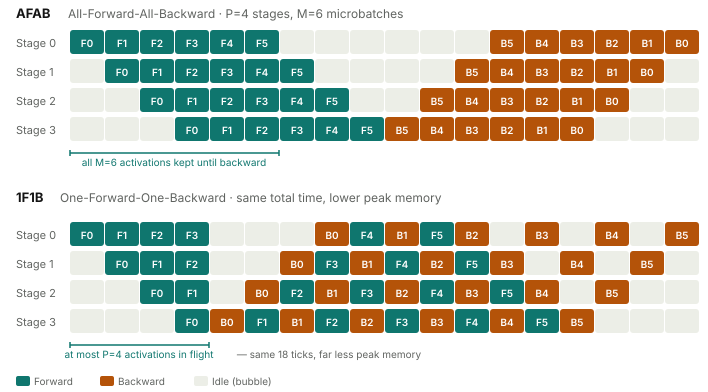

# Pipeline Parallel Schedules

Pipeline parallelism (PP) partitions a model's layers across multiple GPUs. Stage 0
holds layers 0–15, stage 1 holds layers 16–31, and so on. Data flows through stages
like an assembly line: stage 0 computes a forward pass and sends its output
activations to stage 1, which sends to stage 2, and so on until the last stage
computes the loss and starts backward.

The naive problem: with `N` stages, at any given moment only one stage is computing.
The other `N−1` are idle, waiting for activations to arrive. This is the **pipeline
bubble** — the fraction of total compute time spent idle.

The solution is **microbatching**: split the training batch into `M` microbatches
and inject them into the pipeline before the first microbatch's backward pass
arrives. While stage 0 is idle waiting for stage 1's backward pass, it can be
running forward passes for later microbatches.

The **schedule** determines which microbatches are processed in which order, on
which stages, at each time step. The schedule determines the pipeline bubble, memory
peak, and the complexity of the synchronization between stages.

---

<div class="article-figure">
  
</div>

---

## The Two Schedules

MALTOS implements two schedules, selectable via the `schedule` parameter of
`PipelineParallelPlugin`:

**All-Forward-All-Backward (AFAB)**: run all `M` forward passes on all stages, then
run all `M` backward passes. Simple to implement. Has the worst memory footprint: all
`M` sets of intermediate activations must be kept alive simultaneously for the backward
passes. Useful for debugging and for large numbers of microbatches where the pipeline
bubble is small relative to the useful work.

**1-Forward-1-Backward (1F1B)**: after the initial "warmup" phase (which fills the
pipeline), each stage alternates between one forward and one backward. Only a bounded
number of activation sets are live at any time — at most `stage_count` sets, not `M`
sets. The steady-state pipeline bubble fraction approaches `1/M` as `M` grows.

The schedule is encoded as a list of `_PipelineAction` objects:

```python
@dataclass(frozen=True)
class _PipelineAction:
    kind: _PipelineActionKind   # FORWARD or BACKWARD
    microbatch_idx: int          # which microbatch
    backward_step_idx: int = 0  # used to track backward ordering
```

The driver loop iterates through actions:

```python
for action in self._build_schedule(num_microbatches):
    if action.kind == _PipelineActionKind.FORWARD:
        total_loss = self._run_forward_action(...)
    else:
        self._run_backward_action(...)
```

Each action corresponds to one microbatch's forward or backward pass through this
stage. The schedule is computed per-stage — each stage has a different action sequence.

---

## AFAB Schedule Construction

For `M` microbatches, AFAB is:

```python
def _build_afab_schedule(self, num_microbatches):
    actions = [
        _PipelineAction(kind=FORWARD, microbatch_idx=i)
        for i in range(num_microbatches)
    ]
    actions.extend(
        _PipelineAction(kind=BACKWARD, microbatch_idx=i, backward_step_idx=j)
        for j, i in enumerate(range(num_microbatches - 1, -1, -1))
    )
    return actions
```

Backward runs in reverse order: microbatch `M-1` backward first, then `M-2`, ...,
then 0. This matches the standard gradient flow: the loss for the last microbatch
was computed last, so its backward pass runs first.

Every stage runs the same `M` forward actions followed by `M` backward actions. The
only difference between stages is when they receive inputs — stage 0 starts immediately,
stage 1 waits for stage 0's first forward output, and so on. The "pipeline filling"
lag is implicit in the send/receive operations.

**Memory peak for AFAB**: at the moment the first backward action runs, all `M`
intermediate activation tensors are alive — one per microbatch. For a transformer
with sequence length 4096 and model dimension 4096, each activation set might be
2–4 GB. With `M=8` microbatches, peak activation memory is 16–32 GB. This is often
prohibitive for large models.

**Bubble fraction for AFAB**: the fraction of time each stage spends idle. Stage 0
is idle for the time it takes all other stages to complete their forward passes
(waiting for backward to arrive from stage `N-1`). The bubble fraction is
approximately `(N-1)/(N-1+M)` — it decreases as `M` increases, but never reaches
zero because the pipeline always has a startup and teardown phase.

---

## 1F1B Schedule Construction

The 1F1B schedule has two phases: **warmup** and **steady state**.

**Warmup**: each stage does a number of forward passes equal to the stages ahead of
it in the pipeline. Stage 0 (the first stage) has `N-1` stages ahead of it and
does `N-1` forward passes in warmup. Stage `N-1` (the last stage) has 0 stages
ahead of it and skips warmup entirely.

```python
def _build_1f1b_schedule(self, num_microbatches):
    # warmup: how many forward passes before the first backward
    warmup = min(self.stage_count - self.stage_index - 1, num_microbatches)
    remaining = num_microbatches - warmup

    actions = []

    # Warmup phase: forward-only
    for micro_idx in range(warmup):
        actions.append(_PipelineAction(kind=FORWARD, microbatch_idx=micro_idx))

    # Steady state: 1F1B
    for backward_step_idx in range(remaining):
        forward_microbatch_idx = warmup + backward_step_idx
        if forward_microbatch_idx < num_microbatches:
            actions.append(_PipelineAction(kind=FORWARD, ...))
        actions.append(_PipelineAction(kind=BACKWARD, microbatch_idx=backward_step_idx, ...))

    # Drain: remaining backwards
    for backward_step_idx in range(remaining, num_microbatches):
        actions.append(_PipelineAction(kind=BACKWARD, ...))

    return actions
```

For a 4-stage pipeline with 4 microbatches:

| Stage | Warmup | Steady state | Drain |
|---|---|---|---|
| Stage 0 | F0, F1, F2 | F3+B0, B1 | B2, B3 |
| Stage 1 | F0, F1 | F2+B0, F3+B1 | B2, B3 |
| Stage 2 | F0 | F1+B0, F2+B1, F3+B2 | B3 |
| Stage 3 | — | F0+B0, F1+B1, F2+B2, F3+B3 | — |

At any point in steady state, at most `N` activation sets are live (one per stage).
The backward pass frees each activation set as it completes, so the memory stays
bounded at `N` sets regardless of `M`.

**This is the key advantage of 1F1B over AFAB**: activation memory is O(stages),
not O(microbatches). For a 4-stage pipeline with 8 microbatches, AFAB keeps 8
activation sets alive; 1F1B keeps at most 4 alive.

---

## Forward Action: Activation Send

When a forward pass completes on a non-final stage, the output activations must be
sent to the next stage. This is a point-to-point P2P operation:

```python
def _run_forward_action(self, *, micro_batches, states, action, total_loss):
    # ... receive input activations from previous stage (if not stage 0) ...
    self.runtime._forward_step_impl(model_input)  # run the model stage
    state.input_activation = input_activation

    if self.next_global_rank is None:  # last stage
        state.raw_loss = self.runtime.state.loss
        return total_loss  # compute loss, don't send

    # Not the last stage: send activations to next stage
    output = self.runtime.state.outputs
    state.activation_send_work = self._send_activation_async(output, states[action.microbatch_idx])
    return total_loss
```

The send is asynchronous: `_send_activation_async` launches a non-blocking
`dist.isend()` and returns a work handle. The handle is waited on at the end of
the full pipeline step (after all forward and backward actions):

```python
for state in states:
    if state.activation_send_work is not None:
        state.activation_send_work.wait()  # ensure all sends complete
    if state.grad_send_work is not None:
        state.grad_send_work.wait()
```

Asynchronous sends allow the next action (possibly the next microbatch's forward)
to start while the send is in flight. This overlaps computation with communication.

---

## Backward Action: Gradient Receive and Send

The backward pass is the inverse of forward: the last stage generates a loss gradient
and sends it upstream; each upstream stage receives the gradient, runs backward through
its layers, and sends the gradient further upstream:

```python
def _run_backward_action(self, *, states, action):
    state = states[action.microbatch_idx]

    if self.next_global_rank is None:  # last stage
        # Last stage: backward from the loss
        self.runtime.state.loss = state.raw_loss
        self.runtime._backward_step_impl()
        # No gradient to receive from downstream (there is no downstream for last stage)
    else:
        # Non-last stage: receive grad from next stage, backward through local model
        grad = self._recv_grad_async(state)
        # ... wait for grad recv ...
        self.runtime._backward_step_impl(grad_output=grad)

    # Send gradient of input activations back to previous stage
    if self.prev_global_rank is not None and state.input_activation is not None:
        if state.input_activation.grad is not None:
            state.grad_send_work = self._send_grad_async(
                state.input_activation.grad, state
            )
```

The gradient send is also asynchronous — the next action can start while the
gradient is in transit.

---

## The `pp_cur_microbatch_idx` in ZeRO-3

One of the non-obvious interactions between PP and ZeRO-3: ZeRO-3 maintains a
separate set of buffers per microbatch (`exec_states = [_BucketExecState(...) for _ in range(num_microbatches)]`).
This is because in PP, the same ZeRO-3 bucket might be accessed by multiple
microbatches' forward/backward passes simultaneously (in the pipeline sense — one
microbatch is doing forward while another is doing backward).

The `exec_state` for each bucket is indexed by `pp_cur_microbatch_idx`, which
the runtime tracks:

```python
context.set_pp_state(microbatch_idx=action.microbatch_idx, status=PpStatus.FORWARD)
```

When ZeRO-3's `_materialize_full_params` runs, it uses
`self._exec_state(bucket)` which looks up the correct `exec_states[pp_cur_microbatch_idx]`:

```python
def _exec_state(self, bucket):
    if len(bucket.exec_states) == 1:
        return bucket.exec_states[0]  # PP=1: always exec_states[0]
    assert self.runtime is not None
    context = self.runtime.state.step_context
    return bucket.exec_states[context.pp_cur_microbatch_idx]
```

Without this per-microbatch state isolation, two microbatches' forward passes
would clobber each other's `data_buffer` — microbatch 1's forward materialization
would overwrite microbatch 0's buffer before microbatch 0's backward had a chance
to read it.

This is a case where the interaction between two plugins (PP and ZeRO-3) requires
state that neither plugin can independently manage — it must be coordinated through
the runtime's shared step context.

---

## Pipeline Bubble Analysis

The pipeline bubble is the fraction of time each stage spends idle. For an ideal
1F1B schedule with `N` stages and `M` microbatches:

```
bubble fraction = (N-1) / (N-1 + M)
```

For N=4, M=4: bubble = 3/7 ≈ 43%. Nearly half the time is wasted.
For N=4, M=8: bubble = 3/11 ≈ 27%.
For N=4, M=16: bubble = 3/19 ≈ 16%.

The bubble fraction decreases as `M/N` grows. Typical practice is `M = 8*N` to keep
the bubble under 12%. But larger `M` means smaller microbatches, which reduces
arithmetic intensity per microbatch and hurts GPU utilization. The practical choice
is a balance: large enough `M` to reduce bubble, small enough microbatches that each
microbatch still saturates the GPU's tensor cores.

**The zero-bubble schedule** (not yet implemented in MALTOS) achieves near-zero
bubble fraction by exploiting that the backward pass for weights can be deferred
relative to the backward pass for activations. This allows the schedule to run
forward passes on some stages while other stages are still processing backward, with
more careful interlocking to avoid stalls. The theory is clean; the implementation
requires more complex state tracking and careful handling of the weight gradient
buffering.

---

## What the Papers Leave Unspecified

Several implementation details that matter for correctness are not fully specified
in the PP papers:

**How to handle the last stage's loss when earlier stages receive the loss from
later stages**: only the last pipeline stage sees the labeled data and computes the
loss. Earlier stages need a scalar loss value for logging purposes. MALTOS broadcasts
it from the last stage:

```python
def _broadcast_loss(self, total_loss, sample_batch):
    # Only last stage has total_loss; broadcast to all stages
    if total_loss is None:
        total_loss = torch.zeros(1, dtype=..., device=...)
    else:
        total_loss = total_loss.reshape(1)
    dist.broadcast(total_loss, src=self.last_global_rank, group=self.pp_group)
    return total_loss
```

**How gradient accumulation interacts with PP microbatches**: in standard training,
`grad_accum_steps` controls how many forward-backward passes before an optimizer step.
With PP, each "step" is already `M` microbatches. MALTOS treats the PP microbatches
as a single logical step — the gradient accumulation loop counts optimizer steps, not
microbatches. The ZeRO-3 reduce-scatter fires once at the end of the full PP step,
after all `M` microbatches' gradients have been computed.

**How to handle intermediate stages that see neither input data nor compute loss**:
intermediate stages receive activations from the previous stage and forward/backward
through their layers. They don't see the original batch — they receive hidden states.
The model must implement `PipelineParallelizableModule` to declare which layers
belong to which stage, and the PP plugin replaces the model with only the local stage's
layers at `transform_model` time.

**The activation send buffer layout**: activations are arbitrary-shape tensors. The
P2P send/receive requires knowing the shape in advance (to allocate a receive buffer).
MALTOS uses a fixed buffer size derived from the model's `hidden_size` and a maximum
sequence length configuration. Non-standard activation shapes require explicit buffer
pre-allocation.

---

## Activation Memory vs. Gradient Memory

Under 1F1B, the memory breakdown per stage at steady state is:

- **Live activations**: `N` sets (where N = number of stages = how deep in the pipeline
  we are at the warmup boundary)
- **Model parameters**: local stage parameters only (1/N of the full model per stage)
- **Parameter gradients**: accumulate during backward; freed after optimizer step
- **ZeRO-3 buffers**: if ZeRO-3 is active, per-microbatch exec_states × bucket count

The dominant cost for large models is often the activations. Activation checkpointing
(recomputation) can reduce this: instead of storing activations during forward for use
during backward, the stage recomputes them from the saved input. This trades compute
for memory — at the cost of ~33% more FLOPs for an activation-checkpointed layer.

PP and activation checkpointing compose: each stage can independently decide which
of its layers to checkpoint. The pipeline schedule does not need to change — the
recomputation happens transparently when the backward pass requests the activation.

---

## PP and the RuntimePhase System

Unlike other parallelism plugins, PP doesn't just hook into existing phases — it
overrides the step runner entirely:

```python
def transform_model(self, model):
    ...
    # Override the default step runner with the pipeline step runner
    self.runtime._run_step_fn = MethodType(
        lambda runtime, batch: self._run_pipeline_step(batch), self.runtime
    )
```

The pipeline step runner takes the place of the standard `_run_step_impl()`, replacing
the single forward-backward with the full pipeline schedule loop. The `_forward_step_impl`
and `_backward_step_impl` calls inside `_run_pipeline_step` still fire the same
`PRE_FORWARD`, `POST_FORWARD`, `PRE_BACKWARD`, `POST_BACKWARD` phases — so other
plugins (precision casting, ZeRO-3 hooks) still receive those phase notifications.

This design is what allows PP to compose with ZeRO-3, TP, and SP without any of those
plugins needing to know that a pipeline schedule is running. The phases they care about
still fire in the same order; the only difference is that they fire multiple times per
optimizer step (once per microbatch in the pipeline).

---

## Experiment Placeholder

> **[Placeholder: PP bubble fraction vs. microbatch count on real hardware]**
> Measure actual GPU utilization (not just theoretical bubble fraction) for
> AFAB vs. 1F1B at various M/N ratios with pp=4 on a 4-GPU setup.
> Key question: does the theoretical bubble analysis hold in practice, or does
> communication latency change the balance? Expected: 1F1B wins on memory;
> AFAB may win on throughput at large M due to simpler synchronization pattern.

---

## Summary

The pipeline schedule is the bridge between the clean abstraction (stages process
microbatches in an assembly line) and the messy reality (stage idle time, memory
peaks, synchronization between concurrent forward and backward passes). The
implementation in MALTOS shows several non-obvious interactions:

- ZeRO-3 needs per-microbatch exec state to avoid clobbering between concurrent microbatches
- The schedule is computed independently per stage, but the actions must be consistent
  across all stages for the P2P sends/receives to align
- The step runner is replaced wholesale — other plugins use phase hooks, but PP takes
  over the execution engine
- Gradient accumulation counts logical steps, not microbatches
- The loss is a global broadcast from the last stage, not a local computation

A zero-bubble schedule is achievable with further splitting of the backward pass into
a weight-gradient phase and an activation-gradient phase. The infrastructure changes
needed (separate backward steps for weights and activations, more exec states, different
phase hookup) are understood but not yet implemented.
