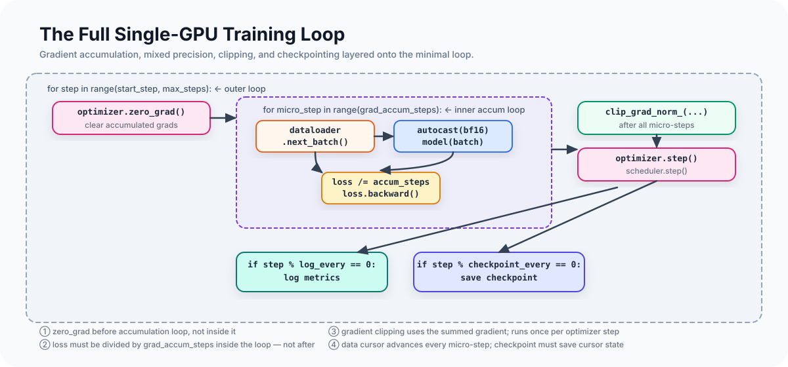

# The Pretraining Loop, From Scratch

Pretraining a language model is fundamentally a loop: get a batch of tokens,
compute the loss, backpropagate, update the parameters, repeat. Every technique
in this series — mixed precision, gradient accumulation, distributed parallelism,
checkpointing — is in service of running that loop more efficiently, on more
data, and without it breaking.

This article builds the loop from scratch, identifies where the simplest version
breaks down, and shows how the structure needs to change to accommodate scale.

---

## The Minimal Training Loop

Start with the smallest correct version:

```python
model = GPT(vocab_size=32000, n_layers=6, d_model=384).to("cuda")
optimizer = torch.optim.AdamW(model.parameters(), lr=3e-4, weight_decay=0.1)

for step in range(max_steps):
    batch = get_next_batch()  # {"input_ids": Tensor[B, T], "labels": Tensor[B, T]}
    loss = model(batch)
    loss.backward()
    optimizer.step()
    optimizer.zero_grad()
    print(f"step={step}  loss={loss.item():.4f}")
```

This is a real training loop. A small language model trained with this code on
real data will learn. The loss will decrease. But it has several problems that
become significant at any real scale.

---

## Problem 1: Memory Limits Batch Size

The effective batch size for LLM pretraining is typically in the millions of
tokens per optimizer step. A GPT-3-scale training run uses a batch size of
roughly 3 million tokens per step.

A single forward pass on one GPU can only fit as many tokens as fit in memory.
For a 40GB A100, that might be 512 tokens × 32 sequences = 16,384 tokens per
step. To reach 3M tokens per step you would need either 183 A100s running DDP,
or gradient accumulation.

**Gradient accumulation** runs multiple forward/backward passes before each
optimizer step, accumulating gradients:

```python
optimizer.zero_grad()
for micro_step in range(grad_accum_steps):
    batch = get_next_batch()
    loss = model(batch) / grad_accum_steps  # scale before backward
    loss.backward()
# gradients have accumulated across all micro-steps
torch.nn.utils.clip_grad_norm_(model.parameters(), max_norm=1.0)
optimizer.step()
```

The division by `grad_accum_steps` is not optional. Without it, the sum of
gradients across micro-steps is `grad_accum_steps` times larger than the gradient
from a single full-batch forward pass. The optimizer step would take an
`grad_accum_steps`-times larger update, which is equivalent to multiplying the
learning rate by that factor.

With the division, the gradient from 8 micro-steps of batch size 16 is
numerically equivalent to one forward pass with batch size 128. This is the
intended behavior: gradient accumulation should be transparent to the optimizer.

---

## Problem 2: Float32 Is Expensive

Modern GPUs execute matrix multiplications roughly twice as fast in `bfloat16`
as in `float32`. The difference between training a 7B-parameter model in 10 days
and 20 days is often just precision.

**Mixed precision** uses lower precision for the compute-intensive forward and
backward passes while maintaining higher-precision optimizer state:

```python
with torch.autocast(device_type="cuda", dtype=torch.bfloat16):
    loss = model(batch) / grad_accum_steps
loss.backward()
```

The autocast context manager handles the dtype conversions automatically. Inside
the context, operations that benefit from lower precision (linear layers,
attention) run in `bfloat16`. Operations that need full precision (layer norm,
loss computation) stay in `float32`. PyTorch maintains an internal allowlist of
which operations cast.

**`bfloat16` vs `float16`**. For LLM training, `bfloat16` is strongly preferred
over `float16`:

- `bfloat16` has the same 8-bit exponent range as `float32`, so it can represent
  the same magnitude of numbers without overflow
- `float16` has only a 5-bit exponent and overflows at values above ~65,500 —
  common in attention logits and gradient norms during LLM training
- `float16` training requires a `GradScaler` that multiplies the loss by a large
  factor before backward to avoid gradient underflow, then divides out before the
  optimizer step; `bfloat16` generally does not

If you are training on older hardware that doesn't support `bfloat16` (pre-A100),
the `float16` path with a gradient scaler looks like:

```python
scaler = torch.amp.GradScaler()
with torch.autocast(device_type="cuda", dtype=torch.float16):
    loss = model(batch) / grad_accum_steps
scaler.scale(loss).backward()
if micro_step == grad_accum_steps - 1:
    scaler.unscale_(optimizer)
    torch.nn.utils.clip_grad_norm_(model.parameters(), max_norm=1.0)
    scaler.step(optimizer)
    scaler.update()
```

Note that gradient clipping must run after `unscale_` — the scaler has inflated
the gradient norms, and clipping against the inflated norms would clip too early.

---

## Problem 3: The Data Loop Is Wrong

The naive `get_next_batch()` abstraction hides a mismatch between how pretraining
data is structured and how supervised learning data is structured.

In supervised learning, a dataset is a finite set of labeled examples. You
shuffle them, iterate through all of them once per epoch, then repeat.

In pretraining, the dataset is a long token sequence — billions of tokens — from
which you construct overlapping windows. There are no natural epoch boundaries in
most pretraining runs (many runs are shorter than one full pass through the data).
Shuffling individual windows loses local context that contributes to the training
signal.

The data pipeline for pretraining is a **stateful cursor** over a sequential
token stream:

```python
class PretrainingDataLoader:
    def __init__(self, dataset, seq_len, micro_batch_size):
        self.shard_idx = 0
        self.token_offset = 0

    def next_batch(self) -> dict[str, torch.Tensor]:
        # read seq_len + 1 tokens, return input_ids and labels (shifted by 1)
        ...
```

The `+1` in `seq_len + 1` deserves explanation. Each training example predicts
the next token at each position. An example with sequence length `T` consumes
`T` input tokens and `T` label tokens. The labels are the inputs shifted left by
one position:

```
input_ids:  [t_0, t_1, t_2, ..., t_{T-1}]
labels:     [t_1, t_2, t_3, ..., t_T    ]
```

So each window consumes `T + 1` raw tokens from the stream. This affects every
calculation: batch size in tokens, DP stride, initial rank offset.

The article [How We Store and Stream Tokens](how-we-store-and-stream-tokens.html)
covers the data pipeline in detail. For now, the key point is that `next_batch()`
is not a stateless function — it advances a cursor, and that cursor state must be
saved in checkpoints.

---

## Problem 4: Nothing Survives a Crash

A pretraining run that trains for 8,000 steps and crashes at step 8,001 starts
from scratch unless it has been checkpointing. Checkpointing is not an
optimization; it is required infrastructure.

A correct resume needs more than the model weights. It needs:

- **Model state**: parameters and buffers
- **Optimizer state**: Adam's first and second moment estimates, step count
- **Scheduler state**: current learning rate position in the schedule
- **Data cursor**: current shard and token offset
- **RNG state**: CPU and CUDA random states, to reproduce stochastic operations

Model-only checkpoints are a common mistake. A run resumed from model weights
alone will start with a fresh optimizer — fresh first and second moments, fresh
step count — and the first several thousand steps will look like a warm-up even
if the model is well-trained. The effective training will be slower than
continuing from the correct optimizer state.

Data cursor checkpointing is subtler. A run that resumes without restoring the
data cursor will re-read tokens the model has already seen, or read from a
different position than where training left off. The loss may continue
decreasing, which makes the problem invisible in the training plot. Over many
steps, the model trained on mis-ordered data will diverge from the correctly
resumed run.

A minimal checkpoint save:

```python
def save_checkpoint(step, model, optimizer, scheduler, dataloader, path):
    torch.save({
        "step": step,
        "model": model.state_dict(),
        "optimizer": optimizer.state_dict(),
        "scheduler": scheduler.state_dict(),
        "dataloader": dataloader.state_dict(),  # shard_idx, token_offset, consumed_tokens
        "rng_cpu": torch.get_rng_state(),
        "rng_cuda": torch.cuda.get_rng_state(),
    }, path)
```

And the corresponding resume:

```python
def load_checkpoint(path, model, optimizer, scheduler, dataloader):
    checkpoint = torch.load(path)
    model.load_state_dict(checkpoint["model"])
    optimizer.load_state_dict(checkpoint["optimizer"])
    scheduler.load_state_dict(checkpoint["scheduler"])
    dataloader.load_state_dict(checkpoint["dataloader"])
    torch.set_rng_state(checkpoint["rng_cpu"])
    torch.cuda.set_rng_state(checkpoint["rng_cuda"])
    return checkpoint["step"]
```

---

## Problem 5: No Visibility

The minimal loop logs one number: the loss. That's not enough to tell whether
a run is healthy.

Useful metrics for a pretraining run:

| Metric | Why it matters |
|---|---|
| **Loss** | The primary signal; should decrease and be smooth |
| **Learning rate** | Verify the schedule is applying correctly |
| **Gradient norm** | Spikes indicate instability; should be smooth after warmup |
| **Tokens per second** | Throughput; should be stable after warmup |
| **TFLOPS/GPU** | Hardware utilization; reveals whether the workload is memory-bound |
| **Reserved memory** | Should be flat; growth indicates a memory leak |
| **Loss scale** (fp16 only) | Overflow indicator |

Logging all of these at every step is expensive. Log every 10–50 steps; use
window averaging to smooth the values between log points.

---

---

<div class="article-figure">
  
</div>

---

## The Full Single-GPU Loop

Putting the above together:

```python
model = GPT(...).cuda()
optimizer = torch.optim.AdamW(model.parameters(), lr=3e-4, weight_decay=0.1)
scheduler = torch.optim.lr_scheduler.CosineAnnealingLR(optimizer, T_max=max_steps)
dataloader = PretrainingDataLoader(dataset, seq_len=1024, micro_batch_size=4)

# Resume if a checkpoint exists
start_step = 0
if resume_from:
    start_step = load_checkpoint(resume_from, model, optimizer, scheduler, dataloader)

for step in range(start_step, max_steps):
    # gradient accumulation loop
    optimizer.zero_grad()
    for _ in range(grad_accum_steps):
        batch = dataloader.next_batch()
        with torch.autocast(device_type="cuda", dtype=torch.bfloat16):
            loss = model(batch) / grad_accum_steps
        loss.backward()

    # clip and step
    grad_norm = torch.nn.utils.clip_grad_norm_(model.parameters(), max_norm=1.0)
    optimizer.step()
    scheduler.step()

    # log
    if step % log_every == 0:
        tokens_per_sec = compute_throughput(step_time, batch_tokens)
        print(f"step={step}  loss={loss.item():.4f}  lr={scheduler.get_last_lr()[0]:.2e}"
              f"  grad_norm={grad_norm:.3f}  tok/s={tokens_per_sec:.0f}")

    # checkpoint
    if step % checkpoint_every == 0:
        save_checkpoint(step, model, optimizer, scheduler, dataloader, f"ckpt_{step}.pt")
```

This is a real, runnable pretraining loop. A 40M-parameter model on a single
4090 training on FineWeb-Edu data produces a loss curve that descends smoothly
from ~2.5 to below 2.0 in a few hundred steps. The infrastructure works.

---

## Where Single-GPU Training Breaks Down

Two limits motivate distributed training:

**Memory**. The parameters, gradients, and optimizer states for a 7B-parameter
model exceed the memory of any single GPU. Under Adam, each parameter requires:
- 2 bytes (parameter, in bf16)
- 4 bytes (optimizer first moment, in fp32)
- 4 bytes (optimizer second moment, in fp32)
- 2 bytes (gradient, in bf16)

That's 12 bytes per parameter, or ~84 GB for a 7B-parameter model — before
activations. A single H100 has 80 GB. Single-GPU training of a 7B model is not
possible.

**Throughput**. Training GPT-3 (175B parameters) to convergence required roughly
3.14 × 10²³ floating point operations. A single H100 at peak bf16 throughput
(~1,979 TFLOPS effective) would take about 50 years. The only option is
distributing across many GPUs.

---

## Why the Trainer Structure Matters

Consider what happens when you add ZeRO to this loop. The optimizer is no longer
a standard AdamW over all parameters. ZeRO shards the optimizer state across
DP ranks, so each rank's optimizer steps on a subset of parameters. The
`optimizer.step()` call now implicitly performs a distributed operation.

If this logic lives inside `fit()`, the training loop grows a conditional:
`if zero3 else if zero2 else if ddp`. Add TP and another conditional appears
for the forward pass token counting. Add PP and the entire accumulation loop
needs to be replaced with a pipeline schedule.

A training loop that knows about every parallelism strategy isn't a trainer.
It's a distributed training framework with an obscured API.

The cleaner separation is:

- **Trainer**: decides when to log, when to checkpoint, how many steps to run.
  Does not know about distributed strategies.
- **Runtime**: executes steps and optimizer updates. Coordinates plugins.
  Does not decide when to log or checkpoint.
- **Plugins**: own distributed behavior. Hook into runtime phases.
  Don't modify each other directly.

With this separation, the trainer above can run single-GPU, DDP, TP+SP, or
DP+TP+SP+ZeRO3 configurations with the same code. The parallelism is in the
plugins, not in the trainer loop.

The MALTOS [trainer](https://github.com/xing7code/maltos/blob/main/train/trainer.py)
is 90 lines. The training loop itself is 12 lines. Everything distributed lives
in plugins.

---

## What's Next in This Series

The next article covers the data pipeline in detail: how token shards are stored,
how memory-mapped access works, and how the data cursor is made deterministic and
resumable across restarts and distributed configurations.

The articles after that cover data parallelism and gradient reduction, tensor and
sequence parallelism, and ZeRO optimizer sharding — each building on the
single-GPU loop established here.
