# Context Parallelism

Self-attention is quadratic in sequence length. Naively materializing the
attention score matrix `[B, H, T, T]` at T=128K would take over 1 TB
(`1 × 32 × 131072 × 131072 × 2 bytes` at B=1, H=32, bf16) — which is why no
modern implementation does it: fused kernels in the FlashAttention style compute
attention in tiles and never store the full matrix. But two costs remain even
with fused kernels. The *compute* is still O(T²) — doubling the context
quadruples the attention FLOPs. And the *activations* — K, V, and every layer's
hidden states — still grow linearly with T per layer; at T=128K, summed across
dozens of layers, they exceed a single GPU's memory on their own. Context
parallelism addresses both by splitting the sequence itself across GPUs.

Sequence parallelism (Part 4) shards activations *between* layers — each rank
holds `[B, T/N, d_model]` outside the TP compute regions, but the attention
computation still processes the full local sequence. CP goes further: it shards
the sequence *everywhere*, including inside attention. Each rank owns `T/N` tokens
and runs the full transformer stack on them. The difference from SP is that CP
maintains this `T/N` sharding *inside* attention, using communication to access
the K, V from other ranks' tokens rather than gathering everything back first.

The complication: causal attention requires that a query at position `i` can
attend to all prior keys at positions `0..i`. If those keys are on a different
rank, they must be communicated before attention can be computed.

---

## What Context Parallelism Does

CP assigns each rank a contiguous slice of the sequence:

```
Sequence of T tokens, cp_world_size = 4:
  Rank 0: positions  0 ..  T/4-1
  Rank 1: positions T/4 .. T/2-1
  Rank 2: positions T/2 .. 3T/4-1
  Rank 3: positions 3T/4 .. T-1
```

Each rank processes its own input tokens through embeddings and all non-attention
layers normally. At the attention layer, the rank has its own Q, K, V for
positions `[rank*T/N .. (rank+1)*T/N - 1]`. Computing causal attention requires
seeing K, V from all *earlier* positions — which live on earlier ranks.

MALTOS implements two strategies to resolve this:

---

## Strategy 1: All-Gather KV

The simpler approach: before computing attention, each rank all-gathers K and V
from all ranks:

```python
class AllGatherKvAttentionCore(nn.Module):
    def forward(self, q, k, v, position_offset, position_ids=None):
        # k, v: [B, H, T/N, d_head] — each rank's local KV slice
        # Gather K and V from all CP ranks → [B, H, T, d_head]
        gathered_k = all_gather(k, group, comm_dim=2)  # gather along sequence dim
        gathered_v = all_gather(v, group, comm_dim=2)

        # Each rank has its own Q but full K, V
        # Apply causal mask using position IDs
        causal_mask = k_positions.unsqueeze(0) <= q_positions.unsqueeze(1)
        scores = (q @ gathered_k.transpose(-2, -1)) * scale
        scores = scores.masked_fill(~causal_mask, float("-inf"))
        return (scores.softmax(-1) @ gathered_v)
```

Each rank now has the full K, V tensors and can compute exact causal attention
for its Q slice. The output is `[B, H, T/N, d_head]` — local to each rank.

**Trade-off**: all-gather KV moves the full K, V tensors to every rank. For a
128K-token sequence with 32 KV heads at d_head=128, B=1, bf16, that's ~2 GB of
K and V (combined) re-materialized on every rank — and this happens at *every*
attention layer, so the transient allocation pressure recurs dozens of times
per forward pass. Far less than materializing attention scores, but the memory
benefit of sequence sharding is partially given back at each attention layer.

All-gather KV is simpler to implement and works correctly with arbitrary
causal masks and positional encodings. It's the safer default.

---

<div class="article-figure">
  
</div>

## Strategy 2: Ring Attention

Ring attention avoids all-gathering the full K, V by rotating them through the
CP ranks one step at a time. Each rank accumulates its attention result
incrementally as it processes each arriving KV block.

```
Step 0: Each rank computes attention using its own local K, V
Step 1: Rank i sends its K, V to rank (i+1)%N, receives from rank (i-1+N)%N
        Each rank computes attention using the received K, V block
Step 2: Rotate again...
...
Step N-1: All N rotation steps complete
```

After N steps, each rank has processed K, V from all N positions and accumulated
the full attention result for its Q slice — without any rank ever holding the
full K, V sequence.

The attention accumulation uses **online softmax** (Flash Attention style): rather
than materializing all T scores before applying softmax, we maintain running
statistics that let us update the attention output incrementally as each new KV
block arrives:

- `running_max`: the maximum score seen so far for each query position (used to
  keep the exponentials numerically stable via the standard log-sum-exp trick)
- `running_lse`: the running sum of `exp(score - running_max)` values — i.e., the
  unnormalized softmax denominator accumulated so far (the variable is named `lse`
  for "log-sum-exp" by convention, but it stores the summed exponentials directly)
- `running_acc`: the weighted sum of V vectors so far (the softmax numerator)

When a new KV block arrives, we rescale the existing accumulator to account for
the new maximum, add the new block's contribution, and update the statistics.
The final output is `running_acc / running_lse.clamp_min(1e-20).unsqueeze(-1)` —
the exact attention result for each query position, computed without ever holding
all T scores in memory. The `.unsqueeze(-1)` broadcasts the scalar denominator
across the value dimension; `.clamp_min(1e-20)` guards against all-zero attention
(empty causal windows at position 0).

```python
for step in range(world_size):
    current_k, current_v = current_kv.split(k_head_dim, dim=-1)
    running_max, running_lse, running_acc = _update_online_attention_state(
        q=q, k=current_k, v=current_v,
        q_positions=q_positions, key_positions=current_positions,
        running_max=running_max, running_lse=running_lse, running_acc=running_acc,
    )
    if step + 1 == world_size:
        break
    # Rotate K, V to the next rank
    current_kv = _ring_shift(current_kv, group, send_to=(rank+1)%N, recv_from=(rank-1+N)%N)
    current_positions = _ring_exchange_tensor(current_positions, ...)
```

At step 0, rank `r` processes its own KV block (positions `r*T/N .. (r+1)*T/N - 1`).
After the ring shift, each rank passes its KV block to `rank+1` and receives from
`rank-1`. So at step 1, rank `r` processes the KV block originally from rank `r-1`;
at step 2, from rank `r-2`; and so on. After `N` steps, rank `r` has accumulated
attention contributions from all N ranks' KV blocks. The causal mask is applied
using `current_positions` (the positions of the KV block currently in hand), so
out-of-range keys are masked regardless of the ring order.

Each rank sends and receives one KV block per ring step, processing blocks of
size `T/N` rather than the full `T`. Memory for K, V stays at `O(T/N)` per rank.

**Trade-off**: N ring steps instead of one all-gather. MALTOS's implementation
exchanges KV synchronously between steps, so each step's P2P latency is exposed.
This is an implementation choice, not a limit of the technique — production ring
attention implementations double-buffer, sending and receiving the *next* KV
block while computing attention on the *current* one, hiding most of the
communication. Even with overlap, for very large CP world sizes the N-step
structure accumulates latency, and all-gather KV may be faster when interconnect
bandwidth makes the one-shot gather cheap.

---

## The Zigzag Assignment

A subtle problem with contiguous sequence assignment: causal attention is heavily
asymmetric. Rank 3 (the last quarter of the sequence) can attend to all of the
previous 3 quarters — it does far more computation per token than rank 0. As
the world size grows, later ranks become compute bottlenecks.

MALTOS's ring attention uses a **zigzag assignment** to balance load: each rank
gets tokens from both the front and the back of the sequence.

```python
def _local_position_ids(seq_len, rank, world_size, attention_core_type):
    if attention_core_type != RING:
        # Contiguous: rank i gets [rank*T/N .. (rank+1)*T/N - 1]
        start, length = rank * (seq_len // world_size), seq_len // world_size
        return torch.arange(start, start + length)
    # Zigzag: rank i gets [rank*half .. (rank+1)*half] ∪ [last-rank mirror]
    half_len = seq_len // (2 * world_size)
    front_start = rank * half_len
    back_start = (2 * world_size - rank - 1) * half_len
    return torch.cat([
        torch.arange(front_start, front_start + half_len),   # early tokens
        torch.arange(back_start, back_start + half_len),     # late tokens
    ])
```

A concrete example with T=16, cp=4, using zigzag:
```
half_len = 16 / (2 × 4) = 2

Rank 0: front [0,1]   + back [14,15]  → "lightest" + "heaviest" positions
Rank 1: front [2,3]   + back [12,13]
Rank 2: front [4,5]   + back [10,11]
Rank 3: front [6,7]   + back [ 8, 9]
```

Each rank gets a light early slice (few preceding tokens to attend to) paired
with a heavy late slice (many preceding tokens to attend to). Since attention work
scales with position index, pairing position `i` with position `T - i - 1` gives
each rank a roughly equal total work — the sum of positions is the same for all ranks
regardless of where they are in the sequence.

Without zigzag (contiguous assignment):
```
Rank 0: [0..3]    ← lightest (each token attends to ≤4 prior tokens)
Rank 3: [12..15]  ← heaviest (each token attends to ≤16 prior tokens)
```
Rank 3 would be 4× slower than rank 0, stalling the whole ring at every step.

The causal mask is applied based on position IDs, not physical slot indices, so
the attention correctness is unaffected by how positions are distributed across
ranks.

---

## CP and Gradient Synchronization

CP is similar to DP in one respect: each CP rank processes different tokens from
the same model parameters. After backward, gradients from different CP ranks must
be averaged, just as DP all-reduces gradients across data-parallel replicas.

The CP plugin handles this via an all-reduce over the CP process group, which runs
after the backward pass at `POST_BACKWARD`. When DP is also active, the two
reductions can be combined: MALTOS forms a DCP process group that spans all ranks
sharing the same model parameters — both across DP replicas and across CP peers.
A single all-reduce over this combined group replaces the two separate reductions.
When only CP is active without DP, the CP plugin registers a `POST_BACKWARD` hook
that calls `dist.all_reduce(param.grad, group=cp_group)` for each parameter — the
same operation as DP gradient sync, just over the CP group instead of the DP group.

---

## CP Memory Benefit

For a sequence of length T, a single attention layer's K, V tensors are:

```
K or V: [B, H_kv, T, d_head]
Memory per tensor: B × H_kv × T × d_head × 2 bytes (bf16)
```

With CP world size N:
- Each rank holds: `[B, H_kv, T/N, d_head]` — memory ÷ N per rank
- All-gather KV: temporarily reconstructs `[B, H_kv, T, d_head]` at attention
- Ring attention: peak is `2 × [B, H_kv, T/N, d_head]` per rank — during the
  ring shift, the current KV block is in memory while the next block arrives;
  the previous block is freed once the shift completes. The peak is 2× a single
  shard, not the full T.

The attention score matrix `[B, H, T, T]` is never fully materialized in either
CP strategy — each rank only computes scores for its Q slice against whatever KV
block it has.

At T=128K (131072), H=32, d_head=128, B=1, bf16:
- Full K or V: 131072 × 32 × 128 × 2 bytes ≈ 1 GB per tensor, per layer
- CP rank at N=4: 256 MB per tensor
- Attention score matrix, if materialized naively: 131072² × 32 × 2 bytes ≈ 1 TB
  (fused kernels avoid this — but the per-layer K/V and hidden-state memory above,
  multiplied across dozens of layers, is unavoidable without CP)

CP makes long-context training feasible where it would otherwise be impossible.

---

## CP + TP and CP + PP

CP composes with the other parallelisms:

**CP + TP**: TP shards weight matrices; CP shards sequences. The two are
orthogonal. With both, each rank holds a fraction of the weights AND a fraction
of the sequence. The TP all-reduce and CP all-reduce operate on different
dimensions.

**CP + PP**: pipeline stages send activations between stages as `[B, T/cp, hidden]`
tensors. The PP plugin detects whether SP (and by extension CP-style sharding) is
active and sizes its communication buffers correctly.

**CP + SP**: SP already shards activations along the sequence dimension between
TP layers. CP works at a coarser level — entire attention layers — and uses
position-based masking. The two can coexist: SP shards activations *within* a
node, CP shards sequences *across* nodes.

---

## Experiment Placeholder

> **[Placeholder: ring vs. all-gather KV throughput and memory at long context]**
> Compare RingAttentionCore vs. AllGatherKvAttentionCore at seq_len=32K and
> seq_len=128K with cp=4. Expected: ring wins on memory (never materializes full
> KV), all-gather wins on throughput at seq_len=32K (one collective vs. N ring
> steps). At seq_len=128K the ring's memory advantage should dominate.
> Measure: `max_memory_allocated()` and tokens/sec.

---

## What's Next

The final tutorial covers Mixture of Experts (MoE) and expert parallelism: how
replacing the dense FFN with a pool of expert networks scales the model's
parameter count without proportionally scaling its compute, and how expert
parallelism distributes those experts across GPUs so they fit in memory.
