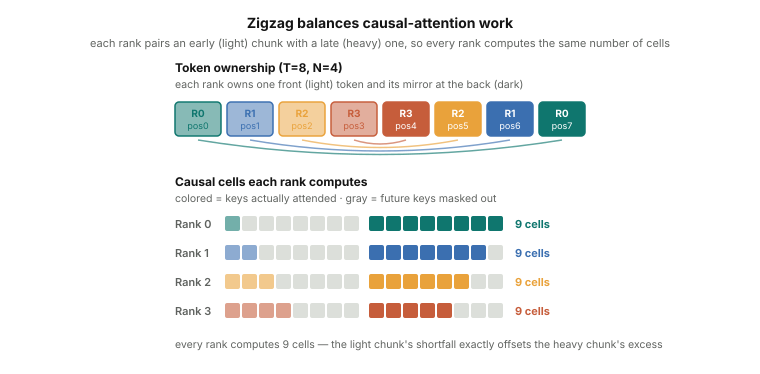

# Context Parallelism

Self-attention is quadratic in sequence length. Naively materializing the
attention score matrix `[B, H, T, T]` at T=128K would take over 1 TB
(`1 × 32 × 128K × 128K × 2 bytes` at B=1, H=32, bf16) — which is why no
modern implementation does it: fused kernels in the FlashAttention style compute
attention in tiles and never store the full matrix. But two costs remain even
with fused kernels. The *compute* is still O(T²) — doubling the context
quadruples the attention FLOPs. And the *activations* — K, V, and every layer's
hidden states — still grow linearly with T per layer; at T=128K, summed across
dozens of layers, they exceed a single GPU's memory on their own. Context
parallelism addresses both by splitting the sequence itself across GPUs.

Sequence parallelism (Part 6) shards activations *between* layers — each rank
holds `[B, T/N, d_model]` outside the TP compute regions, but the attention
computation still processes the full local sequence. CP goes further: it shards
the sequence *everywhere*, including inside attention. Each rank owns `T/N` tokens
and runs the full transformer stack on them. The difference from SP is that CP
maintains this `T/N` sharding *inside* attention, using communication to access
the K, V from other ranks' tokens rather than gathering everything back first.

The complication: causal attention requires that a query at position `i` can
attend to all prior keys at positions `0..i`. If those keys are on a different
rank, they must be communicated before attention can be computed.

---

## What Context Parallelism Does

CP assigns each rank a contiguous slice of the sequence:

```
Sequence of T tokens, cp_world_size = 4:
  Rank 0: positions [   0,  T/4 )
  Rank 1: positions [ T/4,  T/2 )
  Rank 2: positions [ T/2, 3T/4 )
  Rank 3: positions [3T/4,  T   )
```

Each rank processes its own input tokens through embeddings and all non-attention
layers normally. At the attention layer, the rank has its own Q, K, V for
positions `[rank*T/N, (rank+1)*T/N)`. Computing causal attention requires
seeing K, V from all *earlier* positions — which live on earlier ranks.

There are two common strategies to resolve this:

---

## Strategy 1: All-Gather KV (the naive baseline)

The simplest approach: before computing attention, each rank all-gathers K and V
from every other rank along the sequence dimension.

```text
each rank holds local K, V:  [B, H, T/N, d_head]
  → all-gather over CP group → full K, V:  [B, H, T, d_head]
  → attention: scores = Q @ Kᵀ, masked causally by position, softmax, @ V
```

Each rank keeps only its own `T/N` queries but now has the *full* K and V, so it
can compute exact causal attention for its query slice. The causal mask is applied
by comparing positions — a query at position `i` may attend only to keys at
positions `≤ i` — so correctness does not depend on how tokens were distributed
across ranks. The output is `[B, H, T/N, d_head]`, local to each rank.

**Trade-off**: all-gather KV moves the full K, V tensors to every rank. For a
128K-token sequence with 32 KV heads at d_head=128, B=1, bf16, that's ~2 GB of
K and V (combined) re-materialized on every rank — and this happens at *every*
attention layer, so the transient allocation pressure recurs dozens of times
per forward pass.

Notice what this gives back. The whole point of CP is to keep the sequence sharded
*inside* attention; all-gather KV re-assembles the full KV right before the attention
math, so at that moment each rank is holding the entire sequence's keys and values
again. That is essentially SP's behavior — shard between layers, gather the full
sequence for the attention core — with the one saving that queries stay sharded, so
each rank still only computes attention for its own `T/N` queries. The activation
and compute savings survive; the KV-memory saving does not.

So all-gather KV is best seen as a **naive baseline**: it's simple, and it's
correct for arbitrary causal masks and positional encodings, which makes it a fine
fallback for moderate sequence lengths or unusual attention variants. But because it
re-materializes the full KV at every layer, it doesn't scale to the very long
contexts CP exists for. For those, ring attention is the real tool.

---

## Aside: Online Softmax

The second strategy needs one prerequisite, so it's worth a short detour. For one
query, attention over keys with scores $s_1, \dots, s_T$ and value vectors
$v_1, \dots, v_T$ is a softmax-weighted average of the values:

$$
\text{out} = \sum_{j=1}^{T} \frac{e^{s_j}}{\sum_{k=1}^{T} e^{s_k}}\, v_j .
$$

**The numerical problem.** Scores can be large, and $e^{s_j}$ overflows in float
long before $s_j$ itself does. The standard fix is the *safe* (or "stable") softmax:
subtract the row maximum $m = \max_k s_k$ before exponentiating. Since the same
constant is added to numerator and denominator, the result is unchanged, but every
exponent is now $\le 0$:

$$
\text{out} = \sum_{j=1}^{T} \frac{e^{s_j - m}}{\sum_{k=1}^{T} e^{s_k - m}}\, v_j .
$$

**The streaming problem.** Both $m$ and the denominator $\ell = \sum_k e^{s_k - m}$
are taken over the *whole* row, so safe softmax seems to require all $T$ scores in
hand before producing any output. That breaks when the scores arrive a block at a
time — exactly what happens when the keys are scattered across ranks.

**Online softmax** removes that requirement. It processes the scores in blocks,
carrying three running quantities per query and updating them as each block arrives:

- $m$ — the largest score seen so far,
- $\ell$ — the running denominator $\sum e^{s - m}$ over all blocks seen so far,
- $\mathbf{acc}$ — the running numerator $\sum e^{s - m}\, v$ (a weighted sum of value vectors).

The subtlety is that a new block may contain a score larger than the current $m$.
When the max jumps from $m_\text{old}$ to $m_\text{new}$, every term already
accumulated was scaled by the wrong constant, so before adding the new block we
**rescale** the running totals by $e^{m_\text{old} - m_\text{new}}$:

<div>
$$
\begin{aligned}
\ell &\leftarrow \ell\, e^{m_\text{old} - m_\text{new}} + \sum_{j \in \text{block}} e^{s_j - m_\text{new}}, \\
\mathbf{acc} &\leftarrow \mathbf{acc}\, e^{m_\text{old} - m_\text{new}} + \sum_{j \in \text{block}} e^{s_j - m_\text{new}}\, v_j .
\end{aligned}
$$
</div>

After the last block, $\mathbf{acc} / \ell$ is the attention output — bit-for-bit
the same value safe softmax would give over the full row, but computed without ever
holding all $T$ scores at once.

This is precisely the trick FlashAttention uses to tile attention on a single GPU.
Ring attention reuses it across GPUs: each arriving KV block is just one more block
of scores to fold into the running statistics.

We've only described the *forward* pass here. The backward pass through online
softmax is more involved — the rescaling makes the recurrence non-trivial to
differentiate, and practical implementations either recompute the per-block
statistics or stash them from the forward pass. We leave it out; the
[FlashAttention paper](https://arxiv.org/abs/2205.14135) works through the details
for the curious.

---

## Strategy 2: Ring Attention

Ring attention avoids all-gathering the full K, V by rotating them through the
CP ranks one step at a time. Each rank accumulates its attention result
incrementally as it processes each arriving KV block.

<div class="article-figure">
  
</div>

```
Step 0: Each rank computes attention using its own local K, V
Step 1: Rank i sends its K, V to rank (i+1)%N, receives from rank (i-1+N)%N
        Each rank computes attention using the received K, V block
Step 2: Rotate again...
...
Step N-1: All N rotation steps complete
```

After N steps, each rank has processed K, V from all N positions and accumulated
the full attention result for its Q slice — without any rank ever holding the
full K, V sequence.

This is where online softmax earns its place: each KV block a rank receives is
just another block of scores to fold into the running `m`, `ℓ`, and `acc` for its
query slice. A rank never needs the whole score row at once, so it never needs the
whole KV sequence at once — it processes one arriving block, updates its running
statistics, passes that block onward to the next rank, and then waits for the next
incoming block. After the final block, `acc / ℓ` is the exact attention output for
its queries.

At step 0, rank `r` processes its own KV block (positions `[r*T/N, (r+1)*T/N)`).
After the ring shift, each rank passes its KV block to `rank+1` and receives from
`rank-1`. So at step 1, rank `r` processes the KV block originally from rank `r-1`;
at step 2, from rank `r-2`; and so on. After `N` steps, rank `r` has accumulated
attention contributions from all N ranks' KV blocks. The causal mask is applied
using `current_positions` (the positions of the KV block currently in hand), so
out-of-range keys are masked regardless of the ring order.

Each rank sends and receives one KV block per ring step, processing blocks of
size `T/N` rather than the full `T`. Memory for K, V stays at `O(T/N)` per rank.

**Trade-off**: N ring steps instead of one all-gather. A naive implementation
exchanges KV synchronously between steps, so each step's P2P latency is exposed —
but that is an implementation choice, not a limit of the technique. Production ring
attention implementations double-buffer, sending and receiving the *next* KV
block while computing attention on the *current* one, hiding most of the
communication. Even with overlap, for very large CP world sizes the N-step
structure accumulates latency, and all-gather KV may be faster when interconnect
bandwidth makes the one-shot gather cheap.

---

## The Zigzag Assignment

The contiguous assignment above has a load-balancing flaw, and the ring makes it
easy to see. Causal attention is asymmetric: a token at position `i` attends only to
the `i` tokens before it, so **work grows with position**. Under contiguous slicing,
rank 0 owns the earliest quarter (almost nothing to attend to) while the last rank
owns the latest quarter (nearly the whole sequence to attend to).

Watch what that does to the ring. The last rank has to do real attention math at
*every* one of the `N` steps — its queries are late, so every KV block that arrives
contains keys it must attend to. Rank 0 is the opposite: its queries are early, so
most arriving KV blocks are entirely in its future and get masked out — it receives
a block each step and computes almost nothing. But the ring is synchronous: every
step waits for the slowest rank. So the last rank stalls the whole ring at each step
while rank 0 sits idle, and the bigger the world size, the worse the skew.

The **zigzag assignment** fixes this by giving every rank a balanced mix of light
and heavy work. Split the sequence into `2N` chunks instead of `N`, and hand each
rank one chunk from the front paired with one from the back — an early "light" chunk
with a late "heavy" one:

```
T=16, N=4  ->  8 chunks of 2 tokens each

Rank 0: [0,1]   + [14,15]   (lightest + heaviest)
Rank 1: [2,3]   + [12,13]
Rank 2: [4,5]   + [10,11]
Rank 3: [6,7]   + [ 8, 9]
```

<div class="article-figure">
  
</div>

The pairing is what balances the load: the chunk at position `i` goes with the chunk
at `T-1-i`. Since work scales with position, each rank's total is roughly
`i + (T-1-i)` = a constant — the same for every rank, wherever its chunks sit in the
sequence. No rank is the permanent bottleneck anymore, so the ring's per-step wait
is even.

This reshuffling raises no correctness concerns because the causal mask keys off
**position IDs, not physical location**. A token carries its true position no matter
which rank or slot holds it, so "who may attend to whom" is unchanged — zigzag only
alters *which rank computes what*, never the result.

---

## CP and Gradient Synchronization

CP is similar to DP in one respect: each CP rank processes different tokens through
the *same* model parameters. So after backward, gradients from different CP ranks
must be averaged — exactly like the DP all-reduce that synchronizes gradients across
data-parallel replicas. The only difference is the group it runs over: an all-reduce
across the CP ranks rather than the DP ranks.

When DP and CP are both active, the two reductions can be fused into one: since a
parameter's gradient needs to be averaged over *every* rank that holds a copy of it
— across DP replicas and CP peers alike — a single all-reduce over the combined set
of ranks replaces the two separate collectives.

---

## CP Memory Benefit

For a sequence of length T, a single attention layer's K, V tensors are:

```
K or V: [B, H_kv, T, d_head]
Memory per tensor: B × H_kv × T × d_head × 2 bytes (bf16)
```

With CP world size N:
- Each rank holds: `[B, H_kv, T/N, d_head]` — memory ÷ N per rank
- All-gather KV: temporarily reconstructs `[B, H_kv, T, d_head]` at attention
- Ring attention: peak is `2 × [B, H_kv, T/N, d_head]` per rank — during the
  ring shift, the current KV block is in memory while the next block arrives;
  the previous block is freed once the shift completes. The peak is 2× a single
  shard, not the full T.

The attention score matrix `[B, H, T, T]` is never fully materialized in either
CP strategy — each rank only computes scores for its Q slice against whatever KV
block it has.

At T=128K, H=32, d_head=128, B=1, bf16:

- Full K or V: 128K × 32 × 128 × 2 bytes ≈ 1 GB per tensor, per layer
- CP rank at N=4: 256 MB per tensor
- Attention score matrix, if materialized naively: (128K)² × 32 × 2 bytes ≈ 1 TB
  (fused kernels avoid this — but the per-layer K/V and hidden-state memory above,
  multiplied across dozens of layers, is unavoidable without CP)

CP makes long-context training feasible where it would otherwise be impossible.

---

## CP + TP and CP + PP

CP composes with the other parallelisms:

**CP + TP**: TP shards weight matrices; CP shards sequences. The two are
orthogonal. With both, each rank holds a fraction of the weights AND a fraction
of the sequence. The TP all-reduce and CP all-reduce operate on different
dimensions.

**CP + PP**: with CP active, the activations crossing pipeline stage boundaries are
sequence-sharded — `[B, T/cp, hidden]` rather than the full `[B, T, hidden]`. As with
PP + SP, the send and receive buffers on either side of a stage boundary have to
agree on this sharded shape.

**CP + SP**: SP already shards activations along the sequence dimension between
TP layers. CP works at a coarser level — entire attention layers — and uses
position-based masking. The two can coexist: SP shards activations *within* a
node, CP shards sequences *across* nodes.

---

## What's Next

The final tutorial covers Mixture of Experts (MoE) and expert parallelism: how
replacing the dense FFN with a pool of expert networks scales the model's
parameter count without proportionally scaling its compute, and how expert
parallelism distributes those experts across GPUs so they fit in memory.
