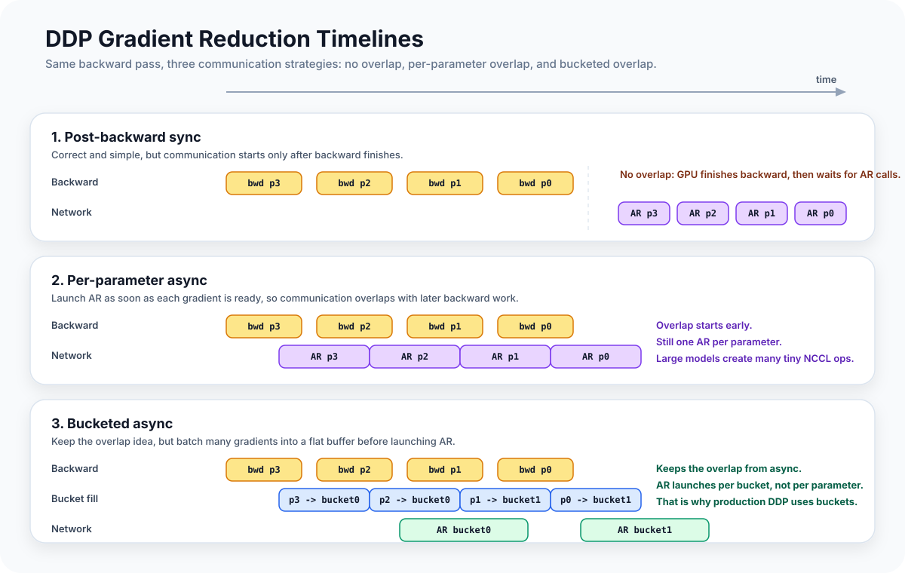

# Data Parallelism and Gradient Reduction

If you are training a model that fits on one GPU, you can still train it faster by
replicating it across multiple GPUs, each processing a different batch of data, and
averaging the gradients after each backward pass. That is data-parallel training
(DDP), and it is the first parallelism strategy every pretraining setup should have.

This article covers how DDP gradient reduction works, why the naive synchronous
implementation is inefficient, and how the bucketed approach achieves nearly full
overlap between computation and communication.

---

## Distributed Primitives: Rank, World Size, Process Groups

Before diving into DDP, three terms appear throughout this article and the next two:

- **Rank**: the integer index (0, 1, 2, …) that identifies this process in a
  distributed job. Each GPU runs one process; rank 0 is typically the "main" process
  for logging and checkpointing.
- **World size**: the total number of processes. In a DDP setup with 4 GPUs,
  `world_size = 4` and ranks are 0–3.
- **Process group**: a named subset of ranks that communicate with each other.
  All-reduce, all-gather, and reduce-scatter operations run within a process group.
  A single training job can have multiple groups — for example, a separate DP group
  and a TP group — each with its own communication scope.

With these in hand, a DDP setup on 4 GPUs means: 4 ranks, world size 4, one DP
process group containing all 4 ranks. Each rank runs the same model on a different
batch; the DP process group is where gradient reduction happens.

---

## The Gradient All-Reduce

In DDP, every GPU holds an identical copy of the model parameters. Each GPU receives
a different batch of data, runs a forward and backward pass, and computes its own
gradient tensor for each parameter.

Before the optimizer step, these gradients must be **averaged across all GPUs** so
that every GPU performs the same parameter update. An optimizer step on unaveraged
gradients would produce different parameters on each GPU — the copies would diverge
and the training would become incoherent.

The operation that computes this average is an **all-reduce**: every rank contributes
its local value, and every rank receives the global average. For gradient reduction,
the all-reduce runs on each parameter's gradient tensor, giving each rank the same
averaged gradient to feed to the optimizer.

```python
# Minimal synchronous DDP (what naive implementations look like)
loss.backward()
for param in model.parameters():
    if param.grad is not None:
        dist.all_reduce(param.grad, op=dist.ReduceOp.AVG, group=dp_group)
optimizer.step()
```

This works correctly, but has a critical performance problem: **it serializes
communication and computation**. The all-reduce on each parameter runs after the
entire backward pass completes. The GPU is idle while the network is busy.

---

<div class="article-figure">
  
</div>

---

## The Bucketed Approach: Overlap Communication with Backward

The key observation is that we don't need to wait for the full backward pass to
start reducing gradients. Gradients are computed in reverse order during backward —
the later layers get their gradients first. As soon as a layer's gradient is ready,
we can start all-reducing it in the background while backward continues on earlier
layers.

The `BucketDataParallelPlugin` implements this with a flat-buffer bucketing scheme:

1. **Before training starts**, parameters are grouped into buckets of ~25 MB each
   (configurable). Each bucket gets a contiguous flat buffer.
2. Each parameter's gradient view points directly into the bucket's flat buffer —
   no copies needed when backward writes into `.grad`.
3. **A hook fires** when the last parameter in a bucket completes its backward pass.
   The hook launches an async `all_reduce` on the bucket's flat buffer.
4. While the async all-reduce runs on the network, backward continues on the
   remaining earlier layers.
5. **At `POST_BACKWARD`**, all bucket handles are waited on before the optimizer step.

The async all-reduce runs on a separate CUDA stream from the backward pass,
so the two operations execute in parallel on the GPU. NCCL manages its own stream
internally; the `handle.wait()` at step 5 inserts a stream dependency that blocks
the optimizer step until all communication has completed.

```python
# From ddp.py: the hook that fires when a bucket is fully ready
def make_hook(self):
    is_gloo = dist.get_backend(self.group) == "gloo"
    world_size = dist.get_world_size(self.group)

    def hook(param):
        self.pending -= 1
        if self.pending == 0:
            self.handle = dist.all_reduce(
                self.flat_buffer,
                op=dist.ReduceOp.AVG,
                group=self.group,
                async_op=True,  # key: non-blocking
            )
    return hook
```

The hook fires via `register_post_accumulate_grad_hook()`, which PyTorch calls
immediately after each parameter accumulates its gradient during backward. This is
what makes the overlap possible: the hook fires as soon as the parameter is ready,
not after all parameters are ready.

---

## Why Flat Buffers

The bucket's flat buffer is the implementation detail that makes bucketed DDP
efficient. When multiple parameters share a single contiguous buffer, they can be
all-reduced in a **single NCCL call** rather than one call per parameter.

NCCL (NVIDIA's Collective Communications Library) has a fixed latency cost per
operation. Without bucketing, each parameter *tensor* (weight matrix, bias vector,
etc.) would require its own all-reduce call. A GPT-style model has on the order of
thousands of parameter tensors — one all-reduce per tensor means thousands of small
NCCL calls, each incurring latency overhead.

Bucketing reduces this to a handful of large calls. For a 7B model at fp32
(4 bytes/param), grouping into 25 MB buckets gives:

```
n_calls = total_param_bytes / bucket_size
         = (7B params × 4 bytes/param) / (25 × 1024 × 1024 bytes)
         ≈ 1,066 calls
```

Roughly 1,000 large NCCL operations instead of thousands of tiny ones. The latency
savings compound: less per-operation overhead, better NIC pipelining, and the
async path can hide most of the cost entirely.

The `finalize()` method sets up these views when the bucket is first created:

```python
def finalize(self) -> None:
    total_numel = sum(param.numel() for param in self.params)
    self.flat_buffer = torch.zeros(total_numel, dtype=..., device=...)
    offset = 0
    for param in self.params:
        view = self.flat_buffer[offset : offset + param.numel()].view_as(param)
        self.param_views.append(view)
        offset += param.numel()
    # Assign param.grad to point into the flat buffer
    for param, view in zip(self.params, self.param_views):
        param.grad = view
```

Now `param.grad` is not a separately allocated tensor — it is a view into the
bucket's flat buffer. When backward writes into `param.grad`, it writes directly
into the buffer that will be all-reduced. Zero copies.

---

## Gradient Accumulation Under DDP

With gradient accumulation (multiple micro-steps per optimizer step), the all-reduce
should only happen on the last micro-step. All-reducing on every micro-step wastes
network bandwidth and would double-count the normalization.

The `BucketDataParallelPlugin` handles this with the `is_step_boundary` flag —
a boolean in the runtime's step context that is `True` only on the last micro-step
of each accumulation window:

```python
def on_phase(self, phase: RuntimePhase) -> None:
    if phase == RuntimePhase.PRE_BACKWARD:
        context = self.runtime.state.step_context
        should_sync = context.is_step_boundary  # True only on last micro-step
        accum_start = context.accum_start       # True only on first micro-step
        for bucket in self.buckets:
            bucket.reset(
                grad_accum_start=accum_start,
                grad_accum_end=should_sync,
            )
```

The `pending` counter is per-bucket and tracks how many parameters in that bucket
still need to complete their backward pass before the bucket is ready to all-reduce.

```
bucket.reset(grad_accum_end=False):  # micro-step 1..N-1
    bucket.pending = 0  # hook checks: if pending == 0, launch reduce
                        # → hook fires but does nothing (already 0)

bucket.reset(grad_accum_end=True):   # last micro-step
    bucket.pending = len(bucket.params)  # arm the hook
    # as each param's backward completes:
    #   hook fires → pending -= 1 → if pending == 0: launch all_reduce
```

On micro-steps 1 through N-1, `should_sync=False`. `bucket.reset()` sets
`pending = 0` — the hook fires for each parameter but finds the counter already
at zero, so it does nothing. Gradients accumulate in the flat buffer silently.

On micro-step N, `should_sync=True`. `pending` is armed to `len(bucket.params)`.
As each parameter completes its backward pass, the hook decrements `pending`. When
the last parameter completes and `pending` reaches zero, the async all-reduce
launches.

---

## Expert Parameters and DP Group Exclusion

Not all parameters should be reduced over the DP group. Expert parameters in a
Mixture-of-Experts model are already handled by the Expert Parallelism plugin with
a separate EP all-reduce. Reducing them again over the DP group would double-count.

The DDP plugin checks the parameter role:

```python
for name, param in self.runtime.model.named_parameters():
    if not param.requires_grad:
        continue
    if self.runtime.get_param_role(param) == ParamRole.EXPERT:
        continue  # skip: EP plugin handles these
    # ... add to all-reduce
```

The bucket builder has the same exclusion:

```python
[p for p in model.parameters()
 if p.requires_grad
 and self.runtime.get_param_role(p) != ParamRole.EXPERT]
```

This works because MALTOS tracks each parameter's role via `register_param_role()`,
which EP plugins call during `transform_model`. By the time DDP is set up (which
also happens during `transform_model`, but runs after EP due to the plugin ordering),
the role annotations are already present.

---

## Numerical Equivalence

Bucketed DDP with async all-reduce produces results that are mathematically
equivalent to synchronous DDP (when using `ReduceOp.AVG`). The only difference
is when the operation executes, not what it computes. In practice, floating-point
associativity means the exact gradient values may differ by ±1 ULP (unit in the
last place) due to different summation ordering in the ring-allreduce algorithm,
but this is not numerically meaningful — gradient descent is robust to this level
of noise.

---

## Gloo vs. NCCL

The all-reduce operation behaves differently depending on whether the process group
uses the Gloo or NCCL backend. NCCL runs on CUDA, supports `ReduceOp.AVG` directly,
and can run asynchronously. Gloo runs on CPU and requires manual normalization:

```python
if is_gloo:
    dist.all_reduce(param.grad, op=dist.ReduceOp.SUM, group=dp_group)
    param.grad.div_(world_size)
else:
    handle = dist.all_reduce(
        param.grad, op=dist.ReduceOp.AVG, group=dp_group, async_op=True
    )
```

Gloo is slower and can't overlap with backward. It is used for CPU smoke tests —
the same code path as the GPU runs, just without the async benefits. This is how
all DDP combinations are validated before running on real hardware.

---

## How DDP Interacts With ZeRO

When ZeRO-3 is in the configuration, DDP is not loaded. ZeRO-3 handles gradient
reduction itself using a different operation: **reduce-scatter** instead of
**all-reduce**.

The difference matters for memory. An all-reduce gives every rank the full averaged
gradient — every rank stores `N × param_bytes` worth of gradient data. A
reduce-scatter is like an all-reduce but each rank only receives its assigned
`1/N` slice of the result. ZeRO-3 uses this to shard the gradients across DP ranks,
so no rank ever stores the full gradient tensor. Tutorial 5 covers ZeRO in detail.

The plugin system enforces the DDP/ZeRO mutual exclusion: both compete for the
same `PluginId.DP` slot, and the runtime prevents two plugins from registering the
same slot ID. You pick one or the other; the configuration is invalid if both are
present.

---

## The `runtime_optimizer_replicated_axes` Method

After gradient reduction, the optimizer state needs to know whether parameters are
replicated across certain axes. DDP declares that parameters are replicated along
the DP axis:

```python
def runtime_optimizer_replicated_axes(self) -> set[MeshAxis]:
    return {MeshAxis.DP} if self.runtime.mesh.dp > 1 else set()
```

This information is used when the checkpoint system decides how to save optimizer
state. If parameters are replicated, only one rank per DP group needs to save the
optimizer state for that parameter — all replicas are identical. The manifest's
`optimizer_source_ranks` field records which rank to load from.

---

## Scaling Beyond a Single Machine

All of the above works on a single machine with multiple GPUs connected by NVLink.
On a multi-node setup, the DP group spans machines connected by InfiniBand or
RoCE. The code is identical — PyTorch's distributed package abstracts the transport.
The difference is performance: NVLink bandwidth (~600 GB/s) is an order of magnitude
higher than InfiniBand (~200 GB/s), so the relative cost of DDP all-reduce increases
as you span more machines.

This is why large-scale pretraining combines DDP with ZeRO: ZeRO-3 reduces the
communication volume from 2× model size (all-reduce) to 3× model size (all-gather
+ reduce-scatter), but the per-step communication is spread across parameter fetches
rather than one big synchronization point. Combined with TP that reduces the model
size visible at each DP rank, the communication overhead becomes manageable at
hundreds of GPUs.

---

## Experiment Placeholder

> **[Placeholder: DDP vs. BucketDDP throughput comparison]**
> A useful experiment here: benchmark `DataParallelPlugin` (sync) vs.
> `BucketDataParallelPlugin` (async bucketed) on a 1B model with dp=4 on the same
> machine. Expected result: bucketed gets closer to peak GPU utilization (higher
> MFU) by overlapping the ~400ms all-reduce with the backward pass. At dp=2 on
> NVLink the gap may be small; at dp=8 spanning nodes on InfiniBand it should be
> significant.

---

## What's Next

The next article covers tensor parallelism and sequence parallelism: how a single
weight matrix is sharded across multiple GPUs, what ColumnParallelLinear and
RowParallelLinear actually do, and how sequence parallelism shards the activations
between layers to cut memory further.

Data parallelism scales training throughput by processing more data in parallel.
Tensor parallelism scales training throughput by making each forward pass faster —
a different axis of parallelism that can be combined with DDP to scale both ways at once.
