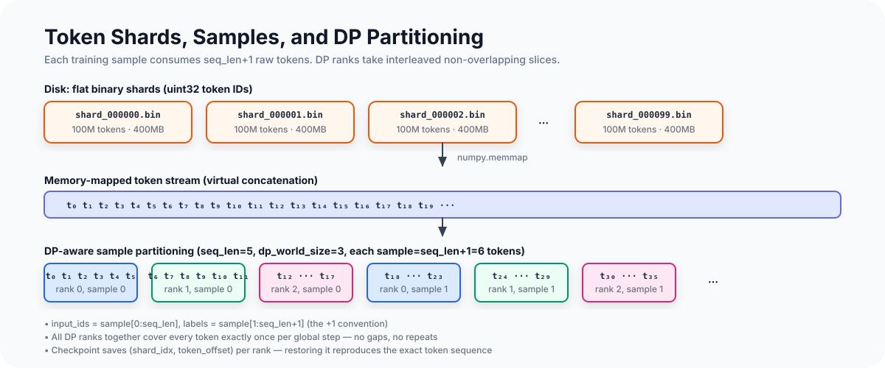

# How We Store and Stream Tokens

A language model learns from a sequence of tokens. Not a collection of labeled
examples, but a very long token stream: billions of tokens laid out end to end,
from which training batches are cut as contiguous fixed-length sequences.

This distinction shapes everything about the data pipeline. A standard PyTorch
`DataLoader` with a shuffle buffer doesn't fit this model. This article covers
the actual data pipeline: how tokens are stored on disk, how they are accessed
efficiently, how multiple GPUs get distinct samples, and how the data position
is preserved across checkpoints.

---

## Why Not a Standard DataLoader

Standard supervised learning has a clear data structure: a finite set of
`(input, label)` pairs. You shuffle them, load them in random order, and iterate
through all of them once per epoch.

Pretraining has different requirements:

- **Scale**: A real pretraining dataset might be 10 trillion tokens. An in-memory
  shuffle index would take 80 GB by itself.
- **Sequential structure**: Training batches are usually produced by advancing a
  cursor through contiguous token storage. That makes sequential access,
  deterministic partitioning, and exact resume behavior first-class concerns.
- **No meaningful epoch boundary**: Many pretraining runs are shorter than one
  full pass through the data. There is no natural point to shuffle and restart.
- **Deterministic partitioning**: In data-parallel training, each GPU must see
  different samples at each step. A random sampler is not sufficient — the
  partitioning must be deterministic, so that the same configuration at the same
  step count produces the same samples, both within a run and after resuming from
  a checkpoint. Without this, resuming a multi-GPU run would assign each GPU
  different data than it would have seen in an uninterrupted run, breaking
  reproducibility.

---

## Preparing Data

Before you can stream tokens efficiently, you need to prepare them into a
simple on-disk format. For FineWeb-Edu, the workflow is:

1. Download the dataset in Arrow/Parquet format
2. Tokenize with a standard HuggingFace tokenizer
3. Write the token IDs to flat binary files in `uint32` format

A minimal shard writer:

```python
import numpy as np

def write_shard(token_ids: list[int], path: str) -> None:
    arr = np.array(token_ids, dtype=np.uint32)
    arr.tofile(path)
```

Token IDs fit in `uint16` for vocabularies up to 65,535 — which covers 32k
(LLaMA-2) and 50k (GPT-2) tokenizers and halves the storage. Newer tokenizers
with 128k vocabularies (LLaMA-3, GPT-4-class) overflow `uint16`, so `uint32`
is the safe default. The cost is 4 bytes per token — 400 MB for 100M tokens —
which is acceptable given the access pattern; if your vocabulary fits and
storage matters, use `uint16`.

**How large should shards be?** 100M tokens (~400 MB) is a practical default.
Too small (< 10M tokens) means many file opens and memmap registrations.
Too large (> 1B tokens) starts to strain the OS page cache on machines with
limited RAM. On a machine with 256 GB of RAM, a 400 MB working set per shard
allows hundreds of shards to remain warm simultaneously.

**What about the last shard?** Most datasets don't divide evenly into equal-sized
shards. The last shard is usually shorter than the others. The `read()` loop
handles this correctly — it only reads `take = min(remaining, shard.size - offset)`
tokens at a time. If a training sample crosses the end of the last shard, the
code wraps to shard 0 for the remainder. No padding is needed.

**Documents vs. sequences**: standard pretraining tokenization concatenates all
documents end-to-end with a special EOS token between them (e.g., `<|endoftext|>`
in GPT-2/LLaMA). This is intentional — the model must learn to predict the start
of a new document given the end of the previous one. Individual document boundaries
do not align with `seq_len` training sequences, and that's correct behavior.

---

## Token Shards

After preprocessing, the standard format for pretraining data is a set of flat
binary files — token shards — each containing a flat array of `uint32` token IDs:

```
/data/fineweb_edu/
    shard_000000.bin   # 100M tokens × 4 bytes = 400 MB
    shard_000001.bin
    ...
    shard_000099.bin
```

The full dataset is the concatenation of all shards in sorted order. To read from
the dataset, you need to track which shard you're in and what byte offset you're
at within that shard.

The resulting files are simple enough to read from any language, verify with a
hex editor, and concatenate trivially.

---

<div class="article-figure">
  
</div>

---

## Memory-Mapped Access

Loading a 400 MB shard into RAM at the start of training would be wasteful and
slow. The better approach is `numpy.memmap`, which uses the OS's virtual memory
system to make the file look like a NumPy array without reading it upfront.
Concretely: the OS maps the file's disk pages into the process's address space.
No bytes are read immediately. When your code accesses `shard[i]`, the CPU
generates a page fault (the page is not yet in RAM), and the OS fetches only the
4 KB disk page containing index `i`. Subsequent accesses to nearby indices hit the
cache. This is called **demand paging**:

```python
import numpy as np

shard = np.memmap(path, mode="r", dtype=np.uint32)
```

The OS caches recently-used pages in RAM automatically.
For sequential access (which pretraining mostly is), the OS prefetcher keeps
the next pages warm, and reads are nearly as fast as reading from RAM.

The result is that `TokenShardDataset` can manage hundreds of shards with a
working set that fits in available RAM, without any manual cache management:

```python
class TokenShardDataset:
    def __init__(self, paths, dtype=np.uint32):
        self.shards = [np.memmap(path, mode="r", dtype=dtype) for path in paths]

    def read(self, shard_idx, token_offset, length):
        tokens = np.empty(length, dtype=self.shards[0].dtype)
        written = 0
        while written < length:
            shard = self.shards[shard_idx]
            take = min(length - written, shard.size - token_offset)
            tokens[written:written + take] = shard[token_offset:token_offset + take]
            written += take
            token_offset += take
            if token_offset >= shard.size:
                shard_idx = (shard_idx + 1) % len(self.shards)
                token_offset = 0
        return tokens, shard_idx, token_offset
```

The return values `(shard_idx, token_offset)` are the updated cursor position
after the read. The caller advances to the next sample from these positions.

Two details in `read()` are worth noting:

**Boundary crossing**. A sample may span two shards. The loop handles this
naturally: when `token_offset` reaches the end of one shard, it wraps to the
start of the next. The caller doesn't need to know that the read crossed a
boundary.

**Circular wrapping**. When the last shard is exhausted, `shard_idx` wraps back
to 0. For most pretraining runs this never happens (the run ends before the
data does). For runs that do wrap, seeing the same tokens a second time is
intentional — analogous to training for more than one epoch in supervised learning.
The practical concern is not correctness but efficiency: if the dataset is
significantly smaller than the compute budget, the model will memorize it rather
than generalize, which degrades downstream performance. Large-scale pretraining
runs (GPT-3, LLaMA) are typically data-limited, not compute-limited — they see
each token fewer than 2× on average.

---

## The +1 Convention

Each training example predicts the next token at every position. An example with
sequence length `T` uses `T` input tokens and `T` label tokens. The label is
the input shifted one position to the right:

```
tokens:     [t_0, t_1, t_2, t_3, ..., t_T]   ← T+1 raw tokens
input_ids:  [t_0, t_1, t_2, t_3, ..., t_{T-1}]
labels:     [t_1, t_2, t_3, t_4, ..., t_T    ]
```

So each training example consumes `seq_len + 1` raw tokens from the stream.
This `+1` propagates through every data-related calculation:

- Tokens consumed per micro-step = `micro_batch_size × (seq_len + 1)`
- DP rank initial offset (for the interleaved per-sample scheme below) = `dp_rank × (seq_len + 1)`
- Inter-sample advance = `(dp_world_size - 1) × (seq_len + 1)`

If you use `seq_len` instead of `seq_len + 1` in any of these, the sample
boundaries are misaligned: labels overlap with the next example's inputs,
and the training signal is corrupted.

---

## DP-Aware Data Partitioning

In data-parallel training with `dp_world_size` replicas, each replica must see
a different batch at each step. The simplest correct approach is to interleave
samples across ranks with a fixed offset:

```
dp_rank 0 reads samples starting at offsets:  0,   dp_world_size,   2*dp_world_size, ...
dp_rank 1 reads samples starting at offsets:  1,   dp_world_size+1, 2*dp_world_size+1, ...
dp_rank 2 reads samples starting at offsets:  2,   dp_world_size+2, 2*dp_world_size+2, ...
```

(Offsets here are in units of `seq_len + 1` tokens.)

The easiest way to picture the nesting is to look at one rank's view of a
single micro-batch:

```text
micro_batch_size = 2, dp_world_size = 2, dp_rank = 0

on this rank, one micro-batch looks like:
    sample 0: read seq_len + 1 raw tokens
    skip samples belonging to other DP ranks
    sample 1: read seq_len + 1 raw tokens
    skip samples belonging to other DP ranks
```

So `dp_rank` chooses where this rank enters the global token stream, while
`micro_batch_size` controls how many rank-local samples are collected before the
model runs a forward pass. In this scheme, `dp_rank` does not jump by an entire
micro-batch. It picks the starting sample for that rank, and the loader then
alternates between "read my sample" and "skip the other ranks' samples."

The loader initializes the cursor at the rank's starting position and advances
by the full DP stride after each sample:

```python
class PretrainingDataLoader:
    def __init__(self, dataset, seq_len, micro_batch_size, dp_rank, dp_world_size):
        self.dataset = dataset
        self.seq_len = seq_len
        self.micro_batch_size = micro_batch_size
        self.dp_rank = dp_rank
        self.dp_world_size = dp_world_size
        self.shard_idx = 0                             # start at first shard
        self.token_offset = dp_rank * (seq_len + 1)   # rank-specific start within stream
        self.dp_stride = dp_world_size * (seq_len + 1)

    def next_batch(self):
        samples = []
        for _ in range(self.micro_batch_size):
            sample, self.shard_idx, self.token_offset = self.dataset.read(
                self.shard_idx, self.token_offset, self.seq_len + 1
            )
            samples.append(sample)
            self._advance_to_next_dp_sample()
        tokens = torch.from_numpy(np.stack(samples).astype(np.int64))
        return {"input_ids": tokens[:, :-1], "labels": tokens[:, 1:]}

    def _advance_to_next_dp_sample(self):
        skip = (self.dp_world_size - 1) * (self.seq_len + 1)
        if skip > 0:
            _, self.shard_idx, self.token_offset = self.dataset.read(
                self.shard_idx, self.token_offset, skip
            )
```

After reading its own sample, each rank calls `_advance_to_next_dp_sample()` to
skip over the tokens that belong to the other DP ranks. Those tokens are not
returned — they are read and immediately discarded. The purpose is solely
to advance the file cursor: after skipping `(dp_world_size - 1) * (seq_len + 1)`
tokens, the cursor is positioned at the start of this rank's *next* sample.

Strictly, the skip doesn't need to touch the data at all — the new
`(shard_idx, token_offset)` can be computed arithmetically by walking the table
of shard sizes. One simple implementation is to reuse `read()` for the skip,
because it keeps the boundary-crossing and wrap-around logic in one place, and
the cost is small:
memmap reads of skipped pages are usually already warm in the OS page cache
from a neighboring rank's read of the same region (on a shared filesystem) or
prefetched sequentially. If profiling ever showed the skip reads mattered, the
arithmetic version is a drop-in replacement.

This partitioning has a useful property: **all DP ranks together cover the full
token stream without gaps or overlaps**. Across all ranks, every token in the
stream is consumed exactly once per full step.

---

## Stateful Resume

The data cursor state that must be saved for an exact resume:

```python
@dataclass(frozen=True)
class PretrainingDataState:
    shard_idx: int       # which shard we're reading from
    token_offset: int    # position within that shard
    consumed_tokens: int # total tokens seen (for logging, not resume)
    seed: int            # for any randomness in preprocessing
```

`shard_idx` and `token_offset` are the only fields required for correct resume.
`consumed_tokens` is a logging counter. `seed` is for reproducibility of any
stochastic preprocessing step applied at load time, if you use one.

The state is serialized and bundled into the checkpoint alongside model weights
and optimizer state:

```python
# Saved in trainer_rank_N.pt
{
    "step_context": ...,
    "dataloader": {
        "shard_idx": 3,
        "token_offset": 47382,
        "consumed_tokens": 1024000,
        "seed": 1234,
    },
    "rng": {"cpu": ..., "cuda": ...}
}
```

On resume, the loader is restored before the first call to `next_batch()`:

```python
loader.load_state_dict(checkpoint["dataloader"])
# next next_batch() reads from exactly where training was interrupted
```

**What goes wrong without this**. A run that resumes without restoring the data
cursor will read from token offset 0 — the beginning of shard 0 — at step 1
after resume. If the checkpoint was at step 5,000, the model has already trained
on those tokens. Re-training on the same tokens isn't catastrophically wrong, but
it produces a subtly different model than an uninterrupted run, and the
difference is invisible in the loss curve.

**RNG state**. Saving and restoring CPU and CUDA RNG state is needed to reproduce
the exact sequence of dropout masks, weight initialization noise (if any), and
other stochastic operations. Omitting it doesn't break training, but the resumed
run diverges from what an uninterrupted run would have produced at that step.

---

## How the Loader Fits Into Training

The loader should stay conceptually small. Its job is to return the next batch
and expose enough state for exact resume:

```python
batch = dataloader.next_batch()
...
checkpoint["dataloader"] = dataloader.state_dict()
```

This separation matters because the training objective can change while the
core streaming mechanics stay the same. A supervised finetuning run uses a
different dataloader than a pretraining run; a preference-training run uses a
different one again. But in each case, the loader is still responsible for
producing batches and, if needed, restoring its cursor state on resume.

---

## What's Next

The next article introduces the distributed primitives that the rest of the
series relies on: ranks, process groups, and the collective communication
operations such as all-reduce, all-gather, and reduce-scatter.

The data pipeline established here — token shards, memory-mapped access,
DP-aware partitioning, stateful resume — is the foundation that all distributed
training configurations build on. A correctly implemented data loader is one of
the few components that doesn't change as you scale from one GPU to a thousand.
