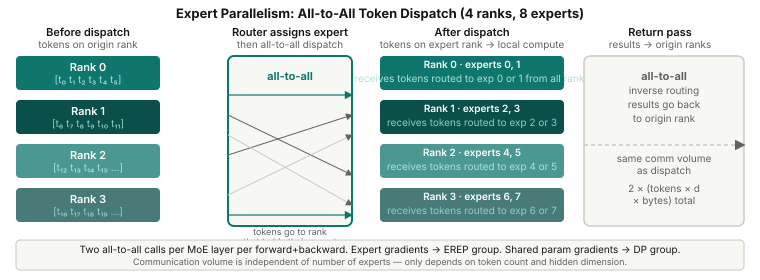

# Mixture of Experts and Expert Parallelism

Every transformer block has a feed-forward network (FFN): two linear layers with
a nonlinearity between them. In a 7B dense model, each FFN has roughly
`4 × d_model` hidden units, and the FFN parameters account for ~2/3 of total
parameters.

The observation behind Mixture of Experts: most tokens don't need all of that
capacity. A sentence about biology and a sentence about tax law both flow through
the same FFN weights. What if you had separate FFN "experts" for different types
of content, and only routed each token to the expert best suited for it?

Mixture of Experts (MoE) does exactly this. It replaces the dense FFN with N
expert networks and a learned router. Each token activates exactly one expert
(Top-1 routing) or a small subset (Top-K routing). The model has more parameters
but the same FLOPS per token — more capacity without proportional compute.

---

## The MoE Layer

A standard transformer FFN:
```python
# Dense FFN: every token → same weights
def ffn(x):
    return gelu(x @ W1) @ W2  # x: [B, T, d]; W1: [d, 4d]; W2: [4d, d]
```

An MoE layer with N experts and Top-1 routing:
```python
class Top1MoE(nn.Module):
    def __init__(self, dim, hidden_size, num_experts):
        self.router = nn.Linear(dim, num_experts, bias=False)
        self.experts = nn.ModuleList([MLP(dim, hidden_size) for _ in range(num_experts)])

    def forward(self, x):
        flat = x.reshape(-1, dim)          # [B*T, d]
        logits = self.router(flat)         # [B*T, N]
        probs = logits.softmax(dim=-1)
        expert_idx = probs.argmax(dim=-1)  # [B*T] — which expert for each token
        weight = probs.gather(1, expert_idx.unsqueeze(1)).squeeze(1)  # routing weight

        out = torch.zeros_like(flat)
        for idx, expert in enumerate(self.experts):
            mask = expert_idx == idx
            if not torch.any(mask):
                continue
            out[mask] = expert(flat[mask]) * weight[mask].unsqueeze(1)
        return out.view(x.shape)
```

Key observations:
- The **router** (`Linear(dim, N)`) is tiny — a single linear projection.
- Each token is processed by exactly one expert — the one with the highest router probability.
- The routing **weight** (`weight = probs.gather(...)`, the softmax probability of the chosen expert)
  scales the expert's output. This is not optional: it keeps the router's probability estimates
  meaningful during training. Without the weight multiplication, the router output would be a binary
  choice with no differentiable signal about *how confident* the router was — the gradient through
  the routing decision would be zero everywhere except at the argmax boundary.
- Experts that receive no tokens for a batch are skipped entirely (`if not torch.any(mask): continue`).

**Parameter count**: the FFN accounts for roughly 2/3 of parameters in a
standard transformer. With N experts replacing the FFN:

```
Dense:  params = P_attn + P_ffn
MoE:    params = P_attn + N × P_ffn
```

For a 7B dense model (≈2.3B attention, ≈4.7B FFN):
- 8 experts: 2.3B + 8×4.7B ≈ **40B parameters**, ~7B FLOPS per token
- 64 experts: 2.3B + 64×4.7B ≈ **303B parameters**, ~7B FLOPS per token

More experts = more capacity, same compute. This is the core MoE value
proposition. (Top-2 routing — used in Mixtral — activates 2 experts per token,
doubling FLOPS but also doubling capacity utilization.)

---

<div class="article-figure">
  
</div>

## Why Naive MoE Doesn't Scale

As shown in the parameter count above, an 8-expert MoE with 7B FLOPS/token
stores ~40B parameters — more than 5× the dense 7B model's footprint. A
64-expert version stores ~303B. This is the point: MoE trades memory for
capacity. As you increase the number of experts, the model becomes richer
(more capacity per FLOP) but also larger in memory. Eventually, no single GPU
can hold all experts, and training becomes impossible without distribution.

The solution is expert parallelism: put different experts on different GPUs.

---

## Expert Parallelism: Sharding Experts Across GPUs

Expert parallelism (EP) gives each GPU ownership of `num_experts / ep_world_size`
experts. With 8 experts across 4 EP ranks:

```
EP rank 0: experts 0, 1
EP rank 1: experts 2, 3
EP rank 2: experts 4, 5
EP rank 3: experts 6, 7
```

The problem: after the router assigns each token to an expert, that token may
need to travel to a different GPU — the one that holds its assigned expert.
This requires cross-GPU communication.

---

## The All-to-All Dispatch

The communication primitive is **all-to-all**: every rank sends a (different)
subset of tokens to every other rank, and receives tokens from every other rank.
Unlike all-reduce (which aggregates data) or all-gather (which replicates it),
all-to-all *redistributes* data — a many-to-many routing operation.

The full dispatch cycle for one MoE layer:

```
1. Router assigns each token to an expert
2. Sort tokens by destination rank (dest_rank = expert_id // experts_per_rank)
3. All-to-all: send tokens to their expert rank, receive tokens from all ranks
4. Each rank runs its local experts on the tokens it received
5. All-to-all: send results back to the originating ranks
```

```python
def forward(self, x):
    flat = x.reshape(-1, hidden_size)

    # 1. Route
    router_probs = self.router(flat).softmax(dim=-1)
    expert_idx = router_probs.argmax(dim=-1)
    expert_weight = router_probs.gather(1, expert_idx.unsqueeze(1)).squeeze(1)

    # 2. Sort by destination rank
    experts_per_rank = len(self.local_expert_ids)
    dest_rank = expert_idx // experts_per_rank
    local_expert_idx = expert_idx - dest_rank * experts_per_rank
    order = torch.argsort(dest_rank)
    send_tokens = flat.index_select(0, order).contiguous()
    send_counts = torch.bincount(dest_rank, minlength=ep_world_size).to(torch.int64)

    # 3. Exchange counts: each rank tells others how many tokens it's sending them
    recv_counts = _exchange_counts(send_counts, self.ep_group)

    # Also exchange the per-token metadata (local expert index, routing weight)
    # so each rank knows which expert to run and with what weight.
    send_local_expert_idx = local_expert_idx[order]  # sorted in same order as send_tokens
    send_weights = expert_weight[order]
    recv_local_expert_idx_buf = torch.empty(recv_counts.sum(), dtype=torch.int64, device=flat.device)
    recv_weights_buf = torch.empty(recv_counts.sum(), device=flat.device, dtype=flat.dtype)
    dist_nn.all_to_all_single(recv_local_expert_idx_buf, send_local_expert_idx, ...)
    dist_nn.all_to_all_single(recv_weights_buf, send_weights, ...)
    recv_local_expert_idx = recv_local_expert_idx_buf
    recv_weights = recv_weights_buf

    # 4. All-to-all dispatch: tokens travel to their expert ranks
    recv_buf = torch.empty(recv_counts.sum(), hidden_size, device=flat.device, dtype=flat.dtype)
    dist_nn.all_to_all_single(
        recv_buf, send_tokens,
        output_split_sizes=recv_counts.tolist(),
        input_split_sizes=send_counts.tolist(),
        group=self.ep_group,
    )
    recv_tokens = recv_buf

    # 5. Run local experts on the tokens that arrived at this rank
    recv_outputs = torch.zeros_like(recv_tokens)
    for local_idx, expert in enumerate(self.local_experts):
        mask = recv_local_expert_idx == local_idx
        if not torch.any(mask):
            continue
        recv_outputs[mask] = expert(recv_tokens[mask]) * recv_weights[mask].unsqueeze(1)

    # 6. All-to-all return: results travel back to originating ranks
    return_buf = torch.empty_like(send_tokens)  # same shape as what we originally sent
    dist_nn.all_to_all_single(
        return_buf, recv_outputs,
        output_split_sizes=send_counts.tolist(),
        input_split_sizes=recv_counts.tolist(),
        group=self.ep_group,
    )
    returned_outputs = return_buf

    # 7. Unsort
    out = torch.zeros_like(flat)
    out.index_copy_(0, order, returned_outputs)
    return out.view(x.shape)
```

Two all-to-all operations in the forward pass: one for dispatch (tokens to
experts), one for return (results back). The backward pass retraces the same
routes in reverse — gradients of the returned outputs travel back to the expert
ranks, and gradients of the dispatched tokens travel home — adding two more.
**Four all-to-alls per MoE layer per training step.** The communication volume
per all-to-all is (token count × hidden_size × dtype_bytes), independent of how
many experts there are.

**Shape walkthrough** (4 ranks, 8 experts, local sequence `S` tokens per rank):

```
Before dispatch:
  flat:         [S×B, d]        — all tokens local on each rank
  send_tokens:  [S×B, d]        — same tokens, sorted by destination rank
  send_counts:  [4]             — how many tokens this rank sends to each other rank

After dispatch all-to-all:
  recv_tokens:  [variable, d]   — tokens from all ranks whose assigned expert is on this rank

After local expert compute:
  recv_outputs: [variable, d]   — expert-processed results, same shape as recv_tokens

After return all-to-all (inverse routing):
  returned_outputs: [S×B, d]    — results sorted back by source rank

After unsort:
  out:          [S×B, d]        — results in original token order
```

Every token starts and ends on its original rank. The two all-to-alls are inverse
operations: the first routes tokens to experts, the second routes results home.

---

## What `_exchange_counts` Does

Before the all-to-all dispatch, each rank needs to know how many tokens it will
*receive* (to pre-allocate the receive buffer). You can't skip this: PyTorch's
`all_to_all_single` requires the output buffer to be pre-allocated with the exact
number of elements that will arrive. Without knowing receive counts, you'd have to
allocate the maximum possible (all tokens from all ranks), wasting memory and
preventing CUDA from knowing where each rank's contribution ends. The sending rank
knows how many it's *sending* to each destination, so a preliminary tiny all-to-all
exchanges these counts:

```python
def _exchange_counts(send_counts, group):
    recv_counts = torch.empty_like(send_counts)
    dist.all_to_all_single(
        recv_counts, send_counts.contiguous(),
        output_split_sizes=[1]*N, input_split_sizes=[1]*N,
        group=group,
    )
    return recv_counts
```

This all-to-all over just N integers (one per rank) is negligible cost compared
to moving the token tensors.

---

## Load Imbalance and Auxiliary Loss

Top-1 routing has a failure mode: the router can learn to send all tokens to
one or two experts, causing those experts to be overloaded while others receive
nothing (expert collapse). Collapsed experts receive no gradient signal and never
improve.

The standard fix is an auxiliary load-balancing loss that penalizes imbalanced
routing:

```python
# Auxiliary loss from the Switch Transformer paper (Fedus et al., 2021)
# (not in MALTOS's current implementation, but standard in production MoE)
#
# NOTE: for the aux loss we need per-expert token counts, not per-rank counts.
# In a single-GPU MoE, send_counts[e] = number of tokens sent to expert e.
# In EP, the dispatch uses per-rank counts; convert back to per-expert here.
tokens_per_expert = ...  # per-expert assignment counts (shape [num_experts])
expert_fractions = tokens_per_expert.float() / tokens_per_expert.sum()
router_probs_mean = router_probs.mean(dim=0)  # average router prob per expert
aux_loss = (expert_fractions * router_probs_mean).sum() * num_experts
total_loss = language_model_loss + aux_loss_coefficient * aux_loss
```

The intuition: `expert_fractions` measures how many tokens went to each expert
(discrete, not differentiable), and `router_probs_mean` measures how much
probability mass the router assigns to each expert (differentiable). Their dot
product is small when routing is uniform and large when routing is concentrated.
Multiplying by N (the expert count) normalizes the loss to be scale-invariant
across different N. Minimizing it encourages the router to spread tokens evenly.

MALTOS's current implementation uses Top-1 routing without the auxiliary loss,
which is fine for small experiments. At scale, collapse occurs within a few
thousand steps without it. Production MoE runs (Mixtral, Switch Transformer)
add the auxiliary loss with a small coefficient (typically 0.01–0.1) to maintain
balance throughout training.

**Imbalance is also a memory problem.** Under EP, the rank holding a hot expert
receives more tokens than its peers — its `recv_tokens` buffer grows with the
imbalance, and in the worst case (full collapse onto one expert) a single rank
receives *every* token in the batch. MALTOS's exact-count exchange
(`_exchange_counts`) handles this correctly but offers no protection against the
memory spike. Production systems bound it with a **capacity factor**: each
expert accepts at most `capacity_factor × (tokens / num_experts)` tokens, and
tokens beyond that are **dropped** — they skip the expert and pass through the
residual connection unchanged. Dropping sounds alarming but is standard practice
(Switch Transformer uses capacity factors of 1.0–1.25); the auxiliary loss keeps
the drop rate low.

---

## Gradient Synchronization: Two Groups

In a training run with both DP and EP, there are two classes of parameters:

- **Shared parameters** (embeddings, attention, layer norms): replicated across
  EP ranks. These receive gradients like standard DP parameters — reduce over
  the DP group.
- **Expert parameters** (the expert FFN weights): each EP rank holds different
  experts. Expert gradients reduce over the **EREP group** (Expert REPlication
  group) — the set of ranks that each hold a copy of the same expert shard.
  In a run with DP=4 and EP=2: EP rank 0 holds experts 0–3, EP rank 1 holds
  experts 4–7. Across DP replicas, every DP rank has the same EP layout, so
  there are 4 copies of "experts 0–3" (one per DP replica). The EREP group for
  EP rank 0 is those 4 DP copies — they all computed gradients for the same
  expert weights and must average them. More generally, EREP = DP × CP (all
  replicas that ran the same expert).

```python
# From ep.py: after backward
# Expert params: reduce over edp_group (ranks that share the same expert shard)
for param in expert_params:
    dist.all_reduce(param.grad, op=AVG, group=self.edp_group)  # edp_group = EREP group

# Shared params: reduce over dp_group (standard DDP)
for param in shared_params:
    dist.all_reduce(param.grad, op=AVG, group=self.dp_group)
```

MALTOS tracks parameter roles via `ParamRole.EXPERT` vs. `ParamRole.SHARED`,
set during `transform_model` when experts are identified. The DDP plugin skips
parameters with `ParamRole.EXPERT` — it knows EP will handle them.

---

## Memory Impact of Expert Parallelism

Without EP: all N experts on one GPU. Memory cost = N × (dense FFN parameter memory).

With EP across `ep_world_size` ranks: each rank holds `N / ep_world_size` experts.
Memory for experts ÷ by EP world size, paid for with the all-to-all communication.

For a 64-expert model with ep_world_size=8: each rank holds 8 experts — 8× the
FFN parameter memory of the dense model, down from 64× without EP. EP divides
expert memory by the EP world size; it does not make MoE memory-free. The
model's total capacity (64× FFN parameters) is preserved; it's just distributed.

The tradeoff is communication: four all-to-all operations per MoE layer per
training step (dispatch + return, forward + backward). On NVLink, these are
fast; cross-node on InfiniBand, they become the dominant cost at large EP
world sizes.

---

## EP + Other Parallelisms

**EP + TP**: TP shards attention and non-MoE FFN layers; EP shards expert layers.
The two operate on different module paths and don't conflict. Expert parameters
are excluded from TP sharding.

**EP + ZeRO**: ZeRO handles expert parameters differently — it shards within the
EDP group rather than the full DP group. This interplay is handled through the
`delegate_expert_sync` flag in the EP plugin.

**EP + PP**: expert parameters belong to the PP stage that contains the MoE
layer. The EP all-to-all dispatch happens entirely within that stage — it doesn't
cross stage boundaries.

---

## Experiment Placeholder

> **[Placeholder: EP all-to-all overhead vs. dense FFN baseline]**
> Compare training throughput: dense 7B model vs. 7B-FLOPS MoE with 8 experts
> at ep=1 (all experts on one GPU) vs. ep=4 (experts distributed). Expected:
> ep=1 MoE slower than dense due to routing overhead and irregular memory access.
> ep=4 reduces per-GPU expert memory and may improve throughput via better
> VRAM utilization, but adds all-to-all cost. Measure: tokens/sec and MFU.

---

## What's Next in This Series

This concludes the tutorial series. You now have the complete picture:

| Tutorial | Technique | What it solves |
|---|---|---|
| 1 | Training loop | Basic infrastructure |
| 2 | Token data pipeline | Efficient sequential data loading |
| 3 | Distributed primitives | Collective communication building blocks |
| 4 | Data parallelism | Throughput via data replication |
| 5 | Tensor + sequence parallelism | Model memory within a node |
| 6 | ZeRO optimizer sharding | Optimizer state memory |
| 7 | Pipeline parallelism | Model depth across nodes |
| 8 | Context parallelism | Quadratic attention memory at long context |
| 9 | MoE + expert parallelism | Parameter scaling without compute scaling |

These nine chapters cover the core building blocks of modern large-scale pretraining.
Real frontier runs combine many of them simultaneously, each solving a different
dimension of the memory and compute problem.

**A practical starting point** — what to reach for at each scale:

| Your situation | Typical configuration |
|---|---|
| Model fits on one GPU, want speed | DDP (Part 4) |
| Model fits, optimizer state doesn't | DDP + ZeRO-1/2 (Part 6) |
| Model doesn't fit on one GPU, fits on a node | TP+SP within the node (Part 5), DP/ZeRO across nodes |
| Model doesn't fit on a node | + PP across nodes (Part 7), or ZeRO-3 if interconnect is fast |
| Long context (32K+) | + CP (Part 8) |
| MoE model | + EP (Part 9) |

A concrete example: a 70B dense model on 64 H100s might run TP=8 (one node),
PP=2, DP=4, with ZeRO-1 on the DP axis — 8×2×4 = 64 GPUs, each holding 1/16 of
the model's layers' weights and 1/64 of the optimizer state. These are the same
levers exposed by DeepSpeed (ZeRO stages) and Megatron-LM (TP/PP/CP sizes) —
the concepts in this series transfer directly to those frameworks' configuration
knobs.

The deep-dive series goes into how MALTOS's plugin system composes these
strategies correctly: how the optimizer factory pattern prevents silent failures,
how checkpoints stay correct under arbitrary parallelism combinations, and what
the AFAB vs. 1F1B schedule actually looks like at the code level.
