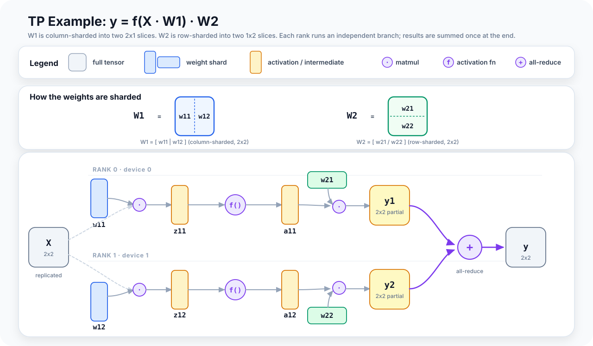

# Tensor and Sequence Parallelism

Data parallelism — and ZeRO, its memory-efficient refinement from the previous
article — keeps every rank working on different data while still, in effect, running
the whole model. Tensor parallelism moves to a different axis: within a TP group,
every rank sees the same input activations, but each rank holds only a slice of the
model weights. Each GPU performs its local piece of the matrix multiply, and the
results are combined with a collective communication operation.

Sequence parallelism extends this by sharding the activations between layers across
the sequence dimension, cutting activation memory by a factor of the TP world size.

Together, TP and SP are the workhorses of large-model training. Data parallelism
alone doesn't solve the memory problem — each DDP replica still holds the full
model. A 70B-parameter model is already about **140 GB just for bf16 weights**
(70B x 2 bytes), and the full training state is much larger once gradients and
optimizer state are included. No single GPU can hold that comfortably. TP splits
the model itself across GPUs, so each device only holds `1/N` of each weight
matrix while remaining fully busy with computation.

---

## Why You Need Both Column and Row Sharding

Consider one linear layer, `Y = X @ W`, where `W` has shape `[d_in, d_out]`.
There are two natural ways to split that matrix across `N` devices.

**Column sharding** means splitting `W` by output columns. Each device stores a
slice of shape `[d_in, d_out/N]` and multiplies the full input `X` by its local
slice. The result is one shard of the output features, so the final output is
formed by concatenating all devices' results along the feature dimension.

**Row sharding** means splitting `W` by input rows. Now each device stores a
slice of shape `[d_in/N, d_out]`, and each device also receives the matching
slice of the input activations. Every device produces a partial contribution to
the full output, and those partial outputs must be summed across devices. That
sum is an all-reduce.

A transformer MLP block is just two linear layers with a nonlinearity in between:
`FFN(x) = GELU(x @ W_1) @ W_2`.
The canonical TP sharding is:

- `W_1`: column sharding → `ColumnParallelLinear`
- `W_2`: row sharding → `RowParallelLinear`

This pairing avoids an all-reduce between the two layers: the column-parallel layer
produces sharded outputs, and those shards are already exactly what the
row-parallel layer expects as input. So the two layers compose cleanly, and only
one all-reduce is needed at the output of `W_2`.

---

<div class="article-figure">
  
</div>

---

## ColumnParallelLinear

`ColumnParallelLinear` holds columns `[col_start : col_end]` of the original weight
matrix:

```python
class ColumnParallelLinear(nn.Module):
    def __init__(self, in_features, out_features, tp_group, gather_output=False):
        self.weight = nn.Parameter(
            torch.zeros(out_features // world_size, in_features)
        )  # local weight: [d_out/N, d_in]
        self.tp_group = tp_group
        self.gather_output = gather_output

    def forward(self, x):
        # x: [B, T, d_in] — replicated on all ranks
        # In backward, dL/dx from all TP ranks must be summed.
        x = mark_input_as_replicated(x, self.tp_group)
        y = F.linear(x, self.weight)  # [B, T, d_out/N] — sharded
        if self.gather_output:
            # all-gather: used when the next layer expects full output
            y = all_gather_along_last_dim(y, self.tp_group)
        return y
```

The input `x` is visible on all TP ranks. Each rank's local forward pass is just
a standard matrix multiply against its own output-column slice. No communication
is needed before or during the matmul.

The output is sharded: each rank has `Y_i` of shape `[B, T, d_out/N]`. If the next
layer is `RowParallelLinear`, that sharded output is already in the right layout.
If some later step needs the full feature dimension, `gather_output=True` triggers
an all-gather.

---

## RowParallelLinear

`RowParallelLinear` holds rows `[row_start : row_end]` of the original weight:

```python
class RowParallelLinear(nn.Module):
    def __init__(self, in_features, out_features, tp_group, comm="none"):
        self.weight = nn.Parameter(
            torch.zeros(out_features, in_features // world_size)
        )  # local weight: [d_out, d_in/N]
        self.tp_group = tp_group
        self.comm = comm  # "all_reduce" (vanilla TP) or "reduce_scatter" (SP)

    def forward(self, x_sharded):
        # x_sharded: [B, T, d_in/N] — already sharded by ColumnParallelLinear
        z_partial = F.linear(x_sharded, self.weight)  # [B, T, d_out] — partial result
        if self.comm == "all_reduce":
            dist.all_reduce(z_partial, group=self.tp_group)  # sum → replicate
        elif self.comm == "reduce_scatter":
            # SP: sum partial results AND scatter to sequence shards in one op
            # output: [B, T/N, d_out] — sequence-sharded for the SP region
            z_partial = reduce_scatter(z_partial, self.tp_group, dim=1)
        return z_partial
```

Each rank's partial result `Z_i = X_i @ W_i` has the full output shape `[B, T, d_out]`
but only contains the contribution from the `i`-th input slice. Summing all partials
gives the correct output.

With `comm="all_reduce"`, this sum is an all-reduce. With `comm="reduce_scatter"`,
this is where sequence parallelism enters — more on this below.

---

## Attention Layer Sharding

It is often clearest to write attention in per-rank shapes.

For one TP rank:

```text
Q  = X @ W_q    W_q: [d_model, d_head x n_q_heads_per_rank]
K  = X @ W_k    W_k: [d_model, d_head x n_kv_heads_per_rank]
V  = X @ W_v    W_v: [d_model, d_head x n_kv_heads_per_rank]
```

All three projections are still column-parallel: TP is applied to **Q, K, and V**.
Each rank owns a subset of heads and computes its local Q/K/V slices from the
replicated input `X`.

In standard multi-head attention, `n_q_heads_per_rank = n_kv_heads_per_rank`.
In grouped-query attention (GQA), they differ: Q has more heads than K/V. For
example, with 32 Q heads, 8 KV heads, and `tp=4`, each rank gets 8 Q heads but
only 2 KV heads.

That is why GQA creates an extra TP constraint on the KV side: `num_kv_heads`
must still divide cleanly across TP ranks unless the system is willing to
replicate KV heads. The Q projection is still sharded normally; it is the smaller
KV head count that becomes the bottleneck.

After the local attention computation, the per-rank attention output has shape:

```text
VO = softmax(QK^T / sqrt(d_head)) @ V
VO: [B, T, d_head x n_q_heads_per_rank]
```

That last dimension matches the **local query-head count**, not the local KV-head
count. Even in GQA, each query head produces its own `d_head` output vector.

The output projection then consumes that local head slice:

```text
output_partial = VO @ W_o
W_o: [d_head x n_q_heads_per_rank, d_model]
```

`W_o` is row-parallel for the same reason `W_2` in the MLP is row-parallel: the
input to this projection is already sharded across ranks. Each rank multiplies its
local `VO` slice by its local rows of `W_o`, producing a partial contribution to
the final `[B, T, d_model]` output. Those partial outputs are summed with an
all-reduce.

So attention follows the same overall TP pattern as the MLP:
column-parallel projections → local computation → row-parallel output projection
→ all-reduce.

---

## Sequence Parallelism: Sharding the Activations

Vanilla TP replicates activations between layers. In the regions between MLP blocks
and attention blocks — layer norms, dropout, residual connections — the full
activation tensor `[B, T, d_model]` sits replicated on every TP rank. This is
memory wasted.

**Sequence parallelism** shards these activations along the sequence dimension.
Between TP layers, each rank holds `[B, T/N, d_model]` rather than `[B, T, d_model]`.
This cuts activation memory by a factor of the TP world size.

The key idea is simple: keep activations sequence-sharded in the cheap parts of
the block, and only reconstruct the full sequence when a TP layer actually needs it.

That means the boundary around each attention or MLP block changes in two places:

1. **Before the block**, ranks all-gather their sequence shards.
   `[B, T/N, d_model] -> [B, T, d_model]`

2. **After the block**, the final row-parallel layer does a reduce-scatter instead
   of an all-reduce.
   `[B, T, d_model] -> [B, T/N, d_model]`

So the block looks like this:

```text
SP region:
  each rank holds [B, T/N, d_model]

  -> all-gather

Inside TP block:
  input to column-parallel layer:   [B, T, d_model]
  intermediate TP activations:      feature-sharded as usual
  output of final row-parallel:     reduce-scatter -> [B, T/N, d_model]

  -> next SP region
```

> **Why can these layers stay sequence-sharded?**
> Dropout, residual adds, and elementwise activations are token-independent, so
> they can run on each rank's local `[B, T/N, d_model]` slice directly.
>
> LayerNorm and RMSNorm also do **not** need the full sequence. Their statistics
> are computed per token over the hidden dimension, not across all tokens in the
> sequence. So if a rank owns some subset of tokens, it can normalize those tokens
> locally with no cross-rank reduction. Sequence parallelism would be much harder
> if the normalization were across the sequence dimension.

The payoff is that layer norm, residual connections, and dropout now operate on
`[B, T/N, d_model]` instead of `[B, T, d_model]`. Communication is not removed;
it is rearranged. Vanilla TP would end the block with an all-reduce that leaves a
fully replicated activation. TP+SP replaces that with an all-gather before the
block and a reduce-scatter after it. The main win is that the activations living
between TP layers are `N` times smaller.

---

## Memory Impact of TP+SP

For a single transformer layer:

| Activation | Plain TP (no SP) | TP+SP |
|---|---|---|
| Layer norm input | `[B, T, d_model]` replicated | `[B, T/N, d_model]` sharded |
| After QKV proj | `[B, T, d_model/N]` sharded | `[B, T, d_model/N]` sharded |
| Full attention `QKᵀ` | `[B, H/N, T, T]` per rank | `[B, H/N, T, T]` (no change, attn is on local heads) |
| After output proj | `[B, T, d_model]` replicated | `[B, T/N, d_model]` sharded |
| FFN intermediate | `[B, T, d_ffn/N]` sharded | `[B, T, d_ffn/N]` sharded |

The important distinction is that SP shrinks the activations **between** TP-heavy
blocks, not the tensors **inside** the attention or MLP core after the all-gather.
So the QKV projections and FFN intermediate keep the same `[B, T, .../N]` shapes
as vanilla TP, while layer-norm inputs, residual streams, and block outputs become
`[B, T/N, d_model]`.

That still reduces peak memory substantially, because those replicated residual-path
activations are large and appear at every layer. For very long contexts (before you
need full context parallelism), SP is often the first tool used to cut activation
memory.

---

## Gradient Semantics Under TP

Weight gradients are local. Each rank owns one slice of the weight matrix, so it
can compute the gradient for that slice from the activations and output gradients
it already has.

The subtle part is the **input gradient**.

For a row-parallel layer, each rank receives the full output gradient and computes
the gradient for its own input slice. No extra reduction is needed there, because
the input itself was sharded in the forward pass.

For a column-parallel layer, each rank holds only one shard of the output features,
so in backward it can only compute one **partial contribution** to the gradient of
the replicated input. Those partial input gradients must be summed across ranks.
That sum is the all-reduce in the backward pass.

So the short version is:

- Weight gradients are local.
- Row-parallel backward returns sharded input gradients naturally.
- Column-parallel backward needs an all-reduce to reconstruct the full input gradient.

---

## What's Next

The next article covers pipeline parallelism: how to split a model vertically
across pipeline stages, why microbatching is necessary to keep all GPUs busy, and
the difference between the AFAB and 1F1B schedules that trade off memory against
the pipeline bubble.

TP+SP splits each layer across GPUs within a node; ZeRO (the previous article)
shards the training state across the data-parallel axis. Both keep every GPU
holding all of the model's layers. Pipeline parallelism is what removes that last
constraint — letting each GPU hold only a fraction of the layers — and TP+SP+ZeRO-3
combined with PP is the standard configuration for the largest models.
