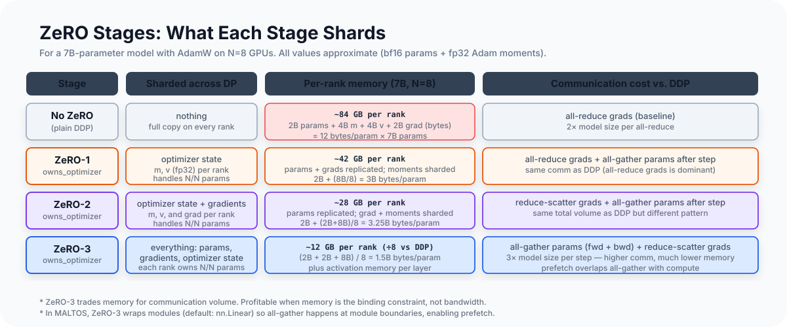
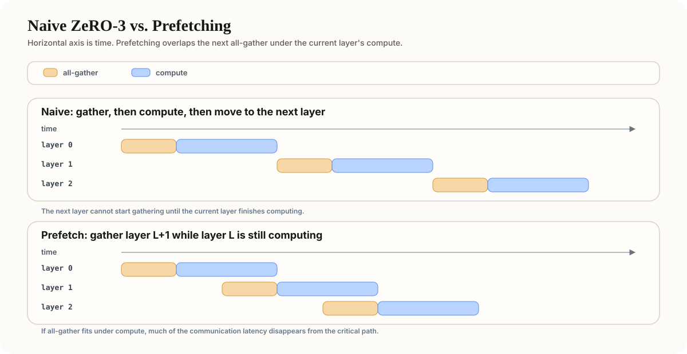

# ZeRO Optimizer Sharding

Training a 7B-parameter language model with AdamW usually requires storing, for
each parameter, a low-precision model copy for forward/backward, its gradient,
an fp32 master copy that the optimizer updates, and Adam's first and second
moment estimates (`m` and `v`). In a typical mixed-precision setup:

| State | Dtype | Bytes/param |
|---|---|---|
| Model parameters | bf16 | 2 |
| Gradients | bf16 | 2 |
| Master parameters | fp32 | 4 |
| Adam m (first moment) | fp32 | 4 |
| Adam v (second moment) | fp32 | 4 |
| **Total** | | **16** |

For 7B parameters: 16 × 7 × 10⁹ ≈ 112 GB. A single H100 has 80 GB, so even
before activations and temporary buffers, single-GPU training does not fit.

ZeRO (Zero Redundancy Optimizer) distributes this memory across data-parallel
ranks. In standard DDP, each rank holds a full copy of all parameters, gradients,
and optimizer state — even though those copies are identical (DDP keeps them in
sync via all-reduce). ZeRO exploits this redundancy: each rank only needs to store
the state it is responsible for updating. The question is *how much* must be
replicated, and the answer is: much less than you'd think.

---

<div class="article-figure">
  
</div>

---

## Stage 1: Shard the Optimizer State

The insight behind ZeRO-1 is simple: DDP makes every rank keep optimizer state
for every parameter, but each rank only needs to update its own shard.

Let `N` be the total number of parameters and `R` the number of data-parallel
ranks. In ZeRO-1, rank `i` owns parameter shard
`[i * N / R, (i + 1) * N / R)`. It stores the fp32 master weights and Adam
moments for that shard, updates only that shard, and then shares the updated
weights back out. The bf16 model weights used for forward/backward are still
replicated on all ranks.

```
After all-reduce (example: `R = 4`):
  Every rank (0-3) holds: averaged grads for all params
  Rank 0 updates: first quarter of parameters
  Rank 1 updates: second quarter of parameters
  Rank 2 updates: third quarter of parameters
  Rank 3 updates: fourth quarter of parameters

All-gather restores the full param set on all ranks.
```

The memory saving is that the fp32 optimizer-owned state is sharded by `R`.
Each rank still stores the full bf16 model weights and full bf16 gradients, but
only `1/R` of the fp32 master weights and Adam moment tensors.

ZeRO-1 still uses the same gradient all-reduce as DDP, so every rank briefly
sees the full averaged gradient. The difference is what happens next: each rank
keeps only the gradient shard it owns, updates only that shard, and discards the
rest. That is less memory-efficient than ZeRO-2, but simpler because only the
optimizer step changes.

After the optimizer step, ranks no longer have identical parameter copies, because
each rank updated only its own shard. A final all-gather restores a consistent
full parameter copy on every rank.

For a 7B model at `R = 8`:

- Before ZeRO: 112 GB per rank
- After ZeRO-1: `2 + 2 + (4 + 4 + 4)/8 = 5.5` bytes/param
  `5.5 x 7B params ≈ 38.5 GB` per rank

---

## Stage 2: Also Shard the Gradients

ZeRO-2 shards both optimizer state and gradients. After backward, instead of
all-reducing the full gradient tensor, we reduce-scatter:

```
All-reduce (DDP/ZeRO-1):
  all ranks → average of all grads → all ranks  (every rank receives the full averaged grad)

Reduce-scatter (ZeRO-2/3):
  all ranks → sum of grads → each rank receives only its assigned shard of the averaged grad
```

Reduce-scatter is **not** the same communication cost as all-reduce. In the usual
ring view, an all-reduce is roughly a reduce-scatter plus an all-gather, so an
all-reduce moves about **2x** the bytes of a reduce-scatter alone.

That is why ZeRO-2 is best understood in two pieces:

- During gradient synchronization, it uses **reduce-scatter** instead of DDP's
  **all-reduce**, so this step is cheaper.
- After the optimizer step, it still needs an **all-gather** to restore a full
  replicated parameter copy on every rank.

Compared with ZeRO-1, the key communication change is simple: the gradient-sync
step changes from **all-reduce** to **reduce-scatter**. Both ZeRO-1 and ZeRO-2
still need an **all-gather** after the optimizer step to restore a full parameter
copy on every rank. So ZeRO-2 saves communication in the gradient-sync phase,
not by removing that final parameter all-gather.

The key difference in memory is what lands on each rank: with all-reduce, every
rank stores the full averaged gradient tensor. With reduce-scatter, rank `i`
only stores `1/R` of it — the shard for its assigned parameters.

The result: after reduce-scatter, only the owning rank needs to keep the gradient.
Other ranks can free their portion immediately, cutting gradient memory by `N`.

ZeRO-2 memory per rank:

- 2 bytes/param for bf16 model parameters (still replicated — every rank needs full params for forward pass)
- (2 + 4 + 4 + 4)/8 = 1.75 bytes/param for grad + master + moments (sharded by N=8)
- Total: ~3.75 bytes/param × 7B params ≈ 26.25 GB per rank (vs. 112 GB with no ZeRO)

---

## Stage 3: Also Shard the Parameters

ZeRO-3 goes all the way: bf16 model parameters, gradients, fp32 master weights,
and optimizer state are all sharded. Each rank stores only `1/N` of each state.

This creates a problem: **each forward pass needs the full parameters for each layer**.
A layer whose weights are sharded across 8 ranks can't compute a matrix multiply.

ZeRO-3 solves this with **just-in-time parameter materialization**: before a layer's
forward pass, all ranks all-gather the full parameter shard. The layer runs. Then
the parameters are immediately freed.

```
Forward pass for layer L:
  1. All-gather W_L from all ranks → W_L_full (on all ranks)
  2. Run forward pass: Y = X @ W_L_full
  3. Free W_L_full (keep only W_L_shard)

Backward pass for layer L:
  1. All-gather W_L from all ranks → W_L_full (must redo; activations were freed
     after the forward pass, so the weight must be rematerialized for dL/dW computation)
  2. Compute dL/dX and dL/dW_L_full
  3. Reduce-scatter dL/dW_L_full → each rank keeps its shard of the gradient
  4. Free W_L_full
```

ZeRO-3 memory per rank: (2 + 2 + 4 + 4 + 4)/8 = 2 bytes/param × 7B params ≈ **14 GB per rank**.

---

## Why ZeRO-3 Materializes by Layer or Bucket

In principle, ZeRO-3 could all-gather each parameter tensor exactly when it is
needed. In practice that would be far too fine-grained: the runtime would spend
its time launching many tiny collective operations instead of doing useful math.

So real systems usually gather parameters at **layer** or **bucket** granularity.
A bucket is just a flat buffer that groups together one module's parameters, or a
small set of adjacent parameters, into one communication unit.

That gives three practical benefits:

1. Fewer collective calls, which reduces launch overhead.
2. Better bandwidth utilization, because larger all-gathers are more efficient.
3. A clean lifetime: gather the bucket, run the layer, free the full copy.

The core idea is still the same as the simple ZeRO-3 story above. The only change
is that "parameter" becomes "layer-sized bucket" as the unit of materialization.

---

## Prefetching: Hiding the Gather Behind Compute

A naive ZeRO-3 schedule is strictly serial: gather one bucket, compute that
layer, then move on to the next layer. That is correct, but it exposes the full
all-gather latency to the critical path.

The standard improvement is **prefetching**: while layer `L` is computing, start
gathering the parameters for layer `L+1`. On a horizontal time axis, the next
all-gather is intentionally staggered under the current layer's compute. If the
overlap is good, much of the gather latency disappears from the critical path.

<div class="article-figure">
  
</div>

Backward can do the same thing in reverse order.

Prefetching helps most when:

- layers execute in a stable order from step to step
- per-layer compute is large enough to hide communication
- interconnect bandwidth is high enough that the next gather can finish in time

If execution order changes dynamically, prefetch may miss its target. The run is
still correct; it just falls back toward the naive gather-then-compute behavior.

---

## Backward and Optimizer Step Under ZeRO-3

The backward pass mirrors the forward pass:

1. Gather the bucket's full parameters.
2. Compute gradients for that bucket.
3. Reduce-scatter those gradients so each rank keeps only its own shard.
4. Free the temporary full parameter copy.

After that, the optimizer step is local again. Each rank updates:

- its own shard of the bf16 parameter
- its own shard of the fp32 master weights
- its own shard of Adam `m` and `v`

So ZeRO-3 is not "doing distributed Adam" at every scalar update. The distributed
part is the gather / reduce-scatter choreography around each layer. Once the shard
gradient is on its owning rank, the actual Adam update is ordinary local optimizer math.

---

## Two Practical Notes

**1. Create the optimizer after sharding is finalized.**
The optimizer must own the actual shard tensors, not the original full-parameter
objects. Otherwise it may allocate state for tensors that are no longer the ones
used by the forward pass.

**2. Checkpoints must record sharded layout explicitly.**
In ZeRO-3, a rank usually saves only its local shard, not the full parameter.
So checkpoint metadata needs to describe which shard this is, what its logical
full shape was, and what DP world size produced it.

---

## ZeRO Stages at a Glance

| Stage | What is sharded | Memory/rank (7B model, N=8) | Extra communication vs. DDP |
|---|---|---|---|
| DDP (no ZeRO) | Nothing | ~112 GB | baseline (1× all-reduce per step) |
| ZeRO-1 | Master weights + optimizer state | ~38.5 GB | +all-gather after optimizer step |
| ZeRO-2 | Master weights + optimizer state + gradients | ~26.25 GB | reduce-scatter replaces all-reduce |
| ZeRO-3 | Master weights + optimizer state + gradients + parameters | ~14 GB | +all-gather on every forward + backward |

The memory numbers assume a standard mixed-precision setup: bf16 model
parameters and gradients, plus fp32 master weights and Adam moments.
ZeRO-3's ~14 GB per rank is under what a single H100 holds; ZeRO-2 and ZeRO-1
still require multiple GPUs or NVLink for the all-reduce to remain efficient.

One important limit: ZeRO reduces **parameter / gradient / optimizer-state**
memory. It does **not** remove the activation memory from forward/backward.
For long contexts or very deep models, you still need techniques like activation
checkpointing, sequence/context parallelism, or pipeline parallelism.

---

## Communication Volume: Is ZeRO-3 Worth It?

Per optimizer step, ZeRO-3 costs roughly:

- **Forward pass**: all-gather for each bucket (1× model size total, once per
  forward step, spread across the step via prefetch). Each rank contributes its
  `1/N` shard; the gather produces the full model on all ranks temporarily.
- **Backward pass**: all-gather for each bucket again (1× model size)
- **Gradient sync**: reduce-scatter (1× model size)
- **Total**: 3× model size per step in communication volume

The "2× model size" figure sometimes cited for the all-gather phases comes from
ring-allreduce accounting, where each byte travels twice. In ZeRO-3's case, the
all-gather is a straightforward gather: each of N ranks sends `model_size/N` bytes,
so total traffic is `model_size × (N-1)/N` ≈ 1× per gather — two gathers = 2×
for parameters, plus 1× for reduce-scatter = 3× total. This 3× figure is the
common way to cite ZeRO-3 overhead in the literature (e.g., the original ZeRO paper).

Compare to plain DDP all-reduce: 2× model size per step (ring-allreduce: each byte
travels through N-1 reduce steps and N-1 broadcast steps).

ZeRO-3 costs 50% more communication per step, but uses `1/N` the memory for
parameters, gradients, master weights, and optimizer state. At N=8, that's
~14 GB vs. ~112 GB for a 7B model.

The practical answer: ZeRO-3 is worth it when the model doesn't fit without it,
and when you have enough bandwidth to hide the communication. On NVLink-connected
A100/H100 nodes, the bandwidth is high enough that prefetch largely hides the
all-gather latency. Across nodes on InfiniBand, the communication starts to dominate.

---

## Gradient Accumulation Under ZeRO-3

ZeRO-3 with gradient accumulation needs one extra rule: do **not** reduce-scatter
on every micro-step if you are still accumulating.

On each micro-step, ZeRO-3:

1. Materializes parameters (forward all-gather)
2. Runs backward and accumulates gradient contributions locally
3. On the last micro-step only: runs the reduce-scatter

Otherwise you would communicate every partial micro-batch gradient separately,
which defeats the point of gradient accumulation. Conceptually, ZeRO-3 should
behave like DDP here: accumulate first, synchronize once at the optimizer-step
boundary.

---

## What's Next

The next article covers tensor and sequence parallelism: how a single weight matrix
is sharded across multiple GPUs, what ColumnParallelLinear and RowParallelLinear
actually do, and how sequence parallelism shards activations between layers to cut
memory further.

DDP and ZeRO both live on the data-parallel axis — they replicate or shard the same
model across ranks that each process different data. Tensor parallelism is a
different axis entirely: it splits an individual weight matrix across GPUs so they
cooperate on one forward pass. It is the standard next tool once a single layer is
too large, or the compute per layer too slow, for the data-parallel axis alone.
